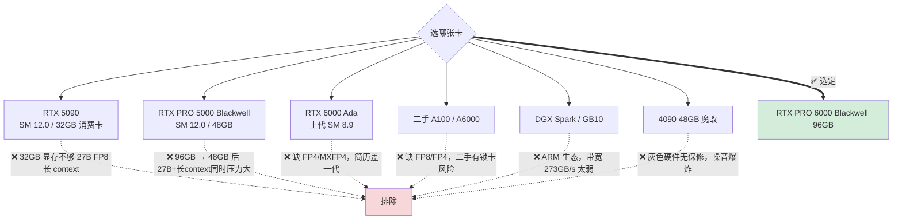

# 硬件方案：PRO 6000 Blackwell 96GB 落地记录

> **状态（2026-05-06）**：硬件已采购、装机、系统就绪。本文档保留为采购档案 + 验证手册 + 长期参考。
>
> **决策结果**：选 **NVIDIA RTX PRO 6000 Blackwell 96GB**（放弃 PRO 5000 48GB 备选方案）。
>
> **核心理由**：96GB 显存 = Qwen3.6-27B-FP8 + 256K context + 多并发同时跑，覆盖 30 天计划全部场景 + 未来 2 年本地 Coding Agent + 35B-A3B MoE 实验。

---

## 一、最终配置（已落地）

| 部件 | 型号 | 备注 |
|---|---|---|
| **GPU** | NVIDIA RTX PRO 6000 Blackwell Workstation Edition 96GB | SM 12.0 / 1792 GB/s / 600W TDP / GDDR7 ECC |
| CPU | Intel Core Ultra 9 285K | 24 核 8P+16E |
| 主板 | MSI PRO B860-P WIFI | PCIe 5.0 x16 |
| 内存 | DDR5 ~30GB（待升级到 ≥64GB） | ⚠️ Week 4 mini-vLLM 需要 |
| 系统盘 | NVMe SSD | |
| 系统 | Ubuntu 24.04 LTS | |
| Driver | NVIDIA 595.58.03 | 通过 `nvidia-smi` 验证 |
| CUDA | 13.2 | 通过 `nvcc -V` 验证 |
| 备用 | Mac mini M4 | 端侧 MLX 实验 |

---

## 二、装机后验证记录

### 2.1 GPU 识别 & PCIe 链路

```bash
# 确认 SM 12.0
nvidia-smi --query-gpu=name,compute_cap,memory.total --format=csv
# 期望: NVIDIA RTX PRO 6000 Blackwell Workstation Edition, 12.0, 98304 MiB

# 确认 PCIe 5.0 x16 满速
nvidia-smi --query-gpu=pcie.link.gen.current,pcie.link.width.current --format=csv
# 期望: 5, 16

# 详细链路状态
sudo lspci -vvv | grep -A 20 "NVIDIA"
# 期望: LnkSta: Speed 32GT/s (Gen5), Width x16
```

### 2.2 CUDA 工具链

```bash
nvcc -V                    # CUDA 13.2
nvidia-smi                 # Driver 595.58.03
python -c "import torch; print(torch.cuda.is_available(), torch.cuda.get_device_capability())"
# 期望: True, (12, 0)
```

### 2.3 Blackwell 关键特性可用性

第 5 代 Tensor Core 支持的精度：
- ✅ FP4 (NVFP4 / MXFP4) — Week 3 Day 17-18 量化重点
- ✅ FP6 (MXFP6)
- ✅ FP8 (MXFP8 / E4M3 / E5M2)
- ✅ BF16 / FP16
- ✅ TF32
- ✅ wgmma（Async Warpgroup MMA）— FA3/FA4 依赖
- ✅ TMA（Tensor Memory Accelerator）
- ✅ CGA（Cluster Programming Model）
- ✅ DSMEM（Distributed Shared Memory）

> ⚠️ **vLLM Blackwell 量化支持**：vLLM 文档 quantization 矩阵当前列到 Hopper 为止，Blackwell 列尚未独立标注。FP8 W8A8 / NVFP4 实际能否在 PRO 6000 (sm_120) 上跑、性能如何 → **Week 3 Day 17-18 自验**。
>
> ⚠️ **sm_120 vs sm_100 关键差异**（NVIDIA 官方）：PRO 6000 Workstation 是 sm_120，与数据中心 B100/B200/GB200 的 sm_100 **同 Blackwell 家族但不同 SM 主版本**：
> - **sm_100 独占**：tcgen05（5 代异步 Tensor Core）+ TMEM（Tensor Memory）+ 5 代 NVLink + INT4 Tensor Core + 228KB shared mem/SM
> - **sm_120 走**：mma.sync + WGMMA（Hopper 路径）+ 128KB shared mem/SM
> - **共有**：TMA、Thread Block Cluster、DSMEM、FP4/FP6/FP8/BF16 数据类型
> - **二进制**：cubin 不互通；baseline PTX (`compute_100`) 可 JIT 到 sm_120（向前兼容），反向不行
> - **简历表述**：避免说"100% 指令集兼容"。说"同 Blackwell 家族，baseline PTX 可移植，tcgen05 等 sm_100-only 路径迁移需重写"。

---

## 三、显存使用规划（Qwen3.6-27B-FP8 为主力）

### 3.1 模型权重

| 模型 | 精度 | 权重显存 | 用途 |
|---|---|---|---|
| Qwen3.6-27B | bf16 (VL) | ~54 GB | Week 3 Hybrid SSM / 多模态实验 |
| **Qwen3.6-27B-FP8** | **FP8** | **~27 GB** | **Week 1-4 主力** |
| Qwen3.6-27B (NVFP4) | NVFP4 | ~14 GB | Week 3 Day 17-18 自量化 |
| Qwen3.6-35B-A3B-FP8 | FP8 (MoE) | ~35 GB | Week 3 MoE 备选 |

### 3.2 KV cache 预算（Qwen3.6-27B 真实结构）

`config.json` 实测：64 层中 **16 层 full_attention + 48 层 linear_attention（hybrid SSM）**，GQA 4 KV heads × head_dim 256。

```
仅 16 层 full_attention 贡献 KV cache：
KV (FP16) per token = 2 × 16 × 4 × 256 × 2 byte = 64 KB
KV (FP8)  per token = 32 KB
KV (INT4, TurboQuant) per token = 8 KB
```

| Context | KV (FP8) | 与 27GB 权重合计 | 96GB 余量 |
|---|---|---|---|
| 32K   | 1.0 GB | 28 GB | 68 GB |
| 128K  | 4.2 GB | 31 GB | 65 GB |
| 256K  | 8.4 GB | 35 GB | 61 GB |
| 1M    | 33 GB  | 60 GB | 36 GB |

> 💡 hybrid attention 让 KV cache 比纯 dense 模型小 4 倍，96GB + FP8 KV 可轻松跑 1M context 学习实验。

### 3.3 与 GitHub Copilot 体验对标

| 维度 | Copilot | PRO 6000 + Qwen3.6-27B-FP8 |
|---|---|---|
| Decode 速度（理论上限）| 50 tps | 1792 / 27 ≈ **66 tps** ✅ |
| 上下文 | 64-128K | **256K+** ✅ |
| 24h 无限 | ❌ | ✅ |
| 隐私 | ❌ | ✅ |

理论 Decode TPS 是带宽 / 模型大小的上限值，实测要打 60-80% 折扣，Week 1 Day 5 / Week 4 mini-vLLM 阶段会有真实数据。

---

## 四、为什么不是其他卡（决策档案）



**与公司集群可移植性**：PRO 6000 (sm_120) 与公司预期的 H100 (sm_90) / B100/B200 (sm_100) **同家族但不同 SM**。在 PRO 6000 上写的 CUDA / Triton kernel 大部分走 baseline PTX (`compute_90` / `compute_100`) 路径,**重新编译即可在 H100/B100 集群跑**;但若用了 sm_120 独有指令(或 sm_100-only 的 tcgen05)需要重写。简历可以诚实说"在 sm_120 平台完成 vLLM / NVFP4 实战,熟悉 sm_100/sm_90 移植路径与编译目标"——这比"100% 兼容"硬气。

---

## 五、BIOS 必设项

| 选项 | 路径 | 设置值 | 为什么 |
|---|---|---|---|
| Above 4G Decoding | Advanced → PCI Subsystem | **Enabled** | 96GB 显存必须开 |
| Re-Size BAR Support | 同上 | **Enabled** | CUDA 性能 +5% |
| PEG Port Speed | Advanced → System Agent | **Gen5** | 强制 PCIe 5.0 |
| CSM Support | Boot | **Disabled** | 否则 ReBAR 失效 |

**MSI PRO B860-P WIFI BIOS 升级**：必须升级到 2025-06 之后版本以支持 PRO 6000 Blackwell：
👉 https://www.msi.com/Motherboard/PRO-B860-P-WIFI/support

---

## 六、剩余风险 & 待办

### 6.1 ⚠️ 内存偏紧（Week 1 内必须解决）

当前 ~30GB DDR5 → Week 4 跑 mini-vLLM 时，HF safetensors 反序列化峰值 + vLLM CPU offload + 同时开 IDE/浏览器/Coding Agent 会触顶。

**建议**：Week 1 Day 1-3 之间下单升级到 **64GB 起步**，96GB 更稳。

### 6.2 ⚠️ Blackwell vLLM 量化支持自验

vLLM 官方 quantization 表停在 Hopper。Week 3 Day 17-18 必须实测以下组合：
- FP8 W8A8 + KV FP8（vLLM `--quantization fp8 --kv-cache-dtype fp8`）
- NVFP4（vLLM `vllm/model_executor/layers/quantization/nvfp4/`）
- TurboQuant 2bit KV（社区 plugin）

如果某项不支持 → 转向手写 Triton 实现作为 portfolio。

### 6.3 散热 & 功耗

- PRO 6000 满载 600W，需独立空间 + 充足机箱风道
- 建议机箱风扇全开 + 显卡区域开放
- 持续满载噪音明显，避免放卧室

### 6.4 电源

- 必须 ≥1300W ATX 3.1（12V-2×6 单根 600W 接口）
- 推荐：海韵 PRIME PX-1300 / 振华 LEADEX VII PRO 1300W

---

## 七、模型存储路径（约定）

```
~/models/
├── Qwen3.6-27B/              # bf16 VL，多模态版（下载中）
│   ├── config.json
│   ├── model-00001-of-NN.safetensors
│   └── ...
└── Qwen3.6-27B-FP8/          # FP8 主力（待下载，命令在下面）
    ├── config.json
    └── ...
```

**FP8 模型下载命令**（Day 0 必做）：

```bash
modelscope download \
  --model Qwen/Qwen3.6-27B-FP8 \
  --local_dir ~/models/Qwen3.6-27B-FP8
```

---

## 八、下一步

→ 完成 [README.md 立即行动清单](./README.md#立即行动) 的 Day 0 任务（FP8 模型下载 + vLLM v0.20.1 安装 + Nsight Systems）

→ 开始 [02-week1.md](./02-week1.md) 的 Day 1 任务（2026-05-07）
