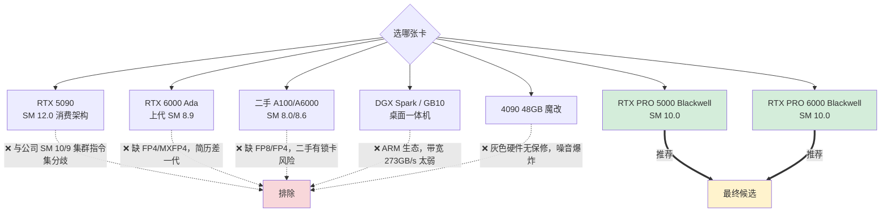
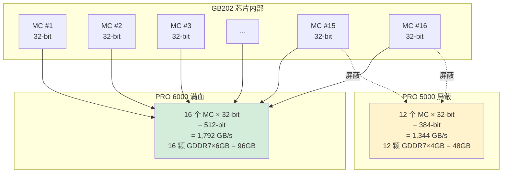
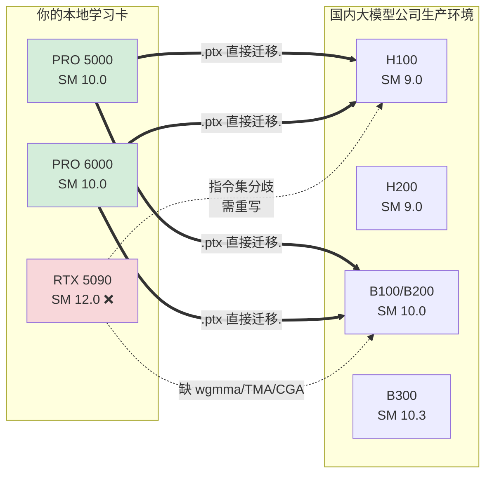
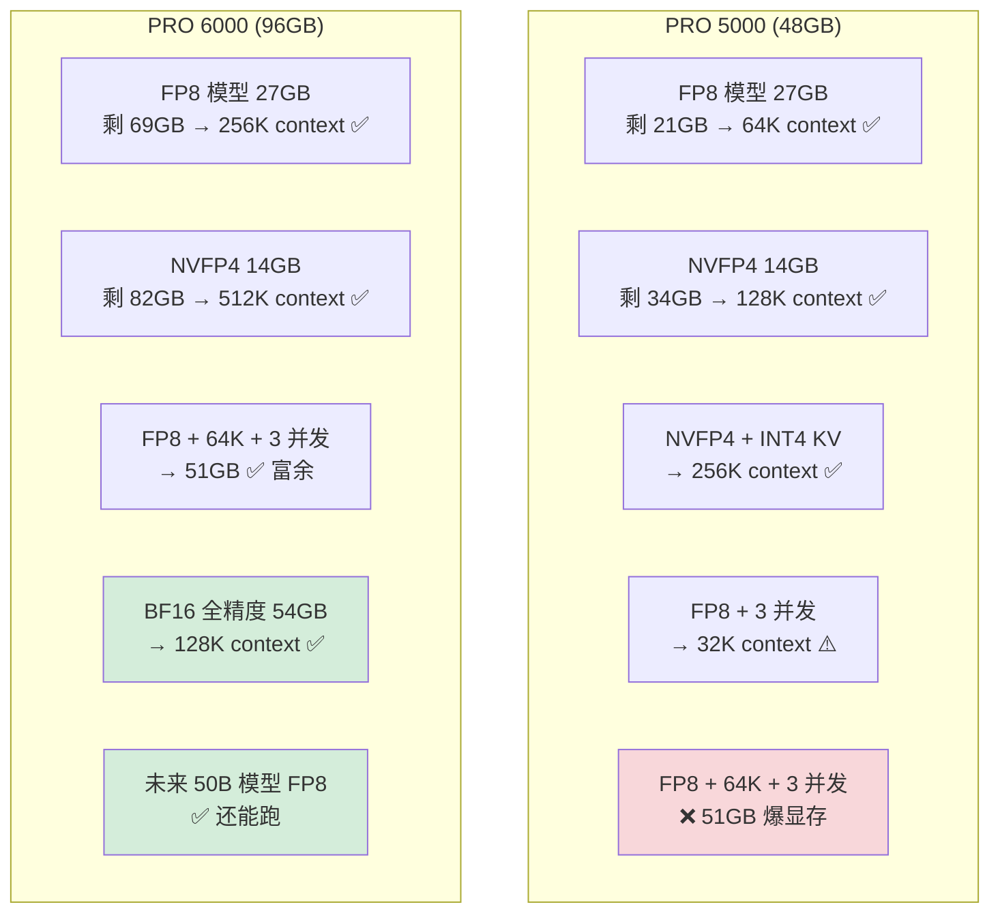
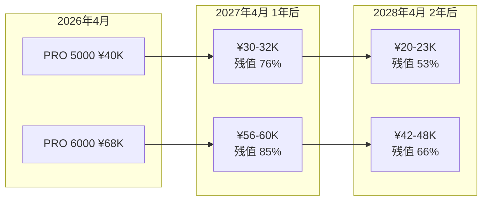
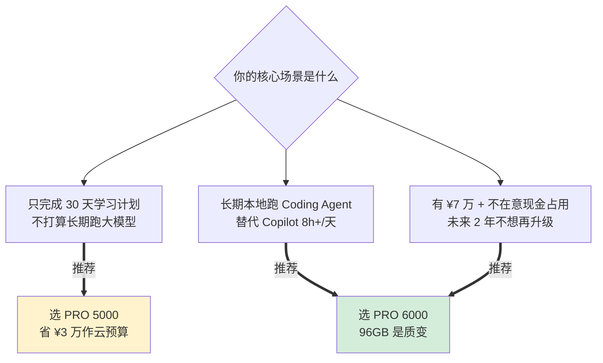
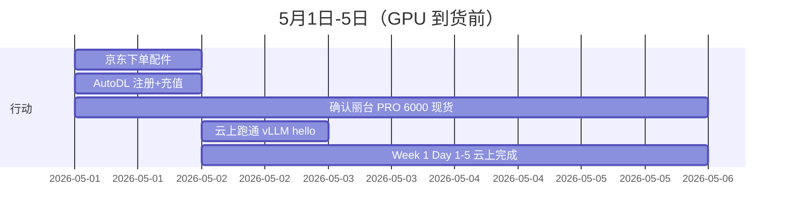

# 硬件方案：PRO 5000 vs PRO 6000 Blackwell 完整对比

> 核心结论：两方案均可，**视预算与未来 2 年使用强度决策**。两者均为 SM 10.0 数据中心架构，与公司 H100/B100/B200 100% 兼容。

---

## 一、为什么不选其他卡（已排除项）



---

## 二、双方案核心规格对比

| 维度 | RTX PRO 5000 Blackwell | RTX PRO 6000 Blackwell | 差距 |
|---|---|---|---|
| **芯片** | GB202 (屏蔽版) | GB202 (满血) | 同芯片 |
| **架构** | Blackwell SM 10.0 | Blackwell SM 10.0 | **相同** ✅ |
| **CUDA 核心** | 14,080 | 24,064 | -41% |
| **Tensor 核心 (5代)** | 440 | 752 | -41% |
| **显存** | 48 GB GDDR7 ECC | 96 GB GDDR7 ECC | **-50%** |
| **显存位宽** | 384-bit | 512-bit | -25% |
| **显存带宽** | **1,344 GB/s** | **1,792 GB/s** | **-25%** |
| **L2 Cache** | ~96 MB | ~128 MB | -25% |
| **TDP** | **300W** | **600W** | 一半 |
| **接口** | PCIe 5.0 x16 | PCIe 5.0 x16 | 相同 |
| **NVLink** | ❌ | ❌（注意，不是 SXM 模块） | 相同 |
| **MIG** | ✅ 最多 4 实例 | ✅ 最多 4 实例 | 相同 |
| **价格（行货含税）** | **¥38,000-42,000** | **¥66,000-72,000** | +¥28,000 |

### 🧠 显存带宽差异原理（冷知识）

```
显存带宽 = 颗粒速度 × 位宽 ÷ 8

PRO 5000: 28 Gbps × 384-bit ÷ 8 = 1,344 GB/s
PRO 6000: 28 Gbps × 512-bit ÷ 8 = 1,792 GB/s
```

**两者都是 28Gbps GDDR7 颗粒，差异完全来自位宽**：



**这是 NVIDIA 经典刀法**：流片良率不是 100%，缺陷在 SM 上的屏蔽 SM，缺陷在显存控制器上的屏蔽 MC。完全良品 → PRO 6000，次品 → PRO 5000。

---

## 三、Blackwell 新特性（两卡 100% 一致，决定简历卖点）

| 特性 | PRO 5000 | PRO 6000 |
|---|---|---|
| 第 5 代 Tensor Core | ✅ | ✅ |
| **NVFP4 / MXFP4** 微缩放 4-bit | ✅ | ✅ |
| MXFP6 / MXFP8 | ✅ | ✅ |
| 第 2 代 Transformer Engine | ✅ | ✅ |
| **TMA (Tensor Memory Accelerator)** | ✅ | ✅ |
| **wgmma (Async Warpgroup MMA)** | ✅ | ✅ |
| **CGA (Cluster Programming Model)** | ✅ | ✅ |
| **DSMEM (Distributed Shared Memory)** | ✅ | ✅ |
| Confidential Computing (TEE) | ✅ | ✅ |
| GDDR7 + ECC | ✅ | ✅ |
| CUDA 13+ / SM 10.0 PTX | ✅ | ✅ |

> 💡 **简历能写的所有 Blackwell 高级特性，两卡 100% 一致**。这是为什么 PRO 5000 仍然是合理选择的根本原因。

---

## 四、与求职目标的兼容性（最重要的维度）



**关键差异：**
- ✅ PRO 5000/6000 写的 CUDA kernel `git clone` 到公司 H100/B100 集群直接跑
- ❌ RTX 5090 写的 kernel 在 H100/B100 上需重新编译，部分高级指令缺失

---

## 五、本地 Coding Agent 场景对比（基于 Qwen3.6 27B Dense 假设）

> ⚠️ **Qwen3.6 27B Dense 规格基于推测**，实际下单前请确认 HuggingFace 最新 spec。下面假设：64 层、hidden 5120、64 head、head_dim 128、GQA 8 group。

### KV cache 显存占用（27B 模型）

| 上下文长度 | KV (FP16) | KV (FP8) | KV (INT4) |
|---|---|---|---|
| 8K | 2.0 GB | 1.0 GB | 0.5 GB |
| 32K | 8.0 GB | 4.0 GB | 2.0 GB |
| 64K | 16.0 GB | 8.0 GB | 4.0 GB |
| **128K** | **32.0 GB** | **16.0 GB** | **8.0 GB** |
| 256K | 64.0 GB | 32.0 GB | 16.0 GB |

### 实际可跑配置



### Decode 速度（带 KV cache）

| 配置 | PRO 5000 (1344 GB/s) | PRO 6000 (1792 GB/s) | 差距 |
|---|---|---|---|
| 27B FP8 + 32K KV (35GB read) | **38 tps** | 51 tps | +33% |
| 27B NVFP4 + 32K KV (22GB read) | **61 tps** | 81 tps | +33% |
| 27B FP8 + 128K KV (43GB read) | ❌ 显存 | 42 tps | - |
| 27B NVFP4 + 128K KV (30GB read) | **45 tps** | 60 tps | +33% |
| 8B FP16 + 16K KV (18GB read) | 75 tps | 100 tps | +33% |

### 对标 GitHub Copilot 体验

| 维度 | GitHub Copilot | PRO 5000 + Qwen3.6 NVFP4 | PRO 6000 + Qwen3.6 FP8 |
|---|---|---|---|
| Decode 速度 | 50 tps | **45-60 tps** ✅ | **42-66 tps** ✅ |
| 上下文长度 | 64-128K | **128K** ✅ | **256K** ✅ |
| TTFT (8K prompt) | 1.5s | ~2.5s ⚠️ | ~2.0s ✅ |
| 代码质量 | Claude/GPT-4 | Qwen3.6 27B 中等 | 同左 |
| 24h 无限 | ❌ | ✅ | ✅ |
| 隐私（公司代码） | ❌ | ✅ | ✅ |
| **总体体验** | 100% | **80%** | **95%** |

---

## 六、二手保值率分析（2 年视角）



### 2 年净持有成本

| 路径 | 买入价 | 2 年后卖出价 | **2 年净成本** | 月均 |
|---|---|---|---|---|
| PRO 5000 | ¥40,000 | ¥21,500 | **¥18,500** | ¥770/月 |
| PRO 6000 | ¥68,000 | ¥45,000 | **¥23,000** | ¥958/月 |
| **差额** | +¥28,000 | +¥23,500 | **+¥4,500** | +¥187/月 |

> 💡 **PRO 6000 多花的 ¥4,500 摊到 24 个月 = 每月 ¥187**，等价于"用 ¥187/月 买 96GB 显存 + 33% Decode 加速 + 未来 2 年游刃"。

---

## 七、决策矩阵（综合所有维度）

| 你的诉求 | PRO 5000 推荐度 | PRO 6000 推荐度 |
|---|---|---|
| 30 天学习计划够用 | ⭐⭐⭐⭐⭐ 95% | ⭐⭐⭐⭐⭐ 100% |
| 简历卖点 (Blackwell SM10.0) | ⭐⭐⭐⭐⭐ 100% | ⭐⭐⭐⭐⭐ 100% |
| 与公司集群兼容 | ⭐⭐⭐⭐⭐ | ⭐⭐⭐⭐⭐ |
| 替代 Copilot 日常使用 | ⭐⭐⭐⭐ 80% | ⭐⭐⭐⭐⭐ 95% |
| 多并发 (3-4 个 agent) | ⭐⭐⭐ 限制 32K | ⭐⭐⭐⭐⭐ 64K+ |
| 未来 2 年模型升级 (40-50B) | ⭐⭐⭐ 吃力 | ⭐⭐⭐⭐⭐ 游刃 |
| 装机省事（沿用现有配件） | ⭐⭐⭐⭐⭐ | ⭐⭐⭐ 必须换电源 |
| 噪音 / 电费 / 散热 | ⭐⭐⭐⭐⭐ 安静低耗 | ⭐⭐⭐ 需独立空间 |
| 二手保值 (2 年) | ⭐⭐⭐ 53% | ⭐⭐⭐⭐ 66% |
| 现金流压力 | ⭐⭐⭐⭐⭐ 占用 ¥4 万 | ⭐⭐⭐ 占用 ¥7 万 |

---

## 八、最终建议



**对你（已离职，急需 30 天出结果，且想长期本地跑 27B 替代 Copilot）的最终推荐：**

> **🥇 PRO 6000 Blackwell**（如果 5.1 后能买到）
>
> 主要理由：本地 Coding Agent 长期使用的 ROI 很高，¥187/月换"无限 Copilot 体验 + 未来 2 年免升级"是划算的。
>
> **🥈 PRO 5000 Blackwell**（如果 PRO 6000 缺货或预算紧）
>
> 主要理由：省 ¥3 万，Coding Agent 用 NVFP4 + 严格优化策略下 80% 体验，30 天计划完全够用。

---

## 九、采购清单（共通配件，无论选哪张卡）

| 优先级 | 项目 | 型号 | 价格 | 渠道 |
|---|---|---|---|---|
| 🔴 P0 | **电源**（PRO 5000 用 1000W，PRO 6000 用 1300W）| 海韵 FOCUS GX-1000 ATX 3.1 / PRIME PX-1300 | ¥1,400 / ¥2,400 | 京东自营 |
| 🔴 P0 | 散热 | 利民 Frozen Notte 360 水冷 | ¥600 | 京东自营 |
| 🔴 P0 | 机箱 | 分形工艺 North Charcoal（PRO 5000 用）/ Define 7 XL（PRO 6000 用）| ¥1,200 / ¥1,500 | 京东自营 |
| 🟡 P1 | 系统 SSD | 三星 990 PRO 2TB | ¥1,200 | 京东自营 |
| 🟡 P1 | 数据 SSD | 致态 TiPlus 7100 4TB | ¥1,800 | 京东自营 |
| 🟢 P2 | 风扇 | 利民 TL-C12C-S ×3 | ¥100 | 京东 |

**共通成本：¥6,300（PRO 5000 路径）/ ¥7,000（PRO 6000 路径）**

### 你已有（不用买）

- ✅ Intel Core Ultra 9 285K（24 核 8P+16E，足够，反而过剩）
- ✅ MSI PRO B860-P WIFI 主板
- ✅ 32GB DDR5 4800（够用，未来跑 70B + offload 时再加 32GB）

---

## 十、装机后的 BIOS 必设项

| 选项 | 路径 | 设置值 | 为什么 |
|---|---|---|---|
| **Above 4G Decoding** | Advanced → PCI Subsystem | **Enabled** | 48GB+ 显存必须开 |
| **Re-Size BAR Support** | Advanced → PCI Subsystem | **Enabled** | CUDA 性能 +5% |
| **PEG Port Speed** | Advanced → System Agent | **Gen5** | 强制 PCIe 5.0 |
| **CSM Support** | Boot | **Disabled** | 否则 ReBAR 失效 |

**MSI PRO B860-P WIFI** 必须升级 BIOS 到支持 PRO 6000 Blackwell 的版本（2025 年 6 月之后）：
👉 https://www.msi.com/Motherboard/PRO-B860-P-WIFI/support

---

## 十一、装机后验证命令

```bash
# 验证 PCIe 5.0 x16 满速
sudo lspci -vvv | grep -A 20 "NVIDIA"
# 期望：LnkSta: Speed 32GT/s (Gen5), Width x16

# 或
nvidia-smi --query-gpu=pcie.link.gen.current,pcie.link.width.current --format=csv
# 期望：5, 16

# 验证 Blackwell SM 10.0
nvidia-smi --query-gpu=compute_cap --format=csv
# 期望：10.0

# 验证显存
nvidia-smi --query-gpu=memory.total --format=csv
# 期望：49152 MiB (PRO 5000) 或 98304 MiB (PRO 6000)
```

---

## 十二、5 天等待期不浪费



**关键：用 AutoDL 4090 (¥2.5/h) 完成 Week 1 前 5 天，到货后无缝切换本地。**

---

## 下一步

→ 阅读 [02-week1.md](./02-week1.md) 开始 Day 1 任务
