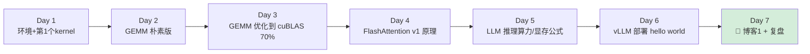
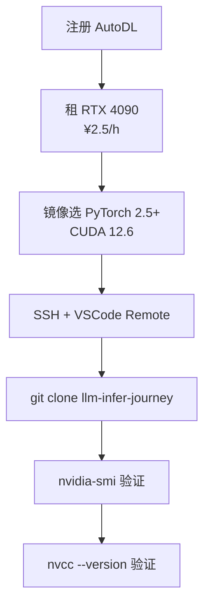
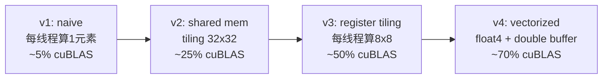
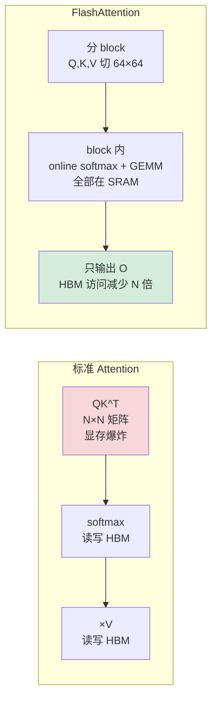
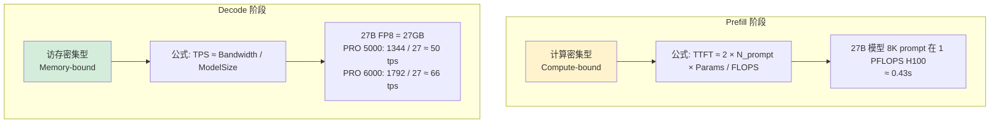

# Week 1：CUDA 基础 + LLM 推理原理（Day 1-7）

> **目标**：从"会写 C++ 驱动"到"能写 CUDA kernel + 算 LLM 推理显存/延迟公式 + 跑通 vLLM hello world"。
>
> **前 5 天用 AutoDL 4090 云上做**（GPU 还没到货），后 2 天用本地 PRO 5000/6000。
>
> **每日产出**：commit 到自己的 GitHub repo `llm-infer-journey/week1/dayN/`

---

## Week 1 总览



**Week 1 最终交付：**
- ✅ GitHub: 6 个 CUDA kernel 实现（5 个 GEMM 版本 + 1 个 softmax）
- ✅ 博客 1：《从系统软件到 LLM 推理：Week 1 学到的 8 个核心概念》
- ✅ 跑通 vLLM 部署 Qwen3-8B-FP8，会用 benchmark 工具

---

## Day 1：环境搭建 + 第一个 CUDA Kernel（5月2日）

### 上午（4h）：云 GPU 启动 + CUDA 工具链



**checklist：**
- [ ] AutoDL 充值 ¥500（够 200 小时 4090）
- [ ] 创建 GitHub repo `llm-infer-journey`，README 写"Intel ISP 工程师转型 LLM 推理 30 天打卡"
- [ ] VSCode Remote-SSH 连上云 GPU
- [ ] 安装 `nsight-systems` `nsight-compute`（性能分析必备）
- [ ] `pip install torch torchvision triton vllm`

### 下午（4h）：写第一个 CUDA kernel

**任务：实现 vector add（向量加法）**

```cuda
// vec_add.cu
__global__ void vec_add(const float* a, const float* b, float* c, int n) {
    int i = blockIdx.x * blockDim.x + threadIdx.x;
    if (i < n) c[i] = a[i] + b[i];
}
```

**关键学习点：**
- Grid / Block / Thread 三层结构
- `cudaMalloc` / `cudaMemcpy` / `cudaFree`
- warp（32 线程同步执行）的概念
- 用 `nsys profile` 观测内核启动延迟

### 晚上（1h）：阅读

**必读：**
- 📖 [PMPP 第 4 版第 1-3 章](https://www.elsevier.com/books/programming-massively-parallel-processors/hwu/978-0-323-91231-0)（PDF 网上能找到）
- 🎥 [Mark Saroufim《GPU MODE Lecture 1》](https://www.youtube.com/@GPUMODE) - 30 分钟入门

### Checkpoint
- [ ] vec_add.cu 编译运行，验证结果正确
- [ ] 用 nsys 看到 kernel 执行时间
- [ ] 能解释什么是 warp、为什么要 32 的倍数

---

## Day 2：GEMM 朴素实现 + 共享内存（5月3日）

### 上午（4h）：朴素 GEMM

**任务：实现 4 个版本的 SGEMM（FP32 矩阵乘）**



**v1 朴素版（必写）：**
```cuda
__global__ void sgemm_v1(float* A, float* B, float* C, int M, int N, int K) {
    int row = blockIdx.y * blockDim.y + threadIdx.y;
    int col = blockIdx.x * blockDim.x + threadIdx.x;
    if (row < M && col < N) {
        float sum = 0;
        for (int k = 0; k < K; ++k) sum += A[row*K+k] * B[k*N+col];
        C[row*N+col] = sum;
    }
}
```

### 下午（4h）：Shared Memory Tiling

**v2 版核心思想：**
- 每个 block 协作把 A、B 的一个 tile 搬到 shared memory
- 减少 global memory 访问 N 倍
- 学会 `__syncthreads()`、bank conflict

**参考 repo（必看）：**
- 🌟 [siboehm/SGEMM_CUDA](https://github.com/siboehm/SGEMM_CUDA) - 10 个版本，配博客
- 配套博客：https://siboehm.com/articles/22/CUDA-MMM

### 晚上（1h）：性能分析

```bash
ncu --set full -o gemm_v1 ./gemm_v1
ncu --set full -o gemm_v2 ./gemm_v2
# 对比 SM throughput / Memory throughput
```

### Checkpoint
- [ ] v1 vs v2 性能对比表（M=N=K=4096，单位 TFLOPS）
- [ ] 能解释 shared memory bank conflict
- [ ] 知道 4090 的理论 FP32 算力（82 TFLOPS）和带宽（1008 GB/s）

---

## Day 3：GEMM 优化进阶 + Tensor Core（5月4日）

### 上午（4h）：v3/v4 优化

**关键技术：**
- **Register Tiling**：每个线程算 8×8 子矩阵（用寄存器代替 shared mem）
- **向量化加载**：`float4` 一次取 16 字节
- **Double Buffering**：计算和加载重叠

### 下午（4h）：Tensor Core 入门 (WMMA)

**任务：用 Tensor Core 写 FP16 GEMM**

```cuda
#include <mma.h>
using namespace nvcuda::wmma;

__global__ void hgemm_wmma(half* A, half* B, float* C, int M, int N, int K) {
    fragment<matrix_a, 16, 16, 16, half, row_major> a_frag;
    fragment<matrix_b, 16, 16, 16, half, col_major> b_frag;
    fragment<accumulator, 16, 16, 16, float> c_frag;
    fill_fragment(c_frag, 0.0f);

    for (int k = 0; k < K; k += 16) {
        load_matrix_sync(a_frag, A + ..., K);
        load_matrix_sync(b_frag, B + ..., K);
        mma_sync(c_frag, a_frag, b_frag, c_frag);
    }
    store_matrix_sync(C + ..., c_frag, N, mem_row_major);
}
```

**为什么重要：**
- LLM 90% 算力消耗在 GEMM
- Tensor Core 比 CUDA Core 快 8-16 倍
- 之后学的 FlashAttention/cuBLASLt 都是 Tensor Core

### 晚上（1h）：阅读
- 📄 [CUTLASS 文档](https://github.com/NVIDIA/cutlass/blob/main/media/docs/efficient_gemm.md) - 工业级 GEMM 怎么写
- 📄 [Hopper / Blackwell wgmma 介绍](https://research.colfax-intl.com/cutlass-tutorial-wgmma-hopper/) - 为之后做铺垫

### Checkpoint
- [ ] 5 个版本性能对比图（commit 到 GitHub）
- [ ] WMMA 版本 ≥ cuBLAS 50%
- [ ] 理解：为什么 Blackwell 引入 wgmma 替代 wmma（async + warp group）

---

## Day 4：FlashAttention 原理 + Softmax（5月5日）

### 上午（4h）：手写 Softmax kernel

**3 个版本：**
1. naive softmax（3 pass: max → exp → norm）
2. online softmax（1 pass，FlashAttention 核心技巧）
3. block-wise softmax（用 shared memory）

```python
# online softmax 数学
# 传统：m = max(x), s = sum(exp(x-m)), out = exp(x-m)/s  → 3 pass
# online：边扫边更新 m 和 s，只 1 pass
def online_softmax(x):
    m_prev, s_prev = -inf, 0
    for xi in x:
        m_new = max(m_prev, xi)
        s_new = s_prev * exp(m_prev - m_new) + exp(xi - m_new)
        m_prev, s_prev = m_new, s_new
    return [exp(xi - m_prev) / s_prev for xi in x]
```

### 下午（4h）：FlashAttention v1 原理

**必读论文（精读）：**
- 📄 [FlashAttention (Dao 2022)](https://arxiv.org/abs/2205.14135)
- 📄 [FlashAttention-2 (Dao 2023)](https://arxiv.org/abs/2307.08691)
- 📄 [FlashAttention-3 (Shah 2024)](https://arxiv.org/abs/2407.08608) - Hopper TMA + wgmma
- 📄 [FlashAttention-4 (2025)](https://tridao.me/blog/2025/flash4/) - Blackwell 专属，必读

**核心理解：**



### 晚上（1h）：尝试自己写 FlashAttention（不要求完成）
- 给定 Q, K, V (BHN×D)，分 block 实现
- 这一步极难，写 30 行能感受复杂度即可

### Checkpoint
- [ ] 能在白板默写 online softmax
- [ ] 用自己的话解释 FlashAttention 为什么省显存（不是省算力）
- [ ] 知道 FA4 在 Blackwell 上比 FA3 快多少（约 1.5×）

---

## Day 5：LLM 推理算力/显存/延迟公式（5月6日）

> **这一天最重要——LLM 推理工程师的"基本功"**

### 上午（4h）：模型显存公式

**Transformer 模型显存 = 权重 + KV cache + 激活值**

```
权重显存 (GB) = 参数量 × 精度字节数
  - 27B FP16 = 54 GB
  - 27B FP8  = 27 GB
  - 27B FP4  = 13.5 GB
  - 27B INT4 = 13.5 GB

KV cache 显存 (GB/seq) = 2 × Layers × KV_heads × HeadDim × SeqLen × 字节数
  - 27B (64L, 8 KV heads GQA, 128 head_dim) FP16, 32K context:
    = 2 × 64 × 8 × 128 × 32768 × 2 = 8 GB
  - 同上 FP8 = 4 GB
  - 同上 INT4 (TurboQuant) = 2 GB

激活值（推理时小，暂忽略）
```

**任务：用 Python 写 `model_memory_calculator.py`**

```python
def calc_memory(params_b, layers, kv_heads, head_dim,
                weight_bits=8, kv_bits=8, seq_len=32768, batch=1):
    weight_gb = params_b * weight_bits / 8
    kv_per_seq_gb = 2 * layers * kv_heads * head_dim * seq_len * (kv_bits/8) / 1e9
    kv_total_gb = kv_per_seq_gb * batch
    return {
        "weight_gb": weight_gb,
        "kv_per_seq_gb": kv_per_seq_gb,
        "kv_total_gb": kv_total_gb,
        "total_gb": weight_gb + kv_total_gb,
    }

# Qwen3.6 27B 在 PRO 5000 (48GB) 上能跑多大 context？
print(calc_memory(27, 64, 8, 128, weight_bits=8, kv_bits=8, seq_len=64*1024))
# → weight 27GB + KV 16GB = 43GB ✓ 能跑
```

### 下午（4h）：算力/延迟公式（Roofline 模型）

**两个核心阶段：**



**Roofline 模型：**

```
arithmetic_intensity = FLOPS / Bytes_accessed

if AI > Peak_FLOPS / Peak_BW:
    bottleneck = compute (Prefill, batch>32)
else:
    bottleneck = memory (Decode, batch=1)
```

**任务：把 Decode TPS 公式套到 PRO 5000/6000 + Qwen3.6 27B，画 batch=1/4/16/64 的曲线**

### 晚上（1h）：必读
- 📝 [Lilian Weng《Large Transformer Inference Optimization》](https://lilianweng.github.io/posts/2023-01-10-inference-optimization/)
- 📝 [Anyscale《Continuous Batching》博客](https://www.anyscale.com/blog/continuous-batching-llm-inference)

### Checkpoint
- [ ] `model_memory_calculator.py` 能正确算 Qwen3.6 / Llama4 / DeepSeek V4 / Nemotron-H
- [ ] 能口算：27B 模型在 X 带宽下的理论 Decode TPS
- [ ] 知道为什么 Decode 是 memory-bound 而 Prefill 是 compute-bound

---

## Day 6：vLLM 部署 hello world + Benchmark（5月7日）

> **如果 GPU 已到货，今天切换到本地。如果没到货，继续 AutoDL。**

### 上午（4h）：vLLM 安装与首次部署

```bash
# 装最新版 vLLM
pip install vllm==0.20.0

# 部署 Qwen3-8B-FP8
vllm serve Qwen/Qwen3-8B-FP8 \
  --max-model-len 32768 \
  --gpu-memory-utilization 0.9 \
  --enable-prefix-caching

# 客户端测试（OpenAI 兼容）
curl http://localhost:8000/v1/chat/completions \
  -H "Content-Type: application/json" \
  -d '{
    "model": "Qwen/Qwen3-8B-FP8",
    "messages": [{"role": "user", "content": "解释 PagedAttention"}]
  }'
```

### 下午（4h）：Benchmark 工具链

**3 个必学工具：**

```bash
# 1. vLLM 自带 benchmark
python -m vllm.entrypoints.openai.api_server ...
python benchmarks/benchmark_serving.py \
  --model Qwen/Qwen3-8B-FP8 \
  --dataset-name sharegpt \
  --num-prompts 1000 \
  --request-rate 10

# 2. genai-perf (NVIDIA 官方)
genai-perf profile \
  -m Qwen/Qwen3-8B-FP8 \
  --service-kind openai \
  --endpoint v1/chat/completions \
  --concurrency 1 4 16 64

# 3. evalscope (阿里, 综合评测)
pip install evalscope
evalscope perf \
  --model Qwen/Qwen3-8B-FP8 \
  --url http://localhost:8000/v1/chat/completions \
  --parallel 32
```

**关键指标（必须能脱口而出）：**

| 指标 | 含义 | 工程意义 |
|---|---|---|
| **TTFT** | Time To First Token | 用户感知响应速度 |
| **TPOT** | Time Per Output Token | 流式吐字速度 |
| **ITL** | Inter-Token Latency | 同 TPOT |
| **e2e Latency** | 端到端延迟 | TTFT + TPOT × N |
| **Throughput (tok/s)** | 系统总吞吐 | 服务成本核心 |
| **Goodput** | 满足 SLO 的吞吐 | 真实可用吞吐 |

### 晚上（1h）：探索
- 看 vLLM 启动日志，理解每个阶段（model loading → profile run → server start）
- `nvidia-smi` 实时观察显存占用

### Checkpoint
- [ ] vLLM 跑通 Qwen3-8B-FP8
- [ ] 跑出 batch=1/16/64 的 throughput 对比表
- [ ] 测出本机 TTFT、TPOT 数值
- [ ] 截图三种 benchmark 工具的输出

---

## Day 7：复盘 + 博客 1（5月8日）

### 上午（4h）：整理 GitHub repo

**目录结构：**
```
llm-infer-journey/
├── README.md           # 30 天打卡总览
├── week1/
│   ├── day1_vec_add.cu
│   ├── day2_gemm_v1_v2.cu
│   ├── day3_gemm_v3_v4_wmma.cu
│   ├── day4_softmax_flash.cu
│   ├── day5_memory_calc.py
│   ├── day6_vllm_benchmark/
│   │   ├── results.csv
│   │   └── plot.py
│   └── REPORT.md       # Week 1 总结
└── progress.md         # 每日打卡
```

**README 必备内容：**
- 自我介绍（7 年系统软件工程师转型）
- 30 天目标
- 每周里程碑
- 技术栈列表（CUDA/Triton/vLLM/PyTorch）

### 下午（4h）：写博客 1

**博客 1 题目：《从 Intel 系统软件到 LLM 推理：Week 1 学到的 8 个核心概念》**

**大纲：**
1. 自我介绍 + 转型动机（200 字）
2. CUDA Grid/Block/Thread vs IPU 异构计算的相似与不同（500 字）
3. GEMM 5 个版本性能对比 + 火焰图（带数字、带图）
4. FlashAttention：为什么是 IO 优化而不是算法优化（500 字）
5. LLM 推理两阶段：Prefill compute-bound vs Decode memory-bound
6. Roofline 模型实战：算 PRO 5000/6000 上的 Qwen3.6 理论上限
7. vLLM 部署初体验 + 三种 benchmark 工具对比
8. 下周计划

**发布平台：**
- 知乎专栏（求职效果最好）
- 个人博客 + 同步发到 [机器之心](https://www.jiqizhixin.com/)、[新智元](https://www.aiqxr.com/) 投稿

### 晚上（1h）：Week 2 准备
- 安装 vLLM dev mode：`pip install -e ".[dev]"`
- clone vLLM repo，浏览目录结构
- 预读 [Anatomy of vLLM 博客](https://blog.vllm.ai/2025/09/05/anatomy-of-vllm.html) 前半部分

### Checkpoint
- [ ] GitHub repo 整理好，README 写完
- [ ] 博客 1 发布（带链接）
- [ ] 至少 1 张性能对比图
- [ ] **【关键】给自己拍张工位 + GPU + 跑代码的照片，未来面试视觉素材**

---

## Week 1 失败兜底

| 风险 | 兜底策略 |
|---|---|
| GEMM 优化卡住到 Day 3 | 跳过 v4，直接学 WMMA，明天继续 |
| FlashAttention 看不懂 | 只学 online softmax + 看动画演示，原理理解即可 |
| 4090 抢不到 | 用 AutoDL A100 (¥7/h) 或 RTX 3090 (¥1.5/h)|
| 本地 GPU 没到 | Day 6-7 也用云上跑，Week 2 再切本地 |
| 8h/天投入不够 | 优先保 Day 5 + Day 6（公式 + vLLM 部署）|

---

## Week 1 成功标准

✅ **必须达成（否则 Week 2 不能开始）：**
1. 能写 GEMM CUDA kernel（至少到 v2 共享内存版）
2. 能算 LLM 显存公式 + Decode TPS 公式
3. vLLM 跑通至少一个 FP8 模型
4. GitHub 有 ≥6 个 commit，每天有产出

🎯 **加分项：**
1. WMMA Tensor Core 版 GEMM 跑到 cuBLAS 50%
2. 自己写出可工作的 FlashAttention 简化版
3. 博客 1 知乎获 ≥50 赞

---

## 下一步

→ [03-week2.md](./03-week2.md) Week 2：vLLM v0.20 源码深读 + MLA + FA4
