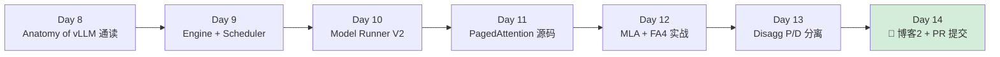
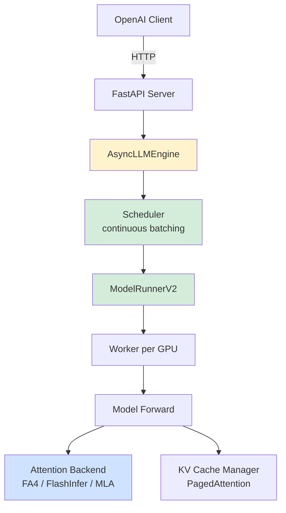
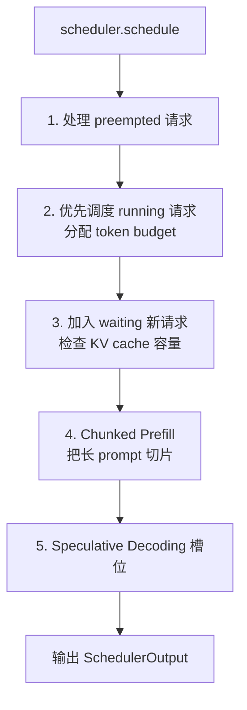
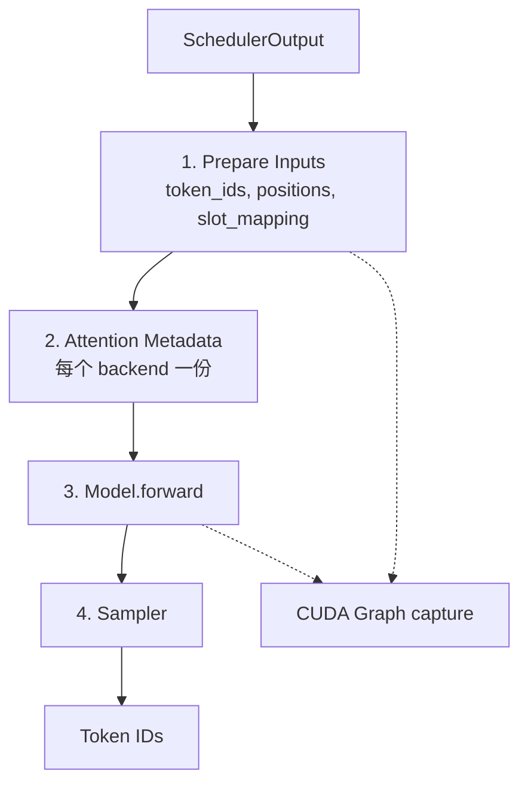
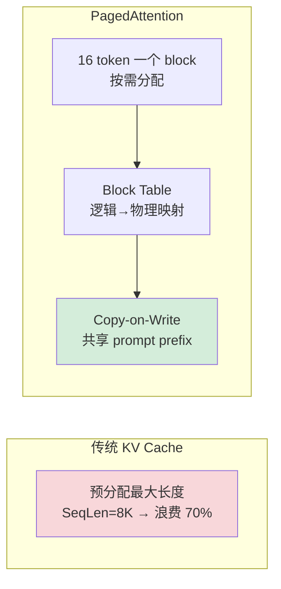
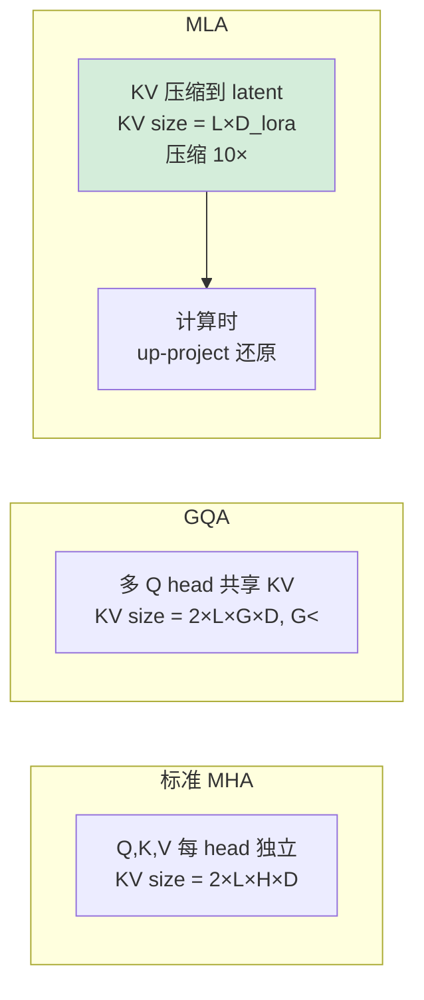
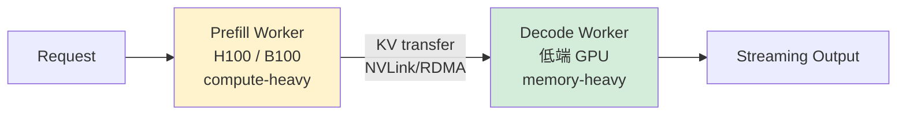

# Week 2：vLLM v0.20 源码深读 + MLA + FA4（Day 8-14）

> **目标**：从"会用 vLLM"到"能改 vLLM 源码 + 提交 1 个 PR + 部署 DeepSeek V4 / Qwen3.6"。
>
> **Week 2 是整个 30 天计划的核心**——读懂 vLLM 是国内大模型推理岗的硬门槛。
>
> **环境**：本地 PRO 6000 96GB + vLLM v0.20.1 (Day 1 已装)。

---

## Week 2 总览



**Week 2 最终交付：**
- ✅ 一份 vLLM v0.20.1 架构笔记（10K 字，含调用栈图）
- ✅ 1 个 vLLM PR（哪怕是文档/小 bug fix 也行，目的是熟悉流程）
- ✅ DeepSeek V4 蒸馏版 / Qwen3.6-27B-FP8 在本地跑通
- ✅ 博客 2：《vLLM v0.20 Model Runner V2 源码解析》

---

## Day 8：Anatomy of vLLM 精读 + 架构总览（2026-05-14，周四）

### 上午（4h）：精读官方长文

**必读（精读，做笔记）：**
- 🌟 [Anatomy of vLLM (2025-09-05)](https://blog.vllm.ai/2025/09/05/anatomy-of-vllm.html) - **vLLM 团队亲自写的官方导读**

**笔记要点：**



### 下午（4h）：源码导航 + 关键文件清单

```bash
git clone https://github.com/vllm-project/vllm
cd vllm && git checkout v0.20.1
uv pip install -e .  # editable install（用 Day 1 的 venv）
```

**必读文件（按顺序）：**

| 文件 | 行数 | 角色 |
|---|---|---|
| `vllm/entrypoints/openai/api_server.py` | ~600 | HTTP 入口 |
| `vllm/v1/engine/async_llm.py` | ~500 | 异步引擎 |
| `vllm/v1/engine/core.py` | ~800 | 调度循环 |
| `vllm/v1/core/sched/scheduler.py` | ~1200 | 连续批处理调度器 |
| `vllm/v1/core/kv_cache_manager.py` | ~600 | KV cache 块管理 |
| `vllm/v1/worker/gpu_model_runner.py` | ~2000 | **Model Runner V2 核心** |
| `vllm/v1/attention/backends/flash_attn.py` | ~800 | FA backend |
| `vllm/v1/attention/backends/mla/` | - | MLA backend (DeepSeek) |
| `vllm/model_executor/models/qwen3_5.py` | - | **你部署的 27B-FP8 走这个** |
| `vllm/model_executor/models/qwen3_5_mtp.py` | - | Qwen3.6 MTP head |

### 晚上（1h）：建立调用栈
画出完整调用链：用户请求 → response 的每一层调用，画在 Excalidraw 上

### Checkpoint
- [ ] Anatomy 长文做完笔记（5K 字）
- [ ] 能画出 vLLM 7 层架构图
- [ ] 知道 V0 vs V1 vs V2 引擎的演进（V2 是 2026 年新版）

---

## Day 9：Engine + Scheduler 源码（2026-05-15，周五）

### 上午（4h）：AsyncLLMEngine 主循环

**核心文件：`vllm/v1/engine/core.py`**

```python
# 简化版主循环
class EngineCore:
    def step(self):
        # 1. 取出新请求
        new_reqs = self.input_queue.get_nowait()
        # 2. 调度（决定本 step 跑哪些请求 + 多少 token）
        scheduler_output = self.scheduler.schedule()
        # 3. 模型 forward（核心！）
        model_output = self.model_runner.execute(scheduler_output)
        # 4. 后处理（采样、stop token 检测）
        outputs = self._process(model_output)
        # 5. 流式发回客户端
        self.output_queue.put(outputs)
```

**重点理解：**
- 为什么是同步 step 循环（vs 异步）
- 调度发生在 forward 之前
- prefill 和 decode 在同一 step 混合执行（chunked prefill）

### 下午（4h）：Scheduler 深读

**文件：`vllm/v1/core/sched/scheduler.py`**

**关键算法：**



**必读：**
- 📝 [Continuous Batching 原理 - Anyscale](https://www.anyscale.com/blog/continuous-batching-llm-inference)
- 📝 [Chunked Prefill 论文 - SARATHI](https://arxiv.org/abs/2308.16369)

### 晚上（1h）：手画调度时序图
模拟 4 个不同长度请求进入，画出 5 个 step 内的调度时序

### Checkpoint
- [ ] 能解释 continuous batching 与传统 static batching 的区别
- [ ] 知道 chunked prefill 的 budget 怎么算
- [ ] 在 scheduler.py 里找到 preemption 的 5 个触发条件

---

## Day 10：Model Runner V2 深读（2026-05-16，周六）

> **MRV2 是 2026 年 vLLM 的新核心**，旧的 ModelRunner 已废弃

### 上午（4h）：MRV2 总体架构

**文件：`vllm/v1/worker/gpu_model_runner.py` (2000+ 行)**



**关键概念：**
- **Persistent Batch**：跨 step 复用 GPU tensor（避免反复 CPU→GPU 拷贝）
- **Attention Metadata**：每个 backend 自定义元数据（slot mapping, block table）
- **CUDA Graph**：把 decode 阶段录制成 graph，省 launch overhead

### 下午（4h）：CUDA Graph 与 Piecewise Capture

**为什么 Decode 必须用 CUDA Graph：**
- Decode 一次只生成 1 token，单 step 极快（毫秒级）
- 每个 kernel launch 有 ~10μs overhead，叠加几十层会成为瓶颈
- CUDA Graph 把整个 forward 一次性录制，重放只需 1 次 launch

**vLLM 的 Piecewise CUDA Graph：**
- 不能整图录制（变长 attention 不友好）
- 拆成 "embed + layer × N + sampler" 多段录制
- 切到 attention 时退回 eager 模式

**实操：**
```bash
VLLM_LOGGING_LEVEL=DEBUG vllm serve ~/models/Qwen3.6-27B-FP8 --max-model-len 32768
# 看启动日志里的 "Capturing CUDA graph for shape ..."
```

### 晚上（1h）：调试技巧
```python
# 在 gpu_model_runner.py 加断点
import torch
torch.cuda.synchronize()
print(f"step {step_idx}: prefill={n_prefill}, decode={n_decode}")
```

### Checkpoint
- [ ] 能画出 MRV2 一次 step 的完整流程图
- [ ] 能在源码中定位 CUDA graph capture 的代码段
- [ ] 知道 Persistent Batch 解决什么问题

---

## Day 11：PagedAttention + KV Cache Manager（2026-05-17，周日）

### 上午（4h）：PagedAttention 论文 + 源码

**必读：**
- 📄 [vLLM 论文 (Kwon 2023)](https://arxiv.org/abs/2309.06180) - PagedAttention 原始论文
- 源码：`vllm/v1/core/kv_cache_manager.py`

**核心思想：**



### 下午（4h）：Prefix Caching 实战（Coding Agent 杀手锏）

**为什么 Prefix Caching 是 Coding Agent 杀手锏：**
- Agent 每次请求 system prompt + tool定义都一样（5K-20K token）
- 命中 prefix cache，TTFT 从 1.5s 降到 100ms
- 算力节省 90%+

**vLLM v0.20.1 启用：**
```bash
vllm serve ~/models/Qwen3.6-27B-FP8 \
  --enable-prefix-caching \
  --prefix-caching-hash-algo builtin  # 或 sha256
```

**源码定位：**
- `vllm/v1/core/kv_cache_manager.py` 的 `find_longest_cache_hit`
- 哈希算法：`vllm/v1/core/block_pool.py`

### 晚上（1h）：自己实现简化版
写 100 行 Python 模拟 PagedAttention 的 block 分配 + prefix 复用（为 Week 4 项目铺垫）

### Checkpoint
- [ ] 能解释 block_size 选 16 的原因
- [ ] 跑 benchmark 对比 prefix_caching on/off 的 TTFT 差异
- [ ] 找到 vLLM 中 KV cache 总块数的计算公式

---

## Day 12：MLA + FlashAttention 4 实战（2026-05-18，周一）

### 上午（4h）：MLA (Multi-head Latent Attention) 原理

**为什么重要：**
- DeepSeek V2/V3/V4 的核心创新
- KV cache 压缩 10×（512维 latent vs 5120维原始）
- 2026 年新模型几乎都用 MLA

**必读：**
- 📄 [DeepSeek-V2 论文](https://arxiv.org/abs/2405.04434) - MLA 提出
- 📄 [DeepSeek-V3 技术报告](https://arxiv.org/abs/2412.19437)
- 📄 [FlashMLA 仓库](https://github.com/deepseek-ai/FlashMLA) - DeepSeek 开源 kernel



### 下午（4h）：vLLM 跑 DeepSeek + 安装 FA4

```bash
# 安装 FA4（Blackwell 专属，CUDA 13 wheel）
uv pip install "flash-attn-4[cu13]"

# DeepSeek V3 671B MoE 单卡跑不动，跑蒸馏版
vllm serve deepseek-ai/DeepSeek-V3-Distill-Qwen-32B \
  --max-model-len 32768 \
  --gpu-memory-utilization 0.92

# Qwen3.6-27B-FP8 + FA4 backend
VLLM_ATTENTION_BACKEND=FLASH_ATTN_V4 \
vllm serve ~/models/Qwen3.6-27B-FP8 \
  --max-model-len 65536
```

**源码定位：**
- `vllm/v1/attention/backends/mla/common.py`
- `vllm/v1/attention/backends/flash_attn.py` 的 v4 分支

### 晚上（1h）：FA4 论文精读
- 📄 [FlashAttention-4 (2025)](https://tridao.me/blog/2025/flash4/)
- 重点：Blackwell wgmma + TMA 多级 pipeline

### Checkpoint
- [ ] 能解释 MLA 与 GQA 的本质区别
- [ ] 跑通至少 1 个 MLA 模型（DeepSeek 蒸馏版）
- [ ] 用 nsys 抓 FA4 vs FA3 的 kernel 时间差

---

## Day 13：Disaggregated Serving (P/D 分离)（2026-05-19，周二）

### 上午（4h）：P/D 分离原理

**为什么要 P/D 分离：**
- Prefill 是 compute-bound（吃算力）
- Decode 是 memory-bound（吃带宽）
- 同一 GPU 同时跑会互相争抢，goodput 下降
- 分到不同 GPU/集群，每边都能打满



**必读：**
- 📄 [DistServe 论文](https://arxiv.org/abs/2401.09670) - P/D 分离开创
- 📄 [Mooncake 论文](https://arxiv.org/abs/2407.00079) - Moonshot 实践
- 📝 [vLLM Disaggregated Prefilling 文档](https://docs.vllm.ai/en/latest/features/disagg_prefill.html)

### 下午（4h）：本地模拟 P/D（单卡 2 进程）

> ⚠️ 单卡 PRO 6000 没法真正模拟 P/D 增益，但可以跑通 KV transfer 流程，验证理解。

```bash
# 终端 1：Prefill server（跑较小模型避免显存冲突）
CUDA_VISIBLE_DEVICES=0 \
vllm serve ~/models/Qwen3.6-27B-FP8 \
  --port 8001 --max-model-len 16384 --gpu-memory-utilization 0.4 \
  --kv-transfer-config '{"kv_role":"producer", "kv_buffer_size":5e9}'

# 终端 2：Decode server
CUDA_VISIBLE_DEVICES=0 \
vllm serve ~/models/Qwen3.6-27B-FP8 \
  --port 8002 --max-model-len 16384 --gpu-memory-utilization 0.4 \
  --kv-transfer-config '{"kv_role":"consumer", "kv_buffer_size":5e9}'

# 终端 3：Proxy
python examples/online_serving/disaggregated_prefill_proxy.py
```

### 晚上（1h）：阅读
- 📝 [LMCache 项目](https://github.com/LMCache/LMCache) - 开源 KV transfer 层

### Checkpoint
- [ ] 能解释 P/D 分离的 goodput 提升机制
- [ ] 本地跑通最简 P/D demo（哪怕 2 进程）
- [ ] 知道 Mooncake / DistServe / Splitwise 三种方案差异

---

## Day 14：博客 2 + 提交 vLLM PR（2026-05-20，周三）

### 上午（4h）：找一个能改的 vLLM issue

**新手友好 PR 类型：**

| 类型 | 难度 | 找的方法 |
|---|---|---|
| 文档错别字 | ⭐ | docs/ 目录通读 |
| 文档补充示例 | ⭐⭐ | label `documentation` |
| 测试用例补全 | ⭐⭐ | label `good first issue` |
| 小 bug fix | ⭐⭐⭐ | label `bug`, comment 数 < 3 |
| 新模型支持 | ⭐⭐⭐⭐ | label `new-model` |

**链接：**
- https://github.com/vllm-project/vllm/labels/good%20first%20issue
- https://github.com/vllm-project/vllm/contribute

**实操步骤：**
```bash
# 1. fork vLLM 到自己账号
# 2. clone fork
git clone https://github.com/YOUR/vllm
cd vllm
git remote add upstream https://github.com/vllm-project/vllm
git checkout -b fix/my-issue

# 3. 改代码 + 跑测试
pytest tests/v1/test_xxx.py

# 4. 签 DCO（重要！）
git commit -s -m "fix: blah"

# 5. 提 PR，标题格式：[Bug][V1] xxx
```

### 下午（4h）：写博客 2

**博客 2 题目：《vLLM v0.20 Model Runner V2 源码解析：从 Anatomy 到自己改源码》**

**大纲：**
1. 为什么读 vLLM 源码：国内大厂推理岗的必备技能
2. V0/V1/V2 引擎演进史（带 commit 链接）
3. MRV2 一次 step 的完整流程图（自绘）
4. PagedAttention 在 v0.20 的新优化（hash-based prefix cache）
5. MLA backend 怎么接入（DeepSeek V4 实战）
6. FA4 在 Blackwell PRO 6000 上的性能数字（自测，附 nsys 截图）
7. 我提交的第一个 PR（链接 + 心得）

### 晚上（1h）：Week 3 准备
- 安装 Triton：已在 Day 1 装好
- 浏览 [Triton tutorials](https://triton-lang.org/main/getting-started/tutorials/index.html)
- 准备 Day 17 NVFP4 量化：`uv pip install llmcompressor`

### Checkpoint
- [ ] vLLM PR 提交（哪怕未 merged，链接放简历）
- [ ] 博客 2 发布
- [ ] DeepSeek 蒸馏版 + Qwen3.6-27B-FP8 + Llama 4 任意 2 个跑通

---

## Week 2 失败兜底

| 风险 | 兜底 |
|---|---|
| 源码读不进去 | 强制只读 5 个核心文件，其他跳过 |
| MLA / DeepSeek 跑不起来 | 改跑 Qwen3.6-27B-FP8（更简单） |
| PR 找不到 | 写一个新文档（如 "vLLM on PRO 6000 Blackwell 部署指南"）也算 |
| FA4 编译失败 | 退回 FA3，但博客里说明原因 |
| Blackwell SM10.0 在某些 backend 报 unsupported | 换 backend 重试，把过程写进博客 |

---

## Week 2 成功标准

✅ **必须达成：**
1. 能在白板讲清 vLLM 7 层调用栈
2. 在源码中能 5 分钟定位任意功能（scheduler/kv cache/attention backend）
3. 至少 1 个真实 vLLM 仓库 PR（status 不限）

🎯 **加分项：**
1. PR 被 merge
2. 博客被官方 vLLM 推特/微信群转发

---

## 下一步

→ [04-week3.md](./04-week3.md) Week 3：Triton kernel + 量化 + P-EAGLE
