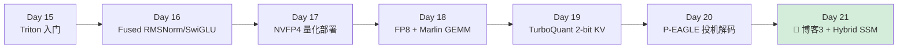
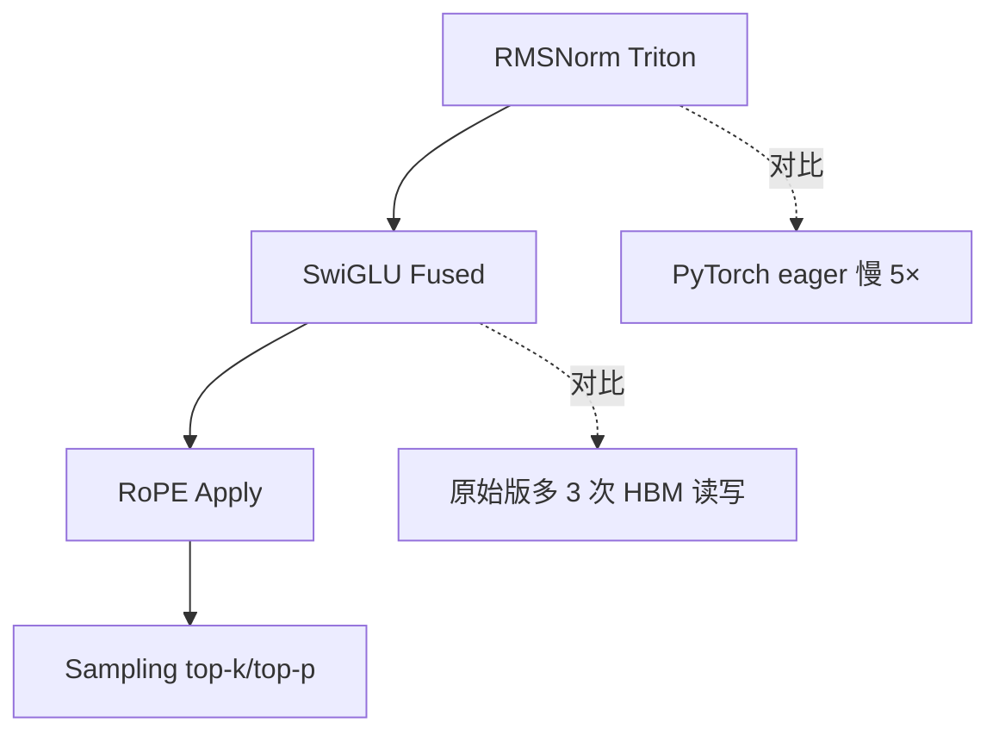
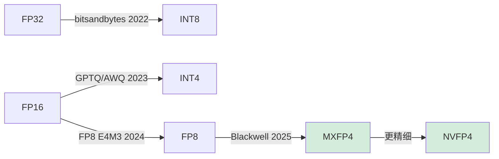
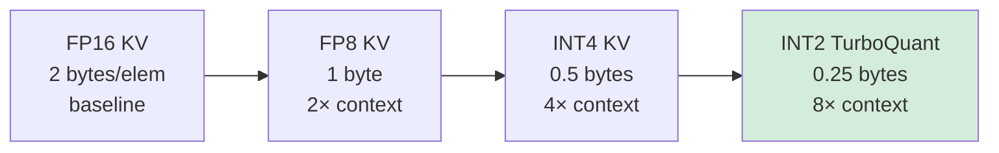
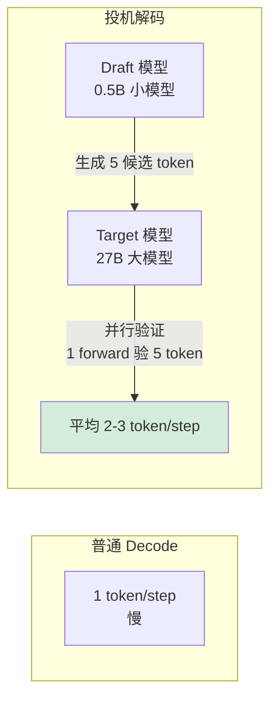

# Week 3：Triton Kernel + 量化 + 投机解码（Day 15-21）

> **目标**：掌握**自己写 fused kernel** + **量化部署 NVFP4/FP8** + **投机解码 P-EAGLE** 三大进阶技能。
>
> **Week 3 是简历"差异化"关键**——会写 Triton kernel 是和应届生区别的硬指标。
>
> **环境**：本地 PRO 6000 96GB + vLLM v0.20.1，Qwen3.6-27B-FP8 已部署。
>
> **每日学习流程**：① 读今日面试题 → ② 去 ~/3rd/vllm 找对应源码 + 看 Triton tutorial → ③ 回答面试题 → ④ 手写 kernel/做实验 → ⑤ AI 反向检查 → ⑥ 写每日笔记（progress.md ≤30 行）

---

## Week 3 总览



**Week 3 最终交付：**
- ✅ 5 个 Triton fused kernel（GitHub）
- ✅ Qwen3.6-27B 的 NVFP4 量化模型（HuggingFace 上传，自己产出 vs Qwen 官方 FP8）
- ✅ P-EAGLE 投机解码 demo（吐字速度 2-3×）
- ✅ 博客 3：《Blackwell sm_120 (PRO 6000 Workstation) 上的 NVFP4 量化与 FA4 实战 —— 兼论与 sm_100 (B100/B200) 的差异》

> **Blackwell sm_120 自验提示**：vLLM 官方量化兼容性表当前 (2026-05) 仅列到 Hopper。NVFP4 / FP8 / TurboQuant 在 Blackwell sm_120（PRO 6000 Workstation）上能否跑通需自行验证。注意 sm_120 **没有 tcgen05 / TMEM**，部分 NVFP4 优化路径（依赖 tcgen05.mma.block_scale）在 CUDA 13.0 cicc 中尚未为 sm_120 emit；CUDA 13.1+ 走 mma.sync.block_scale 路径。每个 Day 末尾记录"实测可用 / 报错 / 兜底方案"到 `progress.md`。

---

## Day 15：Triton 入门 + Vector Add（2026-05-21，周四）

### 🎯 今日面试题（八股来源：[08-job-strategy.md §4.2](./08-job-strategy.md)）
- Q26: Triton vs CUDA 的取舍？什么场景用 Triton 更合适？（C.26）

### 上午（4h）：Triton 哲学

**为什么学 Triton（vs 纯 CUDA）：**

| 维度 | CUDA | Triton |
|---|---|---|
| 学习成本 | 高（warp/shared mem 手动管） | 低（block 级抽象）|
| 性能 | 极致 | 95% 接近极致 |
| 工程效率 | 慢 | 快 5-10× |
| 主流程度 | 系统级必备 | LLM 推理首选 |

**vLLM/SGLang 70%+ 自定义 kernel 都是 Triton 写的**。

### 下午（4h）：Triton hello world

```python
import torch
import triton
import triton.language as tl

@triton.jit
def vec_add_kernel(x_ptr, y_ptr, out_ptr, n, BLOCK: tl.constexpr):
    pid = tl.program_id(0)
    offsets = pid * BLOCK + tl.arange(0, BLOCK)
    mask = offsets < n
    x = tl.load(x_ptr + offsets, mask=mask)
    y = tl.load(y_ptr + offsets, mask=mask)
    tl.store(out_ptr + offsets, x + y, mask=mask)

def vec_add(x, y):
    out = torch.empty_like(x)
    n = x.numel()
    grid = (triton.cdiv(n, 1024),)
    vec_add_kernel[grid](x, y, out, n, BLOCK=1024)
    return out
```

**对比 CUDA 版**：5 行 Python vs 50 行 CUDA + Makefile

### 晚上（1h）：必读
- 🌟 [Triton 官方 tutorial 1-5](https://triton-lang.org/main/getting-started/tutorials/index.html)
- 📝 [GPU MODE Triton lecture](https://www.youtube.com/@GPUMODE)

### Checkpoint
- [ ] vec_add Triton 版跑通
- [ ] softmax Triton 版（tutorial 02）跑通
- [ ] 性能对比 PyTorch（应该接近或超过）

---

## Day 16：Fused Kernel for LLM（2026-05-22，周五）

### 🎯 今日面试题
- Q26: Triton vs CUDA 的取舍？复习（C.26）
- Q10: Sampling 中 temperature/top-k/top-p/repetition_penalty 的作用？（A.10）

### 上午（4h）：写 4 个 LLM 必备 fused kernel



**示例：Fused RMSNorm**

```python
@triton.jit
def rms_norm_kernel(x_ptr, w_ptr, out_ptr, n_cols, eps,
                     BLOCK: tl.constexpr):
    row = tl.program_id(0)
    cols = tl.arange(0, BLOCK)
    mask = cols < n_cols

    x = tl.load(x_ptr + row * n_cols + cols, mask=mask, other=0.0)
    var = tl.sum(x * x, axis=0) / n_cols
    rstd = 1.0 / tl.sqrt(var + eps)
    w = tl.load(w_ptr + cols, mask=mask)
    tl.store(out_ptr + row * n_cols + cols, x * rstd * w, mask=mask)
```

### 下午（4h）：FlashAttention Triton 简化版

**任务：写一个 ~64 行的 forward-only FlashAttention**
- 参考 Triton tutorial 06 (`fused-attention.py`)
- 不要求性能极致，要求理解 online softmax + block GEMM

### 晚上（1h）：性能对比
```bash
# 用 nsys 测自己 kernel vs vLLM 默认 kernel
nsys profile --stats=true python my_kernel_bench.py
```

### Checkpoint
- [ ] 4 个 fused kernel 跑通且数值正确（vs PyTorch 对照）
- [ ] 至少 1 个 kernel 性能 ≥ PyTorch eager 2×
- [ ] 64 行 FlashAttention 能跑（不要求快）

---

## Day 17：NVFP4 量化部署（2026-05-23，周六）

### 🎯 今日面试题
- Q20: KV Cache 量化（FP16 → FP8 → INT4 → INT2 TurboQuant）的精度和容量 tradeoff？（B.20）
- Q19: 投机解码 原理 + 什么时候 ROI 高/低？EAGLE 和 vanilla SpecDec 区别？（B.19）

> **NVFP4 是 Blackwell 的杀手锏**，简历里写"NVFP4 实战经验"是巨大加分项。
>
> ⚠️ Blackwell sm_120 + NVFP4 + Qwen3.6 这条路 vLLM 官方文档尚未明确背书，**今天的核心任务是"探出能不能"**，而不是"刷到完美精度"。注意 sm_120 上 NVFP4 走 mma.sync 路径（非 sm_100 的 tcgen05），CUDA 13.2 应已支持，但 cicc emit 状态需实测。

### 上午（4h）：量化基础理论

**精度演进：**



**NVFP4 vs MXFP4 区别：**
- **MXFP4**：32 元素共享 1 个 E8M0 scale（Open Compute 标准）
- **NVFP4**：16 元素共享 1 个 FP8 E4M3 scale（NVIDIA 私有，精度更高）
- Blackwell 第 5 代 Tensor Core 两者都原生支持，NVFP4 精度损失更小

**必读：**
- 📄 [NVIDIA NVFP4 技术博客](https://developer.nvidia.com/blog/introducing-nvfp4-for-efficient-and-accurate-low-precision-inference/)
- 📄 Microscaling (MX) Format Spec — Open Compute Project
- 📝 vLLM 仓库内 `vllm/model_executor/layers/quantization/nvfp4/` 模块源码（自己 grep）

### 下午（4h）：用 LLM Compressor 量化 Qwen3.6-27B（bf16 源版本）

```bash
uv pip install llmcompressor

# 量化脚本（bf16 → NVFP4，30-60 分钟，96GB 显存够）
# 注意：源模型必须是 bf16 版（Qwen/Qwen3.6-27B），不是已经 FP8 的版本
python -c "
from llmcompressor.transformers import oneshot
from llmcompressor.modifiers.quantization import QuantizationModifier

oneshot(
    model='/home/xuefeiz2/models/Qwen3.6-27B',
    recipe=QuantizationModifier(
        targets='Linear',
        scheme='NVFP4',
        ignore=['lm_head']
    ),
    output_dir='/home/xuefeiz2/models/Qwen3.6-27B-NVFP4'
)
"

# 部署
vllm serve /home/xuefeiz2/models/Qwen3.6-27B-NVFP4 \
  --quantization compressed-tensors \
  --max-model-len 65536
```

> ⚠️ **若量化或加载失败**：检查 llmcompressor 是否支持 qwen3_5 hybrid 架构 + Blackwell sm_120 NVFP4 emit（注意 sm_120 走 mma.sync.block_scale，非 sm_100 tcgen05 路径）。失败立即记录错误码，退回 Day 18 的 FP8 路线（仍是简历加分项）。

### 晚上（1h）：精度评估
```bash
uv pip install lm-eval
lm_eval --model vllm \
  --model_args pretrained=/home/xuefeiz2/models/Qwen3.6-27B-NVFP4 \
  --tasks gsm8k,mmlu \
  --batch_size 16
# 对比官方 Qwen3.6-27B-FP8 精度损失（应 <2%）
```

### Checkpoint
- [ ] NVFP4 量化模型跑通（成功 / 失败均记录到 progress.md）
- [ ] 显存占用 ~14 GB（27B 模型，NVFP4 约 0.5 byte/param）
- [ ] gsm8k 精度损失 <2%
- [ ] 上传到 HuggingFace（如成功，简历亮点）

---

## Day 18：FP8 + Marlin GEMM（2026-05-24，周日）

### 🎯 今日面试题
- Q20: KV Cache 量化 复习（B.20）

### 上午（4h）：FP8 量化（更稳的兜底）

**FP8 vs NVFP4 对比（基于公开资料 + 你今天自验）：**

| 维度 | FP8 (E4M3) | NVFP4 |
|---|---|---|
| 模型大小 | params × 1 byte | params × 0.5 byte |
| 精度损失 | <0.5% | 1-2% |
| 兼容性 | Hopper / Blackwell 原生 | 仅 Blackwell |
| Coding Agent 推荐 | ✅ 首选（已是 Day 1 的 baseline） | ⚠️ 需自验 |

**对照 baseline（Week 1 已部署的 Qwen 官方 FP8）：**
```bash
vllm serve /home/xuefeiz2/models/Qwen3.6-27B-FP8 \
  --max-model-len 65536 \
  --enable-prefix-caching
# 96GB 单卡可吃 27B FP8 + 200K context + 多并发
```

### 下午（4h）：Marlin / Machete GEMM kernel

**Marlin = INT4×FP16 fused GEMM**，是 vLLM 量化推理的核心 kernel 之一。

**任务：**
1. 读 vLLM 中 Marlin 调用代码：`vllm/model_executor/layers/quantization/` 下 marlin 相关文件
2. 跑 vLLM 自带 benchmark 对比 Marlin vs cuBLAS：
```bash
python benchmarks/kernels/benchmark_marlin.py
```

### 晚上（1h）：阅读
- 📄 [Marlin 论文 (IST-DASLab)](https://arxiv.org/abs/2408.11743)
- 📄 [Machete kernel 介绍 - Neural Magic](https://neuralmagic.com/blog/introducing-machete-a-mixed-input-gemm-kernel-optimized-for-nvidia-hopper-gpus/)

### Checkpoint
- [ ] 至少 2 个量化方案对比表（FP16 / FP8 / NVFP4 / INT4-Marlin），数据为本机实测
- [ ] 能解释 Marlin 为什么比 dequant→GEMM 快 4×
- [ ] 知道何时选 FP8 vs NVFP4 vs INT4

---

## Day 19：TurboQuant 2-bit KV Cache（2026-05-25，周一）

### 🎯 今日面试题
- Q20: KV Cache 量化 复习，重点准备 2-bit TurboQuant 与 INT4 的精度差（B.20）

> KV cache 容量再 ×4，长 context 神器。**Blackwell 上是否跑通同样需自验**。

### 上午（4h）：原理



**TurboQuant 关键技术：**
- 2-bit 不是简单截断，是 **vector quantization + Hadamard rotation**
- 精度损失 <2%（对比 FP16）
- 需配合特定 attention backend，开启前先 grep vLLM 仓库 `turboquant/` 目录确认当前可用范围

**必读（先 WebFetch 验证最新链接，不要硬抄）：**
- 📝 vLLM 仓库 `vllm/model_executor/layers/quantization/` 下 `turboquant` 相关文件 + release notes
- 📄 TurboQuant 原论文（自己用 arxiv 搜索 "TurboQuant KV cache 2-bit"，再确认 ID）

### 下午（4h）：实战

```bash
# 注意：Qwen3.6-27B 是 hybrid 架构（16 层 full attention + 48 层 linear attention）
# KV cache 主要在 16 层 full attention 上，FP8 KV 时 256K context 已经只占 ~8.4 GB
# 因此 TurboQuant 在你的本机上"显存收益"没那么夸张，更多是"能不能跑通 + 精度评估"
vllm serve /home/xuefeiz2/models/Qwen3.6-27B-FP8 \
  --kv-cache-dtype <实际名称以 v0.20.1 文档为准> \
  --max-model-len 262144  # 256K context
```

> ⚠️ `--kv-cache-dtype` 的具体取值（如 `int2_turbo` 是否真的支持）请先跑 `vllm serve --help | grep -i kv-cache-dtype` 看本地 v0.20.1 实际接受的值，**不要硬抄文档里的字符串**。

**测试：**
- 给 200K token 的代码库（你自己仓库即可），让模型总结（模拟 Coding Agent 长 context 场景）
- 对比 FP8 KV vs TurboQuant 的精度差异

### 晚上（1h）：Hybrid SSM 模型对照（与 Qwen3.6 hybrid 互参）
- Qwen3.6-27B 本身就是 hybrid（gated linear attention + full attention），今天可以做一组小实验：
  - 用 vLLM 跑 bf16 版 `Qwen/Qwen3.6-27B`，对比 FP8 版的 256K context decode TPS
  - 观察 hybrid 架构下 KV cache 实际占用 vs 纯 attention 模型公式

### Checkpoint
- [ ] TurboQuant 在 Qwen3.6-27B-FP8 上跑通 256K context（成功 / 失败均记录）
- [ ] 长 context QA 精度 vs FP8 KV 对比表
- [ ] 知道 hybrid 架构下 2-bit KV 的精度边界（哪些任务会崩）

---

## Day 20：P-EAGLE 投机解码（2026-05-26，周二）

### 🎯 今日面试题
- Q19: 投机解码 原理 + 什么时候 ROI 高/低？EAGLE 和 vanilla SpecDec 区别？（B.19）
- Q6: Chunked Prefill 是什么？解决什么问题？token budget 怎么选？（A.6）

> **[jobs] 关联任务**: T-010（给 Qwen3.6-27B-FP8 启用 `--speculative-config` MTP，实测加速比与精度漂移）。对比 baseline / MTP-on，跑 humaneval 子集 50 题。

### 上午（4h）：投机解码原理



**演进：**
- **Speculative Decoding (2023)**：原始版
- **EAGLE (2024)**：用大模型 hidden state 做 draft，加速更高
- **EAGLE-2 (2024)**：动态 draft tree
- **P-EAGLE (2025)**：并行 draft，进一步提速

**MTP 路径补充**：Qwen3.6-27B 配置里带 MTP head，vLLM v0.20.1 有 `qwen3_5_mtp.py` 原生支持。今天可以同时尝试 MTP 自带的 multi-token prediction，与外挂 P-EAGLE 做对比。

### 下午（4h）：vLLM 启用 P-EAGLE / MTP

```bash
# 路线 A：MTP（最简单，模型自带）
vllm serve /home/xuefeiz2/models/Qwen3.6-27B-FP8 \
  --speculative-config '{"method": "mtp", "num_speculative_tokens": 3}'

# 路线 B：P-EAGLE（需要外部 draft 模型，先确认 HF 上是否真的有对应 EAGLE 权重）
# 若找不到 Qwen3.6 的 EAGLE draft，退回 MTP 即可，不要硬编造模型名
```

**Benchmark 对比：**
```bash
# 关 SpecDec
vllm bench latency --model /home/xuefeiz2/models/Qwen3.6-27B-FP8 --num-iters 100
# 开 MTP / P-EAGLE
vllm bench latency --model /home/xuefeiz2/models/Qwen3.6-27B-FP8 \
  --speculative-config '...'
# 期望吞吐 1.5-3×
```

**必读：**
- 📄 [EAGLE 系列 GitHub](https://github.com/SafeAILab/EAGLE)
- 📝 [vLLM speculative decoding 文档](https://docs.vllm.ai/en/latest/features/spec_decode.html)（先 WebFetch 确认链接仍有效）

### 晚上（1h）：理解局限
- 投机解码不省算力（甚至更耗），只省延迟
- batch>16 时收益下降（GPU 已饱和）
- Coding Agent (低并发) 是最佳场景

### Checkpoint
- [ ] MTP 或 P-EAGLE 至少跑通一种，得出本机吐字速度提升数据
- [ ] 能解释为什么 batch 大了不划算
- [ ] 找到 vLLM 中 spec_decode 的核心调度逻辑
- [ ] **[jobs] T-010 ✓**: MTP 加速比 + humaneval 精度差记录到 progress.md

---

## Day 21：博客 3 + Hybrid 架构小结（2026-05-27，周三）

### 🎯 今日面试题（Week 3 总复习）
- Q19-26 全部复习（投机解码 / KV 量化 / Triton / Tensor Core / FlashAttention）
- Q8: GQA/MQA/MHA/MLA 区别复习（A.8）

### 上午（4h）：Qwen3.6 Hybrid 架构深读 + 与 Mamba 系对照

**为什么重要：**
- Mamba/SSM 是 Transformer 的潜在替代
- **你正在用的 Qwen3.6-27B 本身就是 hybrid (gated linear attention + full attention)**，已是这个方向的工业落地
- vLLM v0.20.1 原生 `qwen3_5.py` 支持 hybrid

**对比：**

| 架构 | KV Cache | 长 context 复杂度 | 代表模型 |
|---|---|---|---|
| Transformer | O(N) | O(N²) | Llama 3 |
| Pure Mamba | O(1) state | O(N) | Mamba |
| Hybrid (Mamba 风) | 部分 KV | O(N) avg | Nemotron-H, Jamba, Zamba |
| Hybrid (Linear Attn 风) | 16 层 full + 48 层 linear | O(N) avg | **Qwen3.6** |

**任务**：在源码里找到 Qwen3.6 hybrid 的实现（`vllm/model_executor/models/qwen3_5.py`），画出 64 层中哪些层是 full attention、哪些是 linear，并解释 KV cache 为何只挂在 full attention 层上。

### 下午（4h）：写博客 3

**博客 3 题目：《Blackwell sm_120 实战：NVFP4 / FP8 + FA4 + MTP 让 Qwen3.6-27B 在单卡 PRO 6000 96GB 上吃满 256K context —— 顺带说清 sm_120 与 sm_100 的真实差异》**

**大纲：**
1. Blackwell 第 5 代 Tensor Core 与 NVFP4 / MXFP4
2. LLM Compressor 量化 Qwen3.6-27B 全流程（含 HuggingFace 链接，如成功）+ Blackwell 兼容性踩坑
3. FA4 vs FA3 在 PRO 6000 96GB 上的实测（带 nsys 截图）
4. TurboQuant / FP8 KV 让 256K context 成为可能（hybrid 架构下的实际占用）
5. MTP / P-EAGLE 投机解码：Coding Agent 场景下的吐字速度提升
6. 综合 benchmark：纯 BF16 vs 全栈优化（量化 + FA4 + Spec + 长 KV）

**核心图表（实测数字，不要照抄旧版本）：**
```
Qwen3.6-27B 优化前后 (PRO 6000 96GB, 单卡)
                    TTFT (8K)   Decode TPS    Max Context
原版 BF16            ?           ?              ~64K
官方 FP8             ?           ?              ~200K
+ FA4                ?           ?              ~200K
+ MTP / P-EAGLE      ?           ? (×1.5-3)    ~200K
+ TurboQuant / FP8 KV ?           ?              256K
```
> 表格里的 `?` 必须由你这周实测填入，**不准照搬任何博客的现成数字**。

### 晚上（1h）：Week 4 准备
- clone Week 4 要参考的 mini 项目：
  - [llm.c (karpathy)](https://github.com/karpathy/llm.c)
  - [llama2.c (karpathy)](https://github.com/karpathy/llama2.c)
  - 浏览 vLLM v0.20.1 `vllm/v1/` 目录，确定 mini-vLLM 要复刻哪几个核心组件

### Checkpoint
- [ ] 博客 3 发布
- [ ] HuggingFace 上传 NVFP4 量化模型（如 Day 17 成功）
- [ ] Qwen3.6 hybrid 架构层分布图画出来

---

## Week 3 失败兜底

| 风险 | 兜底 |
|---|---|
| Triton kernel 不收敛 / 数值不对 | 用 PyTorch 模拟先验证算法，再翻译 |
| NVFP4 在 Blackwell sm_120 报 unsupported（sm_120 无 tcgen05） | 退回官方 FP8（Day 1 已 baseline，简历依然加分），博客里把"sm_120 没 tcgen05"作为差异化论点 |
| TurboQuant v0.20.1 不稳定 / 选项不存在 | 用 FP8 KV 替代，效果接近 |
| P-EAGLE 找不到 Qwen3.6 draft 模型 | 用 MTP（模型自带），或外挂任意 0.5-1B 小模型 |
| 长 context 测试 OOM | 降 max-model-len 到 128K，hybrid 下显存极宽裕 |
| RAM 不足导致量化 OOM | 加 swap 或先升级到 64GB+ DDR5 |

---

## Week 3 成功标准

✅ **必须达成：**
1. 能独立写 fused Triton kernel（≥3 个）
2. 至少完成 1 种量化方案（FP8 baseline 或 NVFP4 自产）端到端部署
3. 投机解码 demo（MTP 或 P-EAGLE）能跑出 ≥1.5× 加速

🎯 **加分项：**
1. NVFP4 模型上传 HF 且有人 download
2. 博客 3 被技术圈大 V 转发
3. 自己写的 Triton kernel 性能 ≥ vLLM 默认版

---

## 下一步

→ [05-week4.md](./05-week4.md) Week 4：Mini-vLLM 项目 + 求职冲刺
