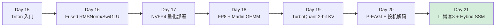
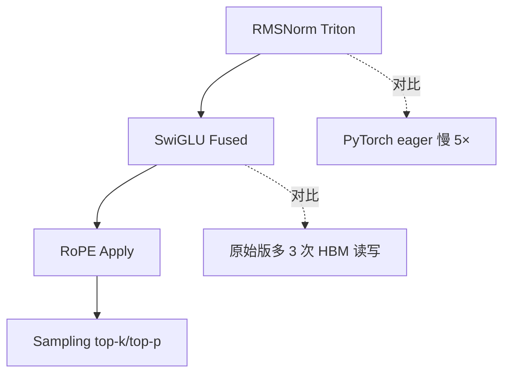
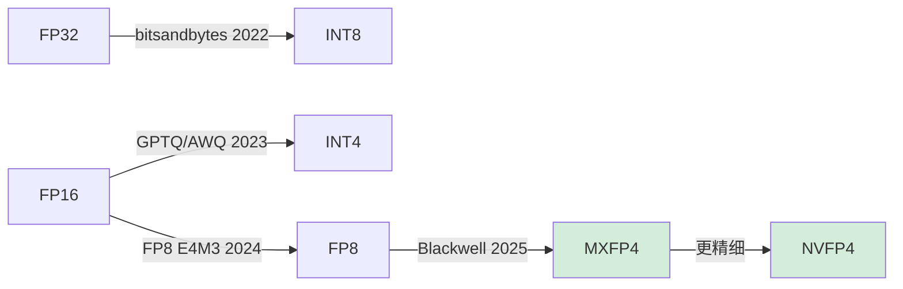
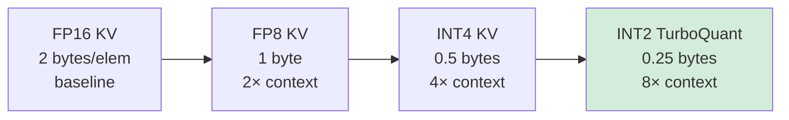
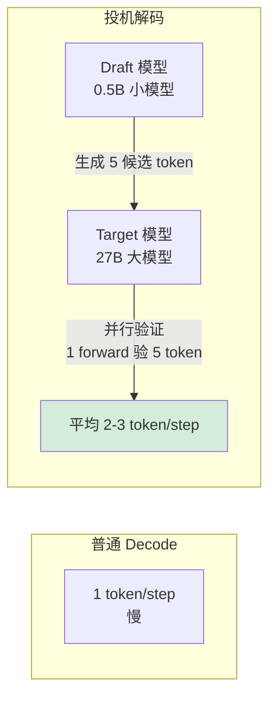

# Week 3：Triton Kernel + 量化 + 投机解码（Day 15-21）

> **目标**：掌握**自己写 fused kernel** + **量化部署 NVFP4/FP8** + **投机解码 P-EAGLE** 三大进阶技能。
>
> **Week 3 是简历"差异化"关键**——会写 Triton kernel 是和应届生区别的硬指标。

---

## Week 3 总览



**Week 3 最终交付：**
- ✅ 5 个 Triton fused kernel（GitHub）
- ✅ Qwen3.6 27B 的 NVFP4 量化模型（HuggingFace 上传）
- ✅ P-EAGLE 投机解码 demo（吐字速度 2-3×）
- ✅ 博客 3：《Blackwell SM 10.0 上的 NVFP4 量化与 FA4 实战》

---

## Day 15：Triton 入门 + Vector Add（5月16日）

### 上午（4h）：Triton 哲学

**为什么学 Triton（vs 纯 CUDA）：**

| 维度 | CUDA | Triton |
|---|---|---|
| 学习成本 | 高（warp/shared mem 手动管） | 低（block 级抽象）|
| 性能 | 极致 | 95% 接近极致 |
| 工程效率 | 慢 | 快 5-10× |
| 主流程度 | 系统级必备 | LLM 推理首选 |

**vLLM/SGLang 70%+ 自定义 kernel 都是 Triton 写的**。

### 下午（4h）：Triton hello world

```python
import triton
import triton.language as tl

@triton.jit
def vec_add_kernel(x_ptr, y_ptr, out_ptr, n, BLOCK: tl.constexpr):
    pid = tl.program_id(0)
    offsets = pid * BLOCK + tl.arange(0, BLOCK)
    mask = offsets < n
    x = tl.load(x_ptr + offsets, mask=mask)
    y = tl.load(y_ptr + offsets, mask=mask)
    tl.store(out_ptr + offsets, x + y, mask=mask)

def vec_add(x, y):
    out = torch.empty_like(x)
    n = x.numel()
    grid = (triton.cdiv(n, 1024),)
    vec_add_kernel[grid](x, y, out, n, BLOCK=1024)
    return out
```

**对比 CUDA 版**：5 行 Python vs 50 行 CUDA + Makefile

### 晚上（1h）：必读
- 🌟 [Triton 官方 tutorial 1-5](https://triton-lang.org/main/getting-started/tutorials/index.html)
- 📝 [GPU MODE Triton lecture](https://www.youtube.com/@GPUMODE)

### Checkpoint
- [ ] vec_add Triton 版跑通
- [ ] softmax Triton 版（tutorial 02）跑通
- [ ] 性能对比 PyTorch（应该接近或超过）

---

## Day 16：Fused Kernel for LLM（5月17日）

### 上午（4h）：写 4 个 LLM 必备 fused kernel



**示例：Fused RMSNorm**

```python
@triton.jit
def rms_norm_kernel(x_ptr, w_ptr, out_ptr, n_cols, eps,
                     BLOCK: tl.constexpr):
    row = tl.program_id(0)
    cols = tl.arange(0, BLOCK)
    mask = cols < n_cols

    x = tl.load(x_ptr + row * n_cols + cols, mask=mask, other=0.0)
    var = tl.sum(x * x, axis=0) / n_cols
    rstd = 1.0 / tl.sqrt(var + eps)
    w = tl.load(w_ptr + cols, mask=mask)
    tl.store(out_ptr + row * n_cols + cols, x * rstd * w, mask=mask)
```

### 下午（4h）：FlashAttention Triton 简化版

**任务：写一个 64 行的 forward-only FlashAttention**
- 参考 Triton tutorial 06 (`fused-attention.py`)
- 不要求性能极致，要求理解 online softmax + block GEMM

### 晚上（1h）：性能对比
```bash
# 用 nsys 测自己 kernel vs vLLM 默认 kernel
nsys profile --stats=true python my_kernel_bench.py
```

### Checkpoint
- [ ] 4 个 fused kernel 跑通且数值正确（vs PyTorch 对照）
- [ ] 至少 1 个 kernel 性能 ≥ PyTorch eager 2×
- [ ] 64 行 FlashAttention 能跑（不要求快）

---

## Day 17：NVFP4 量化部署（5月18日）

> **NVFP4 是 Blackwell 的杀手锏**，简历里写"NVFP4 实战经验"是巨大加分项

### 上午（4h）：量化基础理论

**精度演进：**



**NVFP4 vs MXFP4 区别：**
- **MXFP4**：32 元素共享 1 个 E8M0 scale（Open Compute 标准）
- **NVFP4**：16 元素共享 1 个 FP8 E4M3 scale（NVIDIA 私有，精度更高）
- Blackwell 两者都原生支持，NVFP4 精度损失更小

**必读：**
- 📄 [NVIDIA NVFP4 技术博客](https://developer.nvidia.com/blog/introducing-nvfp4-for-efficient-and-accurate-low-precision-inference/)
- 📄 [Microscaling (MX) Format Spec](https://www.opencompute.org/documents/ocp-microscaling-formats-mx-v1-0-spec-final-pdf)

### 下午（4h）：用 LLM Compressor 量化 Qwen3.6 27B

```bash
pip install llmcompressor

# 量化脚本（30 分钟出结果）
python -c "
from llmcompressor.transformers import oneshot
from llmcompressor.modifiers.quantization import QuantizationModifier

oneshot(
    model='Qwen/Qwen3.6-27B',
    recipe=QuantizationModifier(
        targets='Linear',
        scheme='NVFP4',
        ignore=['lm_head']
    ),
    output_dir='./Qwen3.6-27B-NVFP4'
)
"

# 部署
vllm serve ./Qwen3.6-27B-NVFP4 \
  --quantization compressed-tensors \
  --max-model-len 65536
```

### 晚上（1h）：精度评估
```bash
pip install lm-eval
lm_eval --model vllm \
  --model_args pretrained=./Qwen3.6-27B-NVFP4 \
  --tasks gsm8k,mmlu \
  --batch_size 16
# 对比原版 BF16 精度损失（应 <1%）
```

### Checkpoint
- [ ] NVFP4 量化模型跑通
- [ ] 显存占用 ≤14 GB（27B 模型）
- [ ] gsm8k 精度损失 <1.5%
- [ ] 上传到 HuggingFace（你的简历亮点）

---

## Day 18：FP8 + Marlin GEMM（5月19日）

### 上午（4h）：FP8 量化（更稳）

**FP8 vs NVFP4 对比：**

| 维度 | FP8 (E4M3) | NVFP4 |
|---|---|---|
| 模型大小 | params × 1B | params × 0.5B |
| 精度损失 | <0.5% | 1-2% |
| 兼容性 | H100/B100/B200 | 仅 Blackwell |
| Coding Agent 推荐 | ✅ 首选 | ⚠️ 需评估 |

**部署 Qwen3-32B-FP8（Qwen 官方就有）：**
```bash
vllm serve Qwen/Qwen3-32B-FP8 \
  --max-model-len 65536 \
  --enable-prefix-caching
# PRO 5000 (48GB) 刚好能跑 32B FP8 + 32K context
# PRO 6000 (96GB) 能跑 32B FP8 + 200K context + 多并发
```

### 下午（4h）：Marlin/Machete GEMM kernel

**Marlin = INT4×FP16 fused GEMM**，是 vLLM 量化推理的核心

**任务：**
1. 读 vLLM 中 Marlin kernel 调用代码：`vllm/model_executor/layers/quantization/marlin.py`
2. 跑 benchmark 对比 Marlin vs cuBLAS：
```bash
python benchmarks/kernels/benchmark_marlin.py
```

### 晚上（1h）：阅读
- 📄 [Marlin 论文 (IST-DASLab)](https://arxiv.org/abs/2408.11743)
- 📄 [Machete kernel 介绍](https://neuralmagic.com/blog/introducing-machete-a-mixed-input-gemm-kernel-optimized-for-nvidia-hopper-gpus/)

### Checkpoint
- [ ] 至少 2 个量化方案对比表（FP16/FP8/NVFP4/INT4-Marlin）
- [ ] 能解释 Marlin 为什么比 dequant→GEMM 快 4×
- [ ] 知道何时选 FP8 vs NVFP4 vs INT4

---

## Day 19：TurboQuant 2-bit KV Cache（5月20日）

> **vLLM v0.20 新功能**，KV cache 容量再 ×4，长 context 神器

### 上午（4h）：原理



**TurboQuant 关键技术：**
- 2-bit 不是简单截断，是 **vector quantization + Hadamard rotation**
- 精度损失 <2%（对比 FP16）
- 仅 v0.20 启用，需配合特定 attention backend

**必读：**
- 📄 [TurboQuant 论文](https://arxiv.org/abs/2505.14638)（具体链接以最新为准）
- 📝 [vLLM v0.20 release notes](https://github.com/vllm-project/vllm/releases/tag/v0.20.0)

### 下午（4h）：实战

```bash
vllm serve Qwen/Qwen3.6-27B \
  --kv-cache-dtype int2_turbo \
  --max-model-len 262144  # 256K context!
```

**测试：**
- 给 200K token 的代码库，让模型总结（模拟 Coding Agent 长 context 场景）
- 对比 FP16 KV vs TurboQuant 的精度差异

### 晚上（1h）：Hybrid SSM 模型探索
- 跑 Nemotron-H 9B (Mamba+Attention 混合)
- vLLM v0.20 已支持
```bash
vllm serve nvidia/Nemotron-H-9B-Base
```

### Checkpoint
- [ ] TurboQuant 跑通 256K context
- [ ] 长 context QA 精度 vs FP16 KV 对比
- [ ] 知道 2-bit KV 的精度边界（哪些任务会崩）

---

## Day 20：P-EAGLE 投机解码（5月21日）

### 上午（4h）：投机解码原理



**演进：**
- **Speculative Decoding (2023)**：原始版
- **EAGLE (2024)**：用大模型 hidden state 做 draft，加速更高
- **EAGLE-2 (2024)**：动态 draft tree
- **P-EAGLE (2025)**：并行 draft，进一步提速

### 下午（4h）：vLLM 启用 P-EAGLE

```bash
vllm serve Qwen/Qwen3-32B \
  --speculative-config '{
    "method": "eagle",
    "model": "Qwen/Qwen3-32B-EAGLE-Draft",
    "num_speculative_tokens": 5
  }'
```

**Benchmark 对比：**
```bash
# 关 SpecDec
vllm bench latency --model Qwen/Qwen3-32B --num-iters 100
# 开 P-EAGLE
vllm bench latency --model Qwen/Qwen3-32B --speculative-config '...'
# 期望吞吐 2-3×
```

**必读：**
- 📄 [EAGLE 系列论文](https://github.com/SafeAILab/EAGLE)
- 📝 [vLLM speculative decoding 文档](https://docs.vllm.ai/en/latest/features/spec_decode.html)

### 晚上（1h）：理解局限
- 投机解码不省算力（甚至更耗），只省延迟
- batch>16 时收益下降（GPU 已饱和）
- Coding Agent (低并发) 是最佳场景

### Checkpoint
- [ ] P-EAGLE 跑通，吐字速度提升数据
- [ ] 能解释为什么 batch 大了不划算
- [ ] 找到 vLLM 中 spec_decode 的核心调度逻辑

---

## Day 21：博客 3 + Hybrid SSM 探索（5月22日）

### 上午（4h）：Nemotron-H Hybrid SSM 深入

**为什么重要：**
- Mamba/SSM 是 Transformer 的潜在替代
- Hybrid 架构 (Mamba + Attention) 是 2026 年新方向
- vLLM v0.20 原生支持

**对比：**

| 架构 | KV Cache | 长 context 复杂度 | 代表模型 |
|---|---|---|---|
| Transformer | O(N) | O(N²) | Llama, Qwen |
| Pure Mamba | O(1) state | O(N) | Mamba |
| Hybrid | 部分 KV | O(N) avg | Nemotron-H, Jamba, Zamba |

### 下午（4h）：写博客 3

**博客 3 题目：《Blackwell SM 10.0 实战：NVFP4 量化 + FA4 + P-EAGLE 让 27B 飞起来》**

**大纲：**
1. Blackwell 第 5 代 Tensor Core 与 NVFP4 / MXFP4
2. LLM Compressor 量化 Qwen3.6 27B 全流程（含 HuggingFace 链接）
3. FA4 vs FA3 在 Blackwell 上的实测（带 nsys 截图）
4. TurboQuant 2-bit KV 让 256K context 成为可能
5. P-EAGLE 投机解码：Coding Agent 场景下 2.5× 吐字速度
6. 综合 benchmark：纯 BF16 vs 全栈优化（NVFP4 + FA4 + P-EAGLE + TurboQuant）

**核心图表：**
```
Qwen3.6 27B 优化前后 (PRO 5000)
            TTFT (8K)   Decode TPS    Max Context
原版 BF16   爆显存       -              -
FP8         1.5s        50            32K
NVFP4       1.0s        90            64K
+ FA4       0.8s        100           64K
+ P-EAGLE   0.8s        220 ⭐        64K
+ TurboQuant 0.8s       220           256K ⭐
```

### 晚上（1h）：Week 4 准备
- clone 你 Week 4 要参考的 mini 项目：
  - [pi-llm](https://github.com/pi-llm/pi-llm)（教学版）
  - [llm.c (karpathy)](https://github.com/karpathy/llm.c)
  - [llama2.c](https://github.com/karpathy/llama2.c)

### Checkpoint
- [ ] 博客 3 发布
- [ ] HuggingFace 上传 NVFP4 量化模型
- [ ] Hybrid SSM 至少跑过一个推理 demo

---

## Week 3 失败兜底

| 风险 | 兜底 |
|---|---|
| Triton kernel 不收敛/数值不对 | 用 PyTorch 模拟先验证算法，再翻译 |
| NVFP4 LLM Compressor 报错 | 退回 FP8（更成熟，简历依然加分） |
| TurboQuant v0.20 不稳定 | 用 INT4 KV 替代，效果接近 |
| P-EAGLE 找不到 draft 模型 | 用普通 SpecDec + 0.5B 小模型 |

---

## Week 3 成功标准

✅ **必须达成：**
1. 能独立写 fused Triton kernel（≥3 个）
2. 至少完成 1 种量化方案（FP8 或 NVFP4）端到端部署
3. 投机解码 demo 能跑出 ≥1.5× 加速

🎯 **加分项：**
1. NVFP4 模型上传 HF 且有人 download
2. 博客 3 被技术圈大 V 转发
3. 自己写的 Triton kernel 性能 ≥ vLLM 默认版

---

## 下一步

→ [05-week4.md](./05-week4.md) Week 4：Mini-vLLM 项目 + 求职冲刺
