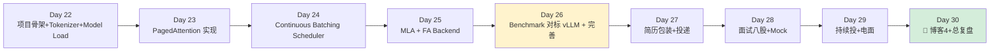
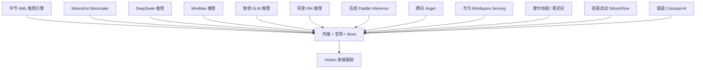
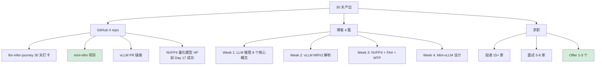

# Week 4：Mini-vLLM 项目 + 求职冲刺(Day 22-30)

> **目标**:用 5 天造出**简历硬通货 Mini-vLLM 推理引擎**,再用 4 天投递 + 面试。
>
> **30 天成败在此一周。**
>
> **环境**:本地 PRO 6000 96GB + Qwen3.6-27B-FP8 已部署。Mini-vLLM 验证用小模型,性能对比也用 Qwen3.6-27B-FP8。

---

## Week 4 总览



**Week 4 最终交付:**
- ✅ Mini-vLLM 项目(GitHub,详见 [06-mini-vllm-design.md](./06-mini-vllm-design.md))
- ✅ 求职简历 v1(中英双语)
- ✅ 投递 ≥10 家公司
- ✅ 博客 4:《我从零造了一个 Mini-vLLM:架构与权衡》

> ⚠️ **30GB RAM 风险**:Mini-vLLM 加载 27B-FP8 权重时 host 端 RAM 峰值会超过 27GB,极可能 OOM。Day 22 的 model loader 必须支持 `mmap=True` + 分片 `to(device)`,或在 Week 1 已升级到 ≥64GB 内存。验证用小模型(Qwen2.5-1.5B / Qwen3-0.6B 之类)做迭代,benchmark 时再换 27B-FP8。

---

## Day 22:Mini-vLLM 项目启动(2026-05-28,周四)

### 上午(4h):项目初始化

```bash
mkdir mini-vllm && cd mini-vllm
git init

# 项目结构(详见 06-mini-vllm-design.md)
mkdir -p mini_vllm/{engine,scheduler,attention,kv_cache,model,sampler}
touch mini_vllm/__init__.py

# 依赖(用 uv,与 Week 1 venv 一致)
cat > requirements.txt << 'EOF'
torch>=2.6
transformers>=4.50
triton>=3.2
flash-attn-4
pydantic
fastapi
uvicorn
EOF
uv pip install -r requirements.txt
```

### 下午(4h):实现 Tokenizer + Model Loading

**`mini_vllm/model/loader.py`**:
- 用本地已有的小模型迭代(如 Qwen2.5-1.5B,host RAM 友好)
- 用 transformers 加载权重,但**不**用 transformers 的 forward
- 必须支持 `safetensors` mmap,避免 host RAM 爆掉

**`mini_vllm/model/qwen.py`**:
- 自己实现 QwenForCausalLM forward
- 调用自己的 attention backend
- 这一步是项目的"骨"

```python
class QwenAttention(nn.Module):
    def __init__(self, config):
        self.q_proj = nn.Linear(...)
        self.k_proj = nn.Linear(...)
        self.v_proj = nn.Linear(...)
        self.o_proj = nn.Linear(...)
        self.attn_backend = FlashAttentionBackend()  # 你自己的

    def forward(self, hidden_states, kv_cache, attn_metadata):
        q = self.q_proj(hidden_states)
        k = self.k_proj(hidden_states)
        v = self.v_proj(hidden_states)
        o = self.attn_backend(q, k, v, kv_cache, attn_metadata)
        return self.o_proj(o)
```

### 晚上(1h):写第一个 commit + GitHub README
- README 必须有:项目截图、架构图、benchmark 数字(先占位)

### Checkpoint
- [ ] 小模型权重能加载(host RAM 不爆)
- [ ] 能跑通 forward(就算只支持 batch=1, 不带 KV cache 也行)

---

## Day 23:PagedAttention 实现(2026-05-29,周五)

### 上午(4h):KV Cache Manager

**核心数据结构(参考 vLLM v0.20.1 但简化):**

```python
class KVCacheManager:
    def __init__(self, num_layers, num_kv_heads, head_dim, block_size=16):
        self.block_size = block_size
        # 物理 block: [num_blocks, 2, num_layers, num_kv_heads, block_size, head_dim]
        self.blocks = torch.zeros(...)
        self.free_blocks = list(range(num_blocks))
        self.req_to_blocks = {}  # request_id -> [block_id, ...]

    def allocate(self, req_id, num_tokens):
        n_blocks = (num_tokens + self.block_size - 1) // self.block_size
        if len(self.free_blocks) < n_blocks:
            return None  # OOM, 调度器需要 preempt
        blocks = [self.free_blocks.pop() for _ in range(n_blocks)]
        self.req_to_blocks[req_id] = blocks
        return blocks

    def free(self, req_id):
        for b in self.req_to_blocks.pop(req_id):
            self.free_blocks.append(b)

    def get_block_table(self, req_ids):
        # 返回 [batch, max_blocks] tensor,给 attention kernel 用
        ...
```

### 下午(4h):PagedAttention Triton Kernel

**简化版(只支持 decode,不支持 prefill):**

```python
@triton.jit
def paged_attention_decode_kernel(
    Q,  # [batch, num_heads, head_dim]
    K_cache, V_cache,  # [num_blocks, num_kv_heads, block_size, head_dim]
    block_table,  # [batch, max_blocks]
    seq_lens,  # [batch]
    Out,  # [batch, num_heads, head_dim]
    BLOCK_SIZE: tl.constexpr,
    HEAD_DIM: tl.constexpr,
):
    # 参考 vLLM v0.20.1 中 paged_attention kernel
    ...
```

**取巧路线:直接调 vLLM 的 kernel** 也行,关键是把流程串起来。

### 晚上(1h):单元测试
- 写一个 reference attention(torch eager)
- 对比 paged attention 输出,diff < 1e-3

### Checkpoint
- [ ] KV cache 分配/释放测试通过
- [ ] paged attention 数值正确
- [ ] 能跑出第一个连续 token(但还没 batching)

---

## Day 24:Continuous Batching Scheduler(2026-05-30,周六)

### 上午(4h):Scheduler 核心算法

```python
class Scheduler:
    def __init__(self, kv_manager, max_batch_size=64, max_token_budget=8192):
        self.waiting = []  # 新请求队列
        self.running = []  # 进行中
        self.kv_manager = kv_manager

    def schedule(self) -> SchedulerOutput:
        # 1. 先处理 running(decode,每个 1 token)
        budget = self.max_token_budget
        scheduled_decode = []
        for req in self.running:
            # 检查 KV 是否够用
            if self.kv_manager.can_append(req, n_tokens=1):
                scheduled_decode.append(req)
                budget -= 1

        # 2. 加新请求(prefill, 占大量 budget)
        scheduled_prefill = []
        while self.waiting and budget > 0:
            req = self.waiting[0]
            n_tokens = min(len(req.prompt_tokens), budget)  # chunked prefill
            blocks = self.kv_manager.allocate(req.id, n_tokens)
            if blocks is None: break
            scheduled_prefill.append((req, n_tokens))
            budget -= n_tokens
            if n_tokens == len(req.prompt_tokens):
                self.running.append(self.waiting.pop(0))

        return SchedulerOutput(
            decode=scheduled_decode,
            prefill=scheduled_prefill,
        )
```

### 下午(4h):Engine 主循环

```python
class LLMEngine:
    def __init__(self, model_path):
        self.model = load_model(model_path)
        self.kv_manager = KVCacheManager(...)
        self.scheduler = Scheduler(self.kv_manager)
        self.tokenizer = AutoTokenizer.from_pretrained(model_path)

    def add_request(self, prompt, sampling_params):
        req_id = uuid.uuid4()
        tokens = self.tokenizer.encode(prompt)
        req = Request(req_id, tokens, sampling_params)
        self.scheduler.waiting.append(req)
        return req_id

    def step(self):
        sched_out = self.scheduler.schedule()
        if sched_out.is_empty(): return []
        model_out = self.model.forward(sched_out, self.kv_manager)
        new_tokens = self.sampler.sample(model_out, sched_out)
        return self._postprocess(new_tokens, sched_out)

    def generate(self, prompts):
        # 高层 API
        for p in prompts: self.add_request(p, ...)
        outputs = []
        while self.scheduler.has_unfinished():
            outputs.extend(self.step())
        return outputs
```

### 晚上(1h):跑 hello world
```python
engine = LLMEngine("/home/xuefeiz2/models/Qwen2.5-1.5B")  # 小模型先跑通
outs = engine.generate(["What is 2+2?", "Capital of France?"])
print(outs)  # 期望两个合理回答
```

### Checkpoint
- [ ] 多请求 batching 跑通
- [ ] Chunked prefill 工作正常
- [ ] 至少 batch=4 时正确生成

---

## Day 25:MLA Backend + FlashAttention 接入(2026-05-31,周日)

### 上午(4h):MLA backend(简历加分)

> 注意:Qwen3.6 用的是 GQA + hybrid linear attention,**不是 MLA**。MLA 是 DeepSeek V2/V3/V4 系列的特色。如果你 Week 2 跑通了 DeepSeek 蒸馏版,这里再实现 MLA 才有意义;否则可以选择只做 GQA + hybrid 路线,把"hybrid attention 简化版"做成项目亮点。

```python
class MLABackend:
    """Multi-head Latent Attention - DeepSeek style"""

    def __init__(self, config):
        self.kv_lora_rank = 512  # latent dim
        self.qk_rope_head_dim = 64
        self.qk_nope_head_dim = 128

    def forward(self, q_lora, kv_lora_compressed, ...):
        # 1. KV up-projection from latent
        kv = self.kv_b_proj(kv_lora_compressed)
        k, v = kv.split([...], dim=-1)

        # 2. RoPE on rope part
        q_rope, q_nope = q.split([self.qk_rope_head_dim, self.qk_nope_head_dim], dim=-1)
        q_rope = apply_rope(q_rope)
        k_rope = apply_rope(k_rope)

        # 3. Concat + flash attn
        q = torch.cat([q_nope, q_rope], dim=-1)
        k = torch.cat([k_nope, k_rope], dim=-1)
        return flash_attn(q, k, v)
```

### 下午(4h):接入真 FlashAttention 4

```python
from flash_attn import flash_attn_varlen_func  # FA4 cu13 wheel

class FlashAttentionBackend:
    def forward(self, q, k, v, attn_metadata):
        if attn_metadata.is_prefill:
            return flash_attn_varlen_func(
                q, k, v,
                cu_seqlens_q=attn_metadata.cu_seqlens,
                cu_seqlens_k=attn_metadata.cu_seqlens,
                ...
            )
        else:
            # decode 调 paged attention
            return self.paged_attn(q, k_cache, v_cache, ...)
```

### 晚上(1h):测试
- 用 mini-vllm 跑 DeepSeek-V3 蒸馏版(MLA),或继续用 Qwen 路线
- 对比输出与 vLLM v0.20.1 是否一致(允许小数值差异,不允许语义崩坏)

### Checkpoint
- [ ] MLA backend 跑通(或明确放弃 + 文档说明,选择 GQA hybrid 路线)
- [ ] FA4 backend 集成完成

---

## Day 26:Benchmark 对标 vLLM + 项目完善(2026-06-01,周一)

### 上午(4h):Benchmark 脚本

```python
# bench.py
import time
from mini_vllm import LLMEngine

def bench(engine, prompts, n_repeat=3):
    times = []
    for _ in range(n_repeat):
        t0 = time.time()
        engine.generate(prompts)
        times.append(time.time() - t0)
    return min(times)

# 对比 vLLM v0.20.1 在同一台机器同一模型
mini_t = bench(MiniVLLMEngine("/home/xuefeiz2/models/Qwen3.6-27B-FP8"), prompts)
vllm_t = bench(VLLMEngine("/home/xuefeiz2/models/Qwen3.6-27B-FP8"), prompts)
print(f"Mini-vLLM: {mini_t:.2f}s, vLLM: {vllm_t:.2f}s, ratio: {mini_t/vllm_t:.1%}")
```

**目标:达到 vLLM v0.20.1 30-50% 性能**(这已经非常体面了)

> 如果 27B-FP8 host RAM OOM,先用 Qwen2.5-7B-FP8 之类小模型出 benchmark,把 27B 列为"Future Work"。诚实 > 编数。

### 下午(4h):写完整 README + 项目文档

**README 必备内容(这是简历链接的脸面):**

````markdown
# Mini-vLLM

A from-scratch LLM inference engine with PagedAttention, hybrid attention, and Continuous Batching, built on a single NVIDIA RTX PRO 6000 Blackwell 96GB.

## Features
- PagedAttention with block-level KV cache
- Continuous batching + chunked prefill
- (Optional) MLA backend for DeepSeek-family models
- FlashAttention 4 backend (Blackwell sm_120 / sm_100, WGMMA + TMA path)
- FP8 / NVFP4 quantization support (via compressed-tensors)
- OpenAI-compatible HTTP server

## Benchmark vs vLLM v0.20.1 (PRO 6000 Blackwell, 96GB)

| Model | Mini-vLLM TPS | vLLM TPS | Ratio |
|---|---|---|---|
| Qwen2.5-1.5B | XX | XX | XX% |
| Qwen3.6-27B-FP8 | XX | XX | XX% |

## Architecture
[贴架构图]

## Quick Start
...

## Tech Notes
[每个模块的 design note 链接]
````

### 晚上(1h):录 demo 视频
- 30 秒视频展示项目运行
- 上传 YouTube + B站 + Twitter

### Checkpoint
- [ ] Benchmark 数字出炉(实测,至少一个模型有数据)
- [ ] README 完整且专业
- [ ] GitHub repo 标星 ≥1(自己点)

---

## Day 27:简历包装 + 投递(2026-06-02,周二)

### 上午(4h):简历定稿

详见 [08-job-strategy.md](./08-job-strategy.md)。

**核心要点:**
- 中英双语
- 简历最上方 3 行突出:"7 年系统软件 + LLM 推理实战 + Blackwell 实战"
- 项目部分:Mini-vLLM + vLLM PR + (NVFP4 量化模型,如 Day 17 成功) + 4 篇博客

### 下午(4h):批量投递

**目标 10-15 家:**



### 晚上(1h):LinkedIn / 脉脉打磨
- 标题改为 "LLM Inference Engineer | ex-Intel ISP | vLLM Contributor"
- 发动态:分享博客 4 + Mini-vLLM 项目

### Checkpoint
- [ ] 中英简历各 1 份 PDF
- [ ] 投递 ≥10 家
- [ ] LinkedIn/脉脉更新

---

## Day 28:面试八股 + Mock(2026-06-03,周三)

### 全天 8h:高密度备考

**必背 30 道八股**(详见 [08-job-strategy.md](./08-job-strategy.md)):
- LLM 推理基础(10 道)
- vLLM 系统设计(10 道)
- CUDA / 性能优化(10 道)

**Mock 面试:**
- 找朋友/AI 模拟 1 场系统设计("设计一个支持 1000 QPS 的 70B 推理服务")
- 录音回放,找改进点

### Checkpoint
- [ ] 30 题能流利答出 25+
- [ ] 1 场 mock 完成

---

## Day 29:持续投 + 电话面试(2026-06-04,周四)

### 上午:响应面试邀请、电话约时间

### 下午:第二批投递(5-10 家)
- 优化简历(根据前一批反馈)
- 投不那么核心的公司(备胎)

### 晚上:更新博客 + 露出
- 在知乎/V2EX 发"求职 LLM 推理工程师"帖(求内推)

---

## Day 30:博客 4 + 总复盘(2026-06-05,周五)

### 上午(4h):博客 4

**博客 4 题目:《我用 30 天从 Intel 系统软件转型 LLM 推理:Mini-vLLM 设计与求职复盘》**

**大纲:**
1. 30 天概览(甘特图)
2. 4 周里程碑回顾
3. Mini-vLLM 架构详解(含每个模块 design note 链接)
4. 性能对比 vLLM v0.20.1
5. 转型建议给同行(系统软件背景如何过渡)
6. 简历开放讨论 + 求 offer 评估

### 下午(4h):复盘 + 持续优化

**复盘维度:**
- 哪些计划严重低估了(如 vLLM 源码阅读)
- 哪些超预期顺利
- Week 5+ 持续学习计划(不能停)

### 晚上:庆祝 + 准备 onsite
- 给自己买顿好的
- 整理面试中常被问到但没准备好的问题

---

## 30 天最终成果(理想)



---

## Week 4 失败兜底

| 风险 | 兜底 |
|---|---|
| Mini-vLLM 跑不通 | 砍 MLA / 砍 paged,做最小可跑的 vanilla 推理 |
| 27B-FP8 host RAM OOM | 用 Qwen2.5-7B / Qwen2.5-1.5B 出 benchmark,27B 列 Future Work |
| Benchmark 性能太差 | 不报数字,重点写 design 思路 + 学习收获 |
| 投递无回应 | Day 29-30 加倍投递 + 找内推(脉脉/V2EX) |
| 面试挂了 | Week 5 继续优化简历,每挂一个写复盘 |

---

## Week 4 成功标准

✅ **最低标准:**
1. Mini-vLLM 能跑通(哪怕只 batch=1 + 小模型)
2. 投递 ≥10 家
3. 至少 1 场技术面(不限通过)

🎯 **理想:**
1. Mini-vLLM 在 27B-FP8 上跑出 vLLM 30%+ 性能
2. 3+ 家公司技术面
3. 1 个 offer

---

## 30 天结束 ≠ 终点

**Week 5+ 持续行动:**
- 每周 1 个 vLLM PR
- 每月 1 篇深度博客
- 持续打榜 GPU MODE 周赛
- 加入 SGLang / TensorRT-LLM 任一社区贡献

→ 详见 [08-job-strategy.md](./08-job-strategy.md) 的"长期规划"章节
