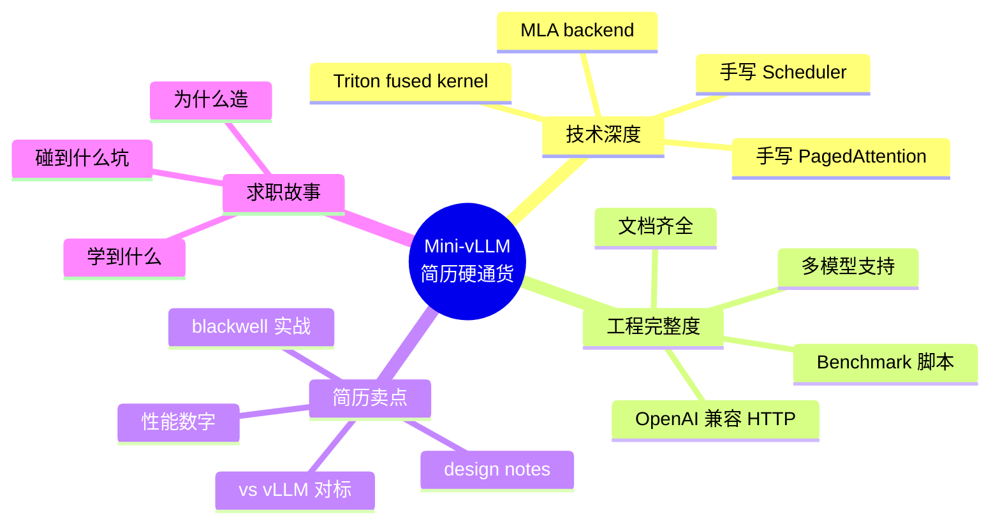
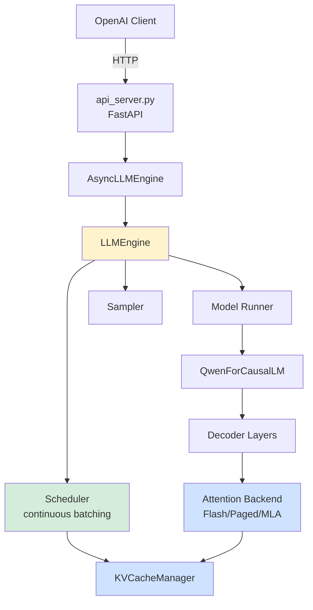
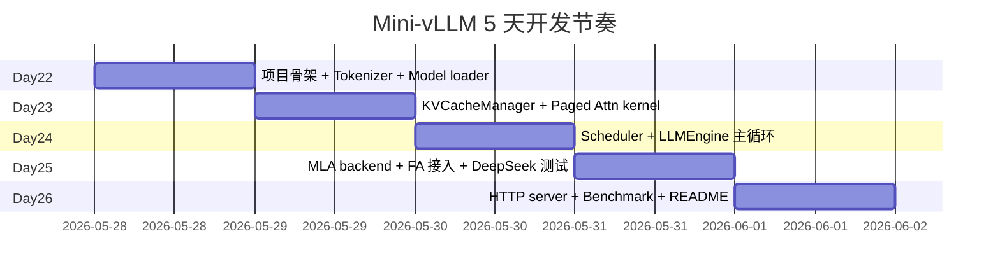
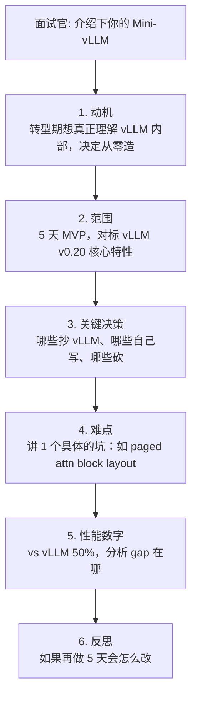

# Mini-vLLM 项目设计文档

> Week 4 的核心交付物，**简历最重的硬通货**。
>
> **设计目标**：5 天造一个可跑的 LLM 推理引擎，达到 vLLM v0.20.1 的 30-50% 性能，覆盖简历所有关键词（PagedAttention / Continuous Batching / MLA / FlashAttention v4 / FP8 / Triton）。
>
> **环境**：本地 PRO 6000 96GB + Ubuntu 24.04 + CUDA 13.2 + ~30GB host RAM。
>
> ⚠️ **30GB host RAM 是 Week 4 的最大风险**：加载 27B-FP8 权重时 host 端峰值 ≈ 27GB，与系统/工具进程共存几乎必爆。两条出路：(1) Week 1 内升级到 ≥64GB DDR5，(2) 全程用 mmap + 分片加载，并把 benchmark 主力换成 7B 以下小模型。

---

## 一、项目定位



---

## 二、技术栈

| 层 | 技术 |
|---|---|
| 语言 | Python 3.12 |
| DL 框架 | PyTorch 2.6+ |
| Kernel | Triton 3.2+ + flash-attn 4 (cu13 wheel) |
| HTTP | FastAPI + uvicorn |
| Tokenizer | HuggingFace transformers (仅 tokenizer) |
| Model | 自己写 forward（不用 transformers 的） |
| 验证模型 | Qwen2.5-1.5B / Qwen3-0.6B（host RAM 友好） |
| Benchmark 主力 | Qwen3.6-27B-FP8（如 RAM 允许） |

---

## 三、目录结构

```
mini-vllm/
├── README.md                    # 项目脸面
├── ARCHITECTURE.md              # 架构总图
├── BENCHMARK.md                 # 性能对比 vLLM
├── pyproject.toml
├── mini_vllm/
│   ├── __init__.py
│   │
│   ├── engine/
│   │   ├── llm_engine.py       # 同步 Engine（先做）
│   │   ├── async_engine.py     # 异步 Engine（HTTP server 用）
│   │   └── request.py          # Request 数据类
│   │
│   ├── scheduler/
│   │   ├── scheduler.py        # Continuous Batching 调度
│   │   ├── budget.py           # token budget 管理
│   │   └── output.py           # SchedulerOutput
│   │
│   ├── kv_cache/
│   │   ├── manager.py          # KV cache 块分配
│   │   ├── block_pool.py       # 物理 block pool
│   │   └── prefix_cache.py     # 可选：prefix caching
│   │
│   ├── attention/
│   │   ├── backend_base.py     # 抽象基类
│   │   ├── flash_attn_backend.py  # 调 flash-attn 库
│   │   ├── paged_attn_kernel.py   # Triton paged attention
│   │   └── mla_backend.py      # MLA (DeepSeek) backend
│   │
│   ├── model/
│   │   ├── loader.py           # 从 HF 加载权重
│   │   ├── qwen.py             # Qwen 系列模型
│   │   ├── deepseek.py         # DeepSeek MLA 模型（可选）
│   │   └── layers/
│   │       ├── linear.py       # 含 FP8 quant 路径
│   │       ├── rmsnorm.py      # Triton fused
│   │       ├── rotary.py       # RoPE Triton
│   │       └── activation.py   # SwiGLU Triton
│   │
│   ├── sampler/
│   │   ├── sampler.py          # top-k / top-p / temperature
│   │   └── kernels.py          # Triton sampling kernel
│   │
│   ├── server/
│   │   ├── api_server.py       # FastAPI OpenAI 兼容
│   │   └── protocol.py         # ChatCompletionRequest 等
│   │
│   ├── config.py               # ModelConfig, EngineConfig
│   └── utils.py
│
├── tests/
│   ├── test_kv_manager.py
│   ├── test_scheduler.py
│   ├── test_attention.py
│   └── test_e2e.py
│
├── benchmarks/
│   ├── bench_throughput.py     # vs vLLM
│   ├── bench_latency.py
│   └── results/
│       └── plots.png
│
└── examples/
    ├── basic_generate.py
    ├── chat_completion.py
    └── server_demo.sh
```

---

## 四、整体架构



---

## 五、核心模块设计

### 5.1 Request 数据类

```python
# mini_vllm/engine/request.py
from dataclasses import dataclass, field
from enum import Enum
from typing import List, Optional

class RequestStatus(Enum):
    WAITING = "waiting"
    PREFILL = "prefill"      # 处于 prefill 阶段
    DECODE = "decode"        # 处于 decode 阶段
    FINISHED = "finished"
    PREEMPTED = "preempted"

@dataclass
class SamplingParams:
    temperature: float = 1.0
    top_p: float = 1.0
    top_k: int = -1
    max_tokens: int = 256
    stop_token_ids: List[int] = field(default_factory=list)

@dataclass
class Request:
    request_id: str
    prompt_token_ids: List[int]
    sampling_params: SamplingParams

    # 运行时状态
    output_token_ids: List[int] = field(default_factory=list)
    status: RequestStatus = RequestStatus.WAITING
    num_computed_tokens: int = 0  # prefill 进度（chunked prefill）
    block_ids: List[int] = field(default_factory=list)  # KV cache blocks

    @property
    def num_total_tokens(self) -> int:
        return len(self.prompt_token_ids) + len(self.output_token_ids)

    @property
    def is_prefill_done(self) -> bool:
        return self.num_computed_tokens >= len(self.prompt_token_ids)
```

### 5.2 KV Cache Manager

```python
# mini_vllm/kv_cache/manager.py
import torch

class KVCacheManager:
    def __init__(
        self,
        num_layers: int,
        num_kv_heads: int,
        head_dim: int,
        num_blocks: int,
        block_size: int = 16,
        dtype: torch.dtype = torch.float16,
        device: str = "cuda",
    ):
        self.block_size = block_size
        self.num_blocks = num_blocks

        # 物理 KV cache: [num_layers, 2 (K/V), num_blocks, block_size, num_kv_heads, head_dim]
        # 注意维度顺序对 attention kernel 的影响（参考 vLLM 的 layout）
        self.kv_cache = torch.zeros(
            num_layers, 2, num_blocks, block_size, num_kv_heads, head_dim,
            dtype=dtype, device=device
        )

        self.free_blocks: List[int] = list(range(num_blocks))
        self.req_to_blocks: Dict[str, List[int]] = {}

    def can_allocate(self, num_tokens: int) -> bool:
        n_blocks = (num_tokens + self.block_size - 1) // self.block_size
        return len(self.free_blocks) >= n_blocks

    def allocate(self, req_id: str, num_tokens: int) -> List[int]:
        n_blocks = (num_tokens + self.block_size - 1) // self.block_size
        if len(self.free_blocks) < n_blocks:
            raise OutOfMemoryError()
        blocks = [self.free_blocks.pop() for _ in range(n_blocks)]
        self.req_to_blocks[req_id] = blocks
        return blocks

    def append(self, req_id: str, num_new_tokens: int) -> Optional[int]:
        """decode 时追加 token，可能需要新 block"""
        blocks = self.req_to_blocks[req_id]
        current_capacity = len(blocks) * self.block_size
        used = self._get_used_tokens(req_id)
        if used + num_new_tokens > current_capacity:
            if not self.free_blocks:
                return None
            new_block = self.free_blocks.pop()
            blocks.append(new_block)
            return new_block
        return blocks[-1]

    def free(self, req_id: str):
        for b in self.req_to_blocks.pop(req_id, []):
            self.free_blocks.append(b)

    def get_block_table(self, req_ids: List[str]) -> torch.Tensor:
        """返回 [batch, max_blocks] 给 attention kernel"""
        max_blocks = max(len(self.req_to_blocks[r]) for r in req_ids)
        table = torch.zeros(len(req_ids), max_blocks, dtype=torch.int32, device='cuda')
        for i, r in enumerate(req_ids):
            blocks = self.req_to_blocks[r]
            table[i, :len(blocks)] = torch.tensor(blocks)
        return table
```

### 5.3 Scheduler

```python
# mini_vllm/scheduler/scheduler.py
class SchedulerOutput:
    scheduled_reqs: List[Request]
    num_scheduled_tokens: Dict[str, int]  # req_id -> 本 step 处理多少 token
    block_table: torch.Tensor
    is_prefill: torch.Tensor  # bool mask

class Scheduler:
    def __init__(self, kv_manager: KVCacheManager, max_num_seqs=64,
                  max_token_budget=8192, chunk_size=512):
        self.kv = kv_manager
        self.max_num_seqs = max_num_seqs
        self.max_token_budget = max_token_budget
        self.chunk_size = chunk_size

        self.waiting: List[Request] = []
        self.running: List[Request] = []

    def add_request(self, req: Request):
        self.waiting.append(req)

    def schedule(self) -> SchedulerOutput:
        scheduled, num_tokens = [], {}
        budget = self.max_token_budget

        # ===== 1. Schedule running requests (decode + 未完成的 prefill) =====
        for req in list(self.running):
            if budget <= 0: break

            if req.is_prefill_done:
                # decode: 1 token
                if self.kv.append(req.request_id, 1) is None:
                    # KV OOM: preempt 最老的请求（简化：跳过）
                    continue
                scheduled.append(req)
                num_tokens[req.request_id] = 1
                budget -= 1
            else:
                # 继续 chunked prefill
                remain = len(req.prompt_token_ids) - req.num_computed_tokens
                n = min(remain, self.chunk_size, budget)
                scheduled.append(req)
                num_tokens[req.request_id] = n
                budget -= n

        # ===== 2. Schedule new requests from waiting =====
        while self.waiting and budget > 0 and len(scheduled) < self.max_num_seqs:
            req = self.waiting[0]
            n_prompt = len(req.prompt_token_ids)
            if not self.kv.can_allocate(n_prompt):
                break  # KV 不够，本 step 不调
            self.kv.allocate(req.request_id, n_prompt)
            n = min(n_prompt, self.chunk_size, budget)
            req.status = RequestStatus.PREFILL
            self.running.append(self.waiting.pop(0))
            scheduled.append(req)
            num_tokens[req.request_id] = n
            budget -= n

        block_table = self.kv.get_block_table([r.request_id for r in scheduled])
        is_prefill = torch.tensor([not r.is_prefill_done for r in scheduled])

        return SchedulerOutput(scheduled, num_tokens, block_table, is_prefill)

    def update(self, scheduler_out, sampled_token_ids):
        """每 step 后更新请求状态"""
        for req, tok_id in zip(scheduler_out.scheduled_reqs, sampled_token_ids):
            n = scheduler_out.num_scheduled_tokens[req.request_id]
            req.num_computed_tokens += n
            if req.is_prefill_done and tok_id is not None:
                req.output_token_ids.append(tok_id)
                if self._is_finished(req, tok_id):
                    req.status = RequestStatus.FINISHED
                    self.running.remove(req)
                    self.kv.free(req.request_id)
```

### 5.4 LLM Engine 主循环

```python
# mini_vllm/engine/llm_engine.py
class LLMEngine:
    def __init__(self, config: EngineConfig):
        self.config = config
        self.tokenizer = AutoTokenizer.from_pretrained(config.model_path)
        self.model = self._load_model()
        self.kv_manager = self._init_kv_cache()
        self.scheduler = Scheduler(self.kv_manager, ...)
        self.sampler = Sampler()

    def add_request(self, prompt: str, sampling_params: SamplingParams) -> str:
        req_id = str(uuid.uuid4())
        tokens = self.tokenizer.encode(prompt)
        self.scheduler.add_request(Request(req_id, tokens, sampling_params))
        return req_id

    @torch.inference_mode()
    def step(self) -> List[Tuple[str, int]]:
        sched_out = self.scheduler.schedule()
        if not sched_out.scheduled_reqs:
            return []

        # 1. Prepare model inputs
        input_ids, positions, attn_metadata = self._prepare_inputs(sched_out)

        # 2. Model forward
        logits = self.model(input_ids, positions, self.kv_manager.kv_cache, attn_metadata)

        # 3. Sample
        sampled = self.sampler(logits, [r.sampling_params for r in sched_out.scheduled_reqs])

        # 4. Update scheduler state
        self.scheduler.update(sched_out, sampled.tolist())

        return self._collect_outputs(sched_out, sampled)

    def generate(self, prompts: List[str], sampling_params=None) -> List[str]:
        sampling_params = sampling_params or SamplingParams()
        ids = [self.add_request(p, sampling_params) for p in prompts]
        results = {i: [] for i in ids}
        while self.scheduler.has_unfinished():
            for req_id, tok in self.step():
                results[req_id].append(tok)
        return [self.tokenizer.decode(results[i]) for i in ids]
```

### 5.5 Attention Backend

```python
# mini_vllm/attention/backend_base.py
class AttentionBackend(ABC):
    @abstractmethod
    def forward(self, q, k, v, kv_cache, attn_metadata) -> torch.Tensor: ...

# mini_vllm/attention/flash_attn_backend.py
from flash_attn import flash_attn_varlen_func

class FlashAttentionBackend(AttentionBackend):
    def forward(self, q, k, v, kv_cache, attn_metadata):
        # 1. 把当前 K/V 写入 paged KV cache
        self._cache_kv(k, v, kv_cache, attn_metadata)

        if attn_metadata.has_prefill:
            # Varlen prefill (FlashAttention)
            o_prefill = flash_attn_varlen_func(
                q[attn_metadata.prefill_mask],
                k[attn_metadata.prefill_mask],
                v[attn_metadata.prefill_mask],
                cu_seqlens_q=attn_metadata.cu_seqlens_q,
                cu_seqlens_k=attn_metadata.cu_seqlens_k,
                max_seqlen_q=attn_metadata.max_seqlen,
                max_seqlen_k=attn_metadata.max_seqlen,
                causal=True,
            )

        if attn_metadata.has_decode:
            # Paged Attention decode (Triton kernel)
            o_decode = paged_attention_decode(
                q[attn_metadata.decode_mask],
                kv_cache,  # paged
                attn_metadata.block_table,
                attn_metadata.seq_lens,
            )

        return self._merge_outputs(o_prefill, o_decode, attn_metadata)
```

### 5.6 OpenAI 兼容 HTTP server

```python
# mini_vllm/server/api_server.py
from fastapi import FastAPI
from fastapi.responses import StreamingResponse

app = FastAPI()
engine = AsyncLLMEngine(EngineConfig(model_path="/home/xuefeiz2/models/Qwen2.5-1.5B"))

@app.post("/v1/chat/completions")
async def chat_completions(req: ChatCompletionRequest):
    prompt = format_chat(req.messages, engine.tokenizer)
    sp = SamplingParams(temperature=req.temperature, max_tokens=req.max_tokens)

    if req.stream:
        async def stream():
            async for tok in engine.generate_stream(prompt, sp):
                yield f"data: {json.dumps({'choices':[{'delta':{'content':tok}}]})}\n\n"
            yield "data: [DONE]\n\n"
        return StreamingResponse(stream(), media_type="text/event-stream")
    else:
        text = await engine.generate(prompt, sp)
        return {"choices": [{"message": {"role": "assistant", "content": text}}]}
```

---

## 六、5 天开发顺序（与 Day 22-26 对齐）



---

## 七、Stretch Goals（行有余力时做）

| 优先级 | 功能 | 简历加分 |
|---|---|---|
| ⭐⭐⭐ | Prefix caching | 高 |
| ⭐⭐⭐ | FP8 quantization 支持 | 高 |
| ⭐⭐ | CUDA Graph for decode | 中 |
| ⭐⭐ | Speculative decoding (vanilla) | 中 |
| ⭐ | 张量并行 (TP) | 高但难，5 天难做完 |
| ⭐ | Disaggregated P/D | 高但难 |

---

## 八、Benchmark 设计

**对比对象**：vLLM v0.20.1 同模型同硬件（PRO 6000 Blackwell 96GB）

**测试矩阵：**

| 模型 | Batch | Seq Len | 测试指标 |
|---|---|---|---|
| Qwen2.5-1.5B | 1, 8, 32 | 1K in / 256 out | TTFT, TPOT, throughput |
| Qwen3.6-27B-FP8 | 1, 4 | 4K in / 512 out | 同上（RAM 允许时）|
| DeepSeek 蒸馏 7B (MLA) | 1, 8 | 2K in / 256 out | 同上（如做 MLA 路线） |

**目标**：mini-vllm 达到 vLLM v0.20.1 **30-50%** 性能就是巨大成功（不要追求 100%）。

**README 里展示（实测数字，禁止编造）：**
```
Qwen2.5-1.5B, batch=8, 1K in / 256 out, RTX PRO 6000 Blackwell 96GB

           Mini-vLLM    vLLM v0.20.1   Ratio
TTFT       ?            ?              ?
TPOT       ?            ?              ?
Throughput ?            ?              ?
```

---

## 九、写文档（README + ARCHITECTURE）

**README 必备 section：**
1. ✅ 一行项目定位（"From-scratch LLM inference engine for Blackwell"）
2. ✅ 截图 / GIF 演示
3. ✅ 特性列表（带 ✅/⏳ 标记）
4. ✅ Benchmark 表格
5. ✅ 架构图（mermaid 直接贴）
6. ✅ Quick Start（5 行命令跑起来）
7. ✅ 设计文档链接（每个模块一篇 design note）
8. ✅ Roadmap（暗示在持续迭代）
9. ✅ 致谢（vLLM, FlashAttention 等）

---

## 十、面试时怎么讲这个项目



**关键话术：**
- ❌ "我做了一个简化版 vLLM"
- ✅ "我从零实现了 LLM 推理引擎的核心抽象（Scheduler / KV Manager / Attention Backend），通过对标 vLLM 验证理解，达到 50% 性能。最大收获是真正搞懂了 continuous batching 的 token budget 调度细节，以及 paged attention 的 block table 设计权衡。"

---

## 十一、风险 & 兜底

| 风险 | 概率 | 兜底 |
|---|---|---|
| paged attn kernel 写不出 | 高 | 直接调 vLLM 的 `_custom_ops.paged_attention_v1` |
| MLA 跑不起来 | 中 | 砍 MLA，只支持 GQA Qwen |
| 性能差 vLLM 100× | 中 | 不报数字，强调架构理解 |
| 5 天写不完 | 中 | 砍 HTTP server + MLA + sampling 优化 |

---

## 十二、参考实现

| 项目 | 用途 |
|---|---|
| [vLLM v0.20.1](https://github.com/vllm-project/vllm) | 抄架构（含 `vllm/v1/`、`qwen3_5.py`、`qwen3_5_mtp.py`）|
| [LightLLM](https://github.com/ModelTC/lightllm) | 参考更轻量实现 |
| [SGLang](https://github.com/sgl-project/sglang) | 参考 RadixAttention |
| [llm.c](https://github.com/karpathy/llm.c) | 极简 inference 灵感 |
| [llama2.c](https://github.com/karpathy/llama2.c) | 单文件 inference |

---

## 下一步

→ 回到 [05-week4.md](./05-week4.md) 按 Day 22 开始实施
