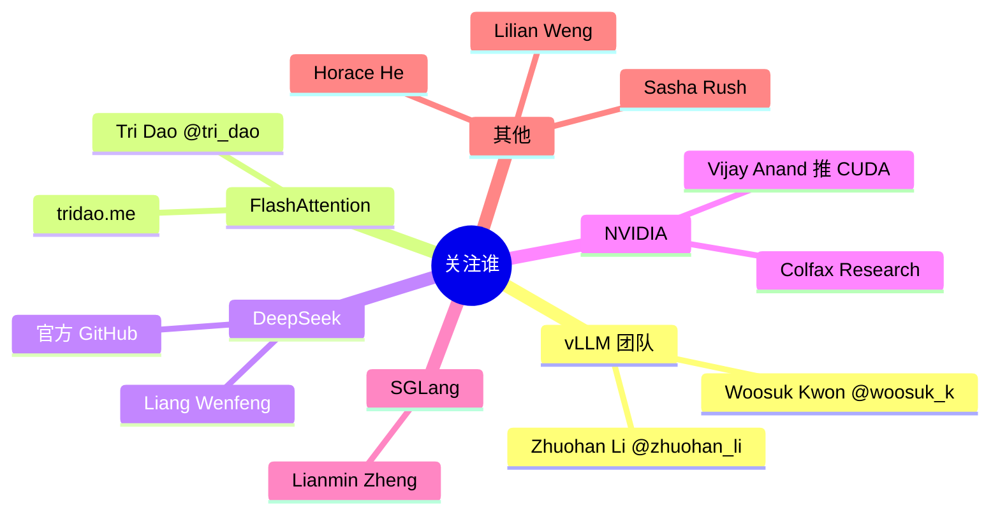

# 完整资源清单

> 30 天里所有要读的论文、博客、书、视频、代码仓库。**按"必读 / 选读 / 参考"分级**，不要试图全读。

---

## 优先级图例

- 🔴 **必读**（30 天内必须读完）
- 🟡 **强烈推荐**（时间够就读）
- 🟢 **参考**（遇到对应问题再查）

---

## 一、论文（按学习顺序）

### Week 1：基础

| 优先级 | 论文 | 链接 | 一句话 |
|---|---|---|---|
| 🔴 | FlashAttention v1 (Dao 2022) | [arxiv 2205.14135](https://arxiv.org/abs/2205.14135) | IO-aware attention 开山 |
| 🔴 | FlashAttention v2 (Dao 2023) | [arxiv 2307.08691](https://arxiv.org/abs/2307.08691) | warp 并行优化 |
| 🟡 | FlashAttention v3 (Shah 2024) | [arxiv 2407.08608](https://arxiv.org/abs/2407.08608) | Hopper TMA + wgmma |
| 🔴 | **FlashAttention v4 (2025)** | [tridao blog](https://tridao.me/blog/2025/flash4/) | Blackwell 专属 ⭐ |
| 🟡 | Online softmax (Milakov 2018) | [arxiv 1805.02867](https://arxiv.org/abs/1805.02867) | FA 的数学根 |

### Week 2：vLLM + 系统

| 优先级 | 论文 | 链接 | 一句话 |
|---|---|---|---|
| 🔴 | **vLLM / PagedAttention (Kwon 2023)** | [arxiv 2309.06180](https://arxiv.org/abs/2309.06180) | 必精读 ⭐ |
| 🔴 | Continuous Batching - Orca (Yu 2022) | [OSDI'22](https://www.usenix.org/conference/osdi22/presentation/yu) | 调度算法源头 |
| 🔴 | SARATHI Chunked Prefill (Agrawal 2023) | [arxiv 2308.16369](https://arxiv.org/abs/2308.16369) | vLLM v1 默认开启 |
| 🔴 | **DeepSeek-V2 (MLA)** | [arxiv 2405.04434](https://arxiv.org/abs/2405.04434) | 必读 ⭐ |
| 🟡 | DeepSeek-V3 技术报告 | [arxiv 2412.19437](https://arxiv.org/abs/2412.19437) | 工业级实践 |
| 🟡 | DistServe P/D 分离 (Zhong 2024) | [arxiv 2401.09670](https://arxiv.org/abs/2401.09670) | 分离推理理论 |
| 🟡 | Mooncake (Moonshot 2024) | [arxiv 2407.00079](https://arxiv.org/abs/2407.00079) | KV 中心化推理 |
| 🟢 | Splitwise (Microsoft 2023) | [arxiv 2311.18677](https://arxiv.org/abs/2311.18677) | P/D 另一方案 |

### Week 3：量化 + 投机解码

| 优先级 | 论文 | 链接 | 一句话 |
|---|---|---|---|
| 🔴 | GPTQ (Frantar 2022) | [arxiv 2210.17323](https://arxiv.org/abs/2210.17323) | INT4 量化经典 |
| 🔴 | AWQ (Lin 2023) | [arxiv 2306.00978](https://arxiv.org/abs/2306.00978) | activation-aware 量化 |
| 🟡 | SmoothQuant (Xiao 2022) | [arxiv 2211.10438](https://arxiv.org/abs/2211.10438) | 激活量化技巧 |
| 🔴 | **NVFP4 介绍** | [NVIDIA blog](https://developer.nvidia.com/blog/introducing-nvfp4-for-efficient-and-accurate-low-precision-inference/) | Blackwell 必读 |
| 🟡 | MXFP4/Microscaling Spec | [OCP MX Spec](https://www.opencompute.org/documents/ocp-microscaling-formats-mx-v1-0-spec-final-pdf) | 行业标准 |
| 🔴 | Marlin GEMM (IST-DASLab 2024) | [arxiv 2408.11743](https://arxiv.org/abs/2408.11743) | 量化推理核心 kernel |
| 🟡 | **TurboQuant 2-bit KV (2025)** | 查 vLLM v0.20 release notes | 长 context 杀手 |
| 🔴 | **EAGLE (2024)** | [arxiv 2401.15077](https://arxiv.org/abs/2401.15077) | 投机解码 SOTA |
| 🟡 | EAGLE-2 / P-EAGLE | [github](https://github.com/SafeAILab/EAGLE) | 实现细节 |
| 🟡 | Speculative Decoding 原始 (Leviathan 2022) | [arxiv 2211.17192](https://arxiv.org/abs/2211.17192) | 思想源头 |

### Week 4：架构 + 前沿

| 优先级 | 论文 | 链接 | 一句话 |
|---|---|---|---|
| 🟡 | Mamba (Gu 2023) | [arxiv 2312.00752](https://arxiv.org/abs/2312.00752) | SSM 新秀 |
| 🟡 | Nemotron-H (NVIDIA 2025) | 查 NV 官博 | Hybrid SSM 落地 |
| 🟢 | Llama 4 技术报告 | Meta 官网 | 业界对比 |
| 🟢 | Qwen3 技术报告 | 阿里官网 | 你部署的就是它 |

---

## 二、博客 / 教程（必读）

### 系统性长文

| 优先级 | 资源 | 价值 |
|---|---|---|
| 🔴 | [Anatomy of vLLM (官方 2025)](https://blog.vllm.ai/2025/09/05/anatomy-of-vllm.html) | vLLM 源码导读，**整个 Week 2 围绕它** |
| 🔴 | [Lilian Weng - LLM Inference Optimization](https://lilianweng.github.io/posts/2023-01-10-inference-optimization/) | 综述教科书 |
| 🔴 | [Anyscale Continuous Batching](https://www.anyscale.com/blog/continuous-batching-llm-inference) | 调度入门 |
| 🟡 | [Aleksa Gordić LLM 推理 series](https://www.aleksagordic.com) | 现代化解释 |
| 🟡 | [Horace He - PyTorch Inside Out](https://horace.io) | 性能调优思路 |

### CUDA / Triton

| 优先级 | 资源 | 价值 |
|---|---|---|
| 🔴 | [siboehm CUDA MMM](https://siboehm.com/articles/22/CUDA-MMM) | GEMM 优化必读 ⭐ |
| 🔴 | [Triton 官方 tutorials](https://triton-lang.org/main/getting-started/tutorials/index.html) | 1-6 必做 |
| 🔴 | [GPU MODE YouTube](https://www.youtube.com/@GPUMODE) | 周更高质量 lecture |
| 🟡 | [Colfax Research blog](https://research.colfax-intl.com) | wgmma / TMA 深度 |
| 🟡 | [Simon Boehm Blog](https://siboehm.com/) | CUDA 优化 |
| 🟡 | [CUDA C++ Best Practices](https://docs.nvidia.com/cuda/cuda-c-best-practices-guide/) | 官方权威 |

### vLLM / SGLang 生态

| 优先级 | 资源 | 价值 |
|---|---|---|
| 🔴 | [vLLM 官方 docs](https://docs.vllm.ai) | 全面 |
| 🔴 | [vLLM blog](https://blog.vllm.ai) | release + 深度 |
| 🟡 | [SGLang docs](https://docs.sglang.ai) | 备选引擎 |
| 🟡 | [TensorRT-LLM docs](https://nvidia.github.io/TensorRT-LLM/) | 工业部署 |
| 🟢 | [LMSYS blog](https://lmsys.org/blog/) | SGLang 团队 |

---

## 三、书

| 优先级 | 书 | 章节 |
|---|---|---|
| 🔴 | **Programming Massively Parallel Processors (PMPP) 4th** | 第 1-7 章足矣 |
| 🟡 | CUDA C Programming Guide | 当字典查 |
| 🟡 | Designing Machine Learning Systems (Huyen) | 部分推理章节 |
| 🟢 | High Performance Python (2nd) | Python 性能基础 |

---

## 四、代码仓库

### 必看（精读级）

| Repo | 看什么 |
|---|---|
| 🔴 [vllm-project/vllm](https://github.com/vllm-project/vllm) | 主战场 |
| 🔴 [Dao-AILab/flash-attention](https://github.com/Dao-AILab/flash-attention) | FA 源码 |
| 🔴 [NVIDIA/cutlass](https://github.com/NVIDIA/cutlass) | GEMM 工业实现 |
| 🔴 [siboehm/SGEMM_CUDA](https://github.com/siboehm/SGEMM_CUDA) | Week 1 教学 |

### 强烈推荐（参考级）

| Repo | 看什么 |
|---|---|
| 🟡 [sgl-project/sglang](https://github.com/sgl-project/sglang) | RadixAttention |
| 🟡 [ModelTC/lightllm](https://github.com/ModelTC/lightllm) | 轻量参考 |
| 🟡 [NVIDIA/TensorRT-LLM](https://github.com/NVIDIA/TensorRT-LLM) | NV 官方 |
| 🟡 [karpathy/llm.c](https://github.com/karpathy/llm.c) | 极简 |
| 🟡 [neuralmagic/llm-compressor](https://github.com/vllm-project/llm-compressor) | 量化工具 |
| 🟡 [deepseek-ai/FlashMLA](https://github.com/deepseek-ai/FlashMLA) | MLA kernel |

### 教学项目

| Repo | 看什么 |
|---|---|
| 🟢 [karpathy/llama2.c](https://github.com/karpathy/llama2.c) | 单文件 inference |
| 🟢 [karpathy/nanoGPT](https://github.com/karpathy/nanoGPT) | 基础 |
| 🟢 [pi-llm/pi-llm](https://github.com/pi-llm/pi-llm) | 教学版 vLLM |

---

## 五、视频课程

| 优先级 | 课程 | 时长 |
|---|---|---|
| 🔴 [GPU MODE Discord + YouTube](https://www.youtube.com/@GPUMODE) | 每周更新 |
| 🟡 [Stanford CS336 (LLM systems 2025)](https://stanford-cs336.github.io/) | 整学期 |
| 🟡 [Stanford CS149 (Parallel Computing)](https://gfxcourses.stanford.edu/cs149) | 整学期 |
| 🟢 [karpathy NN: Zero to Hero](https://karpathy.ai/zero-to-hero.html) | 已是基础 |

---

## 六、关键人物 Twitter / Blog（高信噪比）



---

## 七、必加群 / 社区

| 社区 | 加入方式 |
|---|---|
| 🔴 GPU MODE Discord | [discord.gg/gpumode](https://discord.gg/gpumode) |
| 🔴 vLLM Slack | [slack invite](https://slack.vllm.ai) |
| 🟡 SGLang Slack | github 主页找 |
| 🟡 知乎"AI Infra"话题 | 关注 |
| 🟡 V2EX `/go/ml` 节点 | 看求职帖 |
| 🟢 Reddit r/LocalLLaMA | 偏消费级 |

---

## 八、定期信息源（求职后持续）

| 频率 | 来源 |
|---|---|
| 每日 | Twitter (上面人物) + arxiv-sanity |
| 每周一 | vLLM blog + GitHub releases |
| 每月 | DeepSeek/Qwen/Llama 新版本 |
| 每季度 | NVIDIA GTC / NeurIPS / OSDI 议程 |

---

## 九、面试前突击包

```
面试前 1 天必复习：
1. vLLM Anatomy 长文（重读笔记）
2. PagedAttention 论文
3. FlashAttention 1+2 论文（v3/v4 看 blog 即可）
4. 自己的 Mini-vLLM README + benchmark
5. 自己的 4 篇博客
6. 30 道八股（见 08-job-strategy.md）
```

---

## 十、英文术语速查（面试常用）

| 中文 | 英文 |
|---|---|
| 连续批处理 | Continuous Batching |
| 分块预填充 | Chunked Prefill |
| 分页注意力 | PagedAttention |
| 投机解码 | Speculative Decoding |
| 张量并行 | Tensor Parallelism (TP) |
| 流水线并行 | Pipeline Parallelism (PP) |
| 专家并行 | Expert Parallelism (EP) |
| 数据并行 | Data Parallelism (DP) |
| 推理分离 | Disaggregated Serving |
| 抢占 | Preemption |
| 前缀缓存 | Prefix Caching |
| 算力受限 | Compute-bound |
| 带宽受限 | Memory-bound |
| 算术强度 | Arithmetic Intensity |
| 吞吐 | Throughput |
| 时延 | Latency |
| 首 token 时延 | TTFT (Time to First Token) |
| 每 token 时延 | TPOT (Time Per Output Token) |
| 端到端时延 | E2E Latency |
| 有效吞吐 | Goodput |

---

## 下一步

→ [08-job-strategy.md](./08-job-strategy.md) 求职策略
