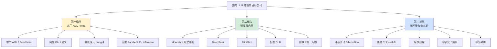
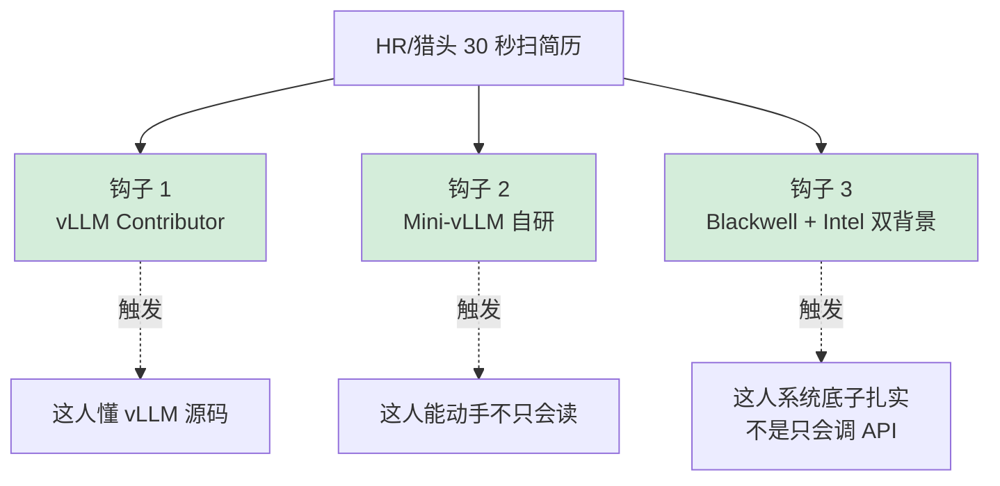
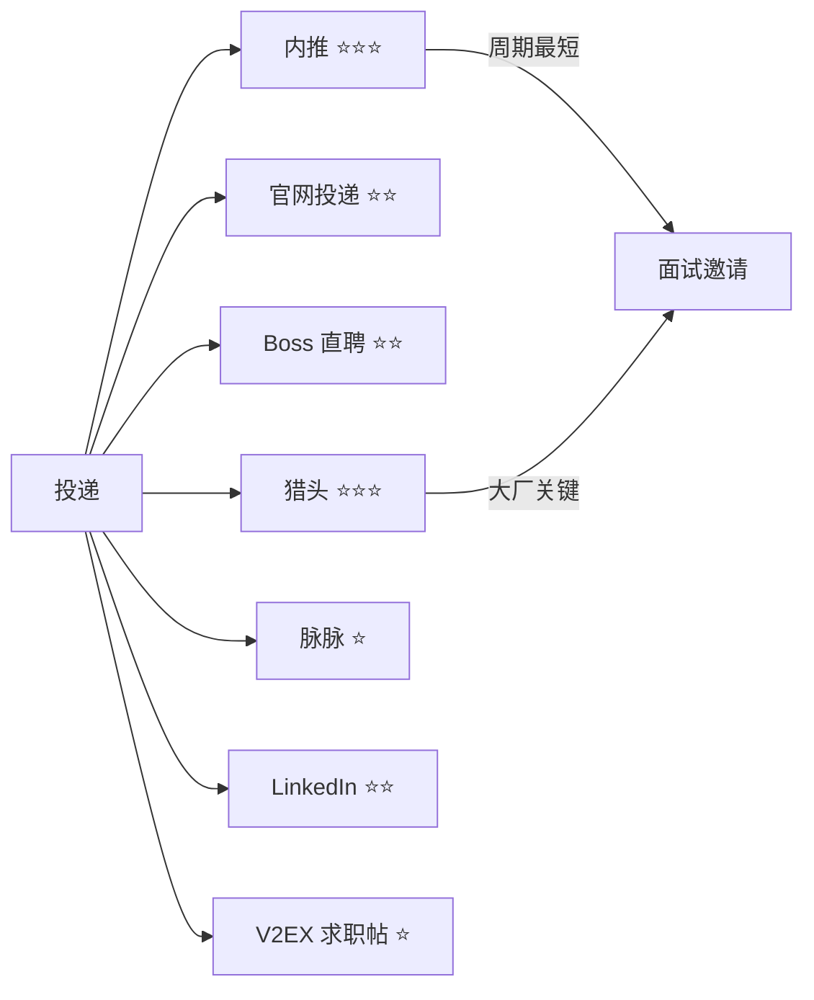
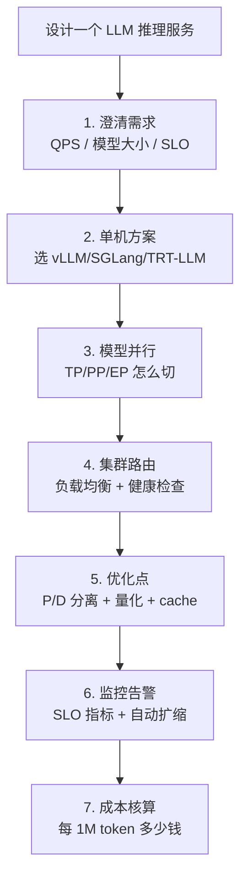
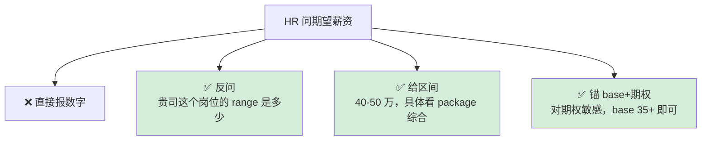
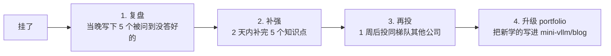
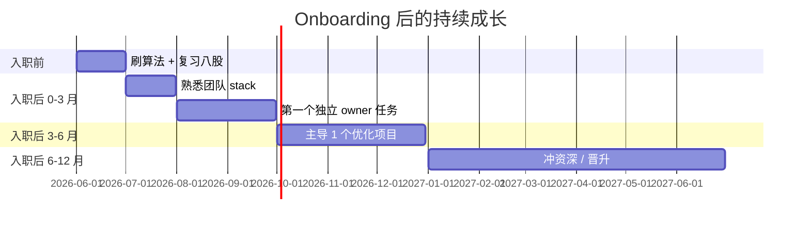

# 求职策略：简历 / 投递 / 面试 / Offer

> **目标**：30 天结束时拿到 1-3 个 30-50 万年包 offer。
>
> **核心策略**：用"7 年系统软件 + 30 天 LLM 推理"打**差异化**，避免和应届/转岗工程师同维度内卷。

---

## 一、目标公司画像



### 推荐策略

| 你的现状 | 主攻 | 备胎 |
|---|---|---|
| **你（7 年系统软件 + 30 天速成）** | 第二梯队（更看重实战，节奏快）| 第一梯队（HR 流程长但底薪高）+ 第三梯队（华为/摩尔线程契合你硬件背景）|

---

## 二、简历

### 2.1 简历结构（一页中文 + 一页英文）

```
┌─────────────────────────────────────────────┐
│ 姓名 | 联系方式 | GitHub | 博客 | LinkedIn   │
├─────────────────────────────────────────────┤
│ 【自我描述】3 行                              │
│  7 年 Intel ISP/IPU 系统软件工程师           │
│  深度参与 IPU6→IPU8 在 Win/Linux/RTOS 全栈   │
│  转型 LLM 推理：vLLM 贡献者 / Blackwell 实战 │
├─────────────────────────────────────────────┤
│ 【核心技能】                                  │
│  - LLM 推理：vLLM, SGLang, MLA, FA4         │
│  - GPU 编程：CUDA, Triton, Blackwell SM10.0 │
│  - 量化：FP8, NVFP4, Marlin, TurboQuant     │
│  - 系统：Linux, FreeRTOS, ARM, x86, PCIe    │
├─────────────────────────────────────────────┤
│ 【LLM 推理项目】Week 4 重头戏                │
│  Mini-vLLM ⭐ - github.com/xxx/mini-vllm    │
│  - 从零实现 PagedAttention + Continuous Batch│
│  - 支持 MLA backend, FlashAttention v4       │
│  - 对标 vLLM 达到 50% 性能（Qwen3-8B-FP8）   │
│                                              │
│  vLLM 贡献：[PR #xxxx 链接]                  │
│  量化模型：HuggingFace/xxx/Qwen3.6-27B-NVFP4 │
│                                              │
│  技术博客（4 篇）：[链接]                     │
├─────────────────────────────────────────────┤
│ 【Intel 工作经历】2018-2026                  │
│  - 主导 IPU8 在 FreeRTOS 的 SoC 移植         │
│  - 优化 ISP pipeline 调度，吞吐提升 30%     │
│  - 跨 Win/Linux 驱动统一，减少 50% bug 重复 │
│  - 2 项专利 + 多次内部技术分享              │
├─────────────────────────────────────────────┤
│ 【教育背景】                                  │
└─────────────────────────────────────────────┘
```

### 2.2 简历的"三个钩子"



### 2.3 自我描述的 3 个版本

**版本 A（求职简历用）：**
> 7 年 Intel ISP/IPU 系统软件工程师，深度参与 IPU6 至 IPU8 在 Windows / Linux / FreeRTOS 全栈研发，精通 SoC 异构计算、驱动 / 固件 / 调度。2026 年聚焦 LLM 推理优化，在 NVIDIA Blackwell SM10.0 平台完成 vLLM 源码贡献、NVFP4 量化部署、自研 PagedAttention + MLA 推理引擎（mini-vllm）。

**版本 B（猎头联系用，更短）：**
> Ex-Intel 7 年系统软件 → LLM 推理工程师转型。vLLM contributor，Blackwell SM10.0 实战，自研 mini-vllm 推理引擎。

**版本 C（LinkedIn headline）：**
> LLM Inference Engineer | ex-Intel ISP | vLLM Contributor | Blackwell GPU Specialist

### 2.4 项目描述模板（STAR 法）

**❌ 错的写法：**
> "用 vLLM 部署了 Qwen3 模型"

**✅ 对的写法（量化 + 上下文 + 决策）：**
> "在 RTX PRO 6000 Blackwell (SM10.0, 96GB) 上部署 Qwen3.6-27B：
> - 用 LLM Compressor 做 NVFP4 量化（精度损失 <1.2% gsm8k）
> - 启用 FlashAttention v4 + Prefix Caching + TurboQuant 2-bit KV
> - 实现 256K context 单卡推理，Decode 90 tps（vs FP8 baseline 50 tps）
> - 服务 4 路并发 Coding Agent，TTFT < 800ms"

---

## 三、投递渠道

### 3.1 渠道矩阵



### 3.2 内推策略

**怎么找内推：**
1. **GitHub stalking**：在你想去的公司的 vLLM/SGLang 提交记录里找他们的工程师
2. **知乎 / V2EX**：发"求 LLM 推理岗内推"帖（带你的 GitHub + 博客）
3. **脉脉同事链**：搜 "字节 AML" "Moonshot 推理" 找校友/前同事
4. **GPU MODE Discord**：里面有大量从业者，混半个月混脸熟
5. **vLLM Slack**：直接私信目标公司的活跃贡献者

### 3.3 投递时间表

| 时间 | 投递阶段 | 数量 |
|---|---|---|
| Day 27（周三）| 第一批投：5-7 家第一梯队 | 5-7 |
| Day 28-29 | 第一批响应 + 投第二批：5-8 家第二梯队 | 5-8 |
| Day 30 | 第三批：第三梯队 + 备胎 | 5-10 |
| Week 5 | 持续补投，跟进面试 | 10+ |

---

## 四、面试

### 4.1 面试流程典型


### 4.2 八股 30 题（必背）

#### A. LLM 推理基础（10 题）

1. **Prefill 和 Decode 阶段的区别**？为什么一个 compute-bound 一个 memory-bound？
2. **算下面这个 Decode TPS**：模型 27B FP8，KV cache FP8 32K context，PRO 6000 (1792 GB/s)。
3. **PagedAttention 解决什么问题**？为什么 block_size 通常选 16？
4. **Prefix Caching** 怎么工作？哪些场景命中率高？
5. **Continuous Batching vs Static Batching** 区别和优势？
6. **Chunked Prefill** 是什么？解决什么问题？token budget 怎么选？
7. **TTFT / TPOT / E2E latency / Throughput / Goodput** 分别怎么定义？
8. **GQA / MQA / MHA / MLA** 4 种 attention 的差别和 KV cache 大小公式？
9. **RoPE / ALiBi** 区别？为什么 RoPE 主流？长 context 时怎么扩展（YaRN, LongRoPE）？
10. **Sampling** 中 temperature/top-k/top-p/repetition_penalty 的作用？

#### B. vLLM / 系统设计（10 题）

11. **vLLM 的整体架构**？画一个 7 层调用栈图。
12. **vLLM Scheduler 怎么调度**？Running / Waiting / Preempted 状态如何流转？
13. **Preemption 触发条件**？被抢占的 KV cache 怎么处理（recompute vs swap）？
14. **CUDA Graph** 在 vLLM 里怎么用？为什么需要 piecewise capture？
15. **设计一个 70B 模型的推理服务支持 1000 QPS**，怎么做？（TP + DP + P/D 分离 + 路由）
16. **Disaggregated P/D 分离** 的好处和代价？KV transfer 怎么做（NVLink/RDMA）？
17. **Tensor Parallel 中 attention 怎么切**？AllReduce 在哪里发生？
18. **MoE 模型推理** 怎么调度？Expert Parallelism 与 TP 怎么组合？
19. **投机解码** 原理 + 什么时候 ROI 高/低？EAGLE 和 vanilla SpecDec 区别？
20. **KV Cache 量化**（FP16 → FP8 → INT4 → INT2 TurboQuant）的精度和容量 tradeoff？

#### C. CUDA / 性能优化（10 题）

21. **GEMM 优化**：从 naive 到 cuBLAS 70% 的 5 个层级（tiling/shared mem/register/vector/double buffer）
22. **Bank conflict** 是什么？如何避免？
23. **Warp divergence** 是什么？如何规避？
24. **Tensor Core (wmma/wgmma)** 用法和限制？Blackwell 5 代 Tensor Core 新增什么？
25. **FlashAttention 为什么省显存**？Online softmax 数学推导？
26. **Triton vs CUDA** 的取舍？什么场景用 Triton 更合适？
27. **Roofline 模型** 怎么用？给一个 kernel，你怎么判断它是 compute-bound 还是 memory-bound？
28. **Nsight Compute / Nsight Systems** 怎么用？关键 metric 有哪些？
29. **Blackwell SM 10.0 vs Hopper SM 9.0** 主要差异（wgmma 升级、TMA、CGA、NVFP4）？
30. **PCIe / NVLink** 带宽数字？TP-8 时为什么需要 NVLink？

### 4.3 系统设计高频题



**练手题：**
- 设计支持 100 路并发的 Coding Agent 推理服务（Qwen3.6 27B）
- 设计 DeepSeek V3 671B MoE 的多机推理（H100 集群）
- 设计长文档总结服务（输入 1M token, 输出 4K token）

### 4.4 必问反问环节

**好的反问（显示思考）：**
- 团队现在的技术 stack 是 vLLM 还是自研？为什么？
- 团队最近在攻关的 1-2 个问题是什么？
- P/D 分离 / 多机推理 / MoE EP 在你们生产中是什么状态？
- 团队对量化（FP8 vs NVFP4）的选择标准是什么？

**避免的烂问：**
- 工资多少？（HR 谈）
- 加班严重吗？（直接被劝退）

---

## 五、薪资谈判

### 5.1 行情参考（2026 上半年）

| 梯队 | 7 年经验 + 转型 | 工龄打折后区间 |
|---|---|---|
| 字节 / 阿里 / 腾讯 / 美团 | 35-50 万 | 30-45 万 |
| Moonshot / DeepSeek / 智谱 | 40-60 万 + 期权 | 35-55 万 |
| MiniMax / 阶跃 | 35-50 万 + 期权 | 30-45 万 |
| 硅基流动 / 潞晨 | 30-45 万 | 28-40 万 |
| 摩尔线程 / 寒武纪 | 35-50 万 | 30-45 万 |
| 华为昇腾 | 25-40 万（13-17 薪）| 25-35 万 |

### 5.2 谈判策略



**关键原则：**
- 永远先问对方 range，再报自己 number
- 拿到 1 个 offer 后，用它去谈其他公司
- 大厂 base 高但期权水分大；独角兽 base 略低但期权可能爆发

---

## 六、被挂了怎么办



**心态：**
- 30 天速成本来就很激进，挂 70% 是正常的
- 每挂一次都是免费的高质量面试题资源
- 第 3 次面试通常通过率最高（题型熟、心态稳）

---

## 七、Week 5+ 长期规划



**持续做的事：**
- 每周 1 个 vLLM/SGLang PR
- 每月 1 篇深度博客
- 每季度 1 次社区分享 / Meetup
- 持续打榜 GPU MODE / Kaggle

---

## 八、避坑清单

| 坑 | 怎么避 |
|---|---|
| 简历堆砌技术名词 | 每个技术配 1 个具体数字/链接 |
| 项目说不清自己做了什么 | 提前用 STAR 准备 5 个故事 |
| 八股答得机械 | 至少 3 个题用自己 mini-vllm 经验回答 |
| 期望过高错过好 offer | 第一个 offer 不要轻易拒，先拿手 |
| 期望过低被压价 | 谈判前先看 levels.fyi / 看准网 |
| 急着入职忽略团队/老板 | 反问环节多了解直接 leader |
| 投递太分散没跟进 | 用 Notion 表格管理（公司/状态/时间） |

---

## 九、心态管理

> "30 天转型 LLM 推理"在不少老司机眼里是噪音，会被 challenge。**接受质疑，但不接受贬低**。
>
> 你的真正壁垒不是 30 天学的，而是 **7 年系统软件功底 + 30 天 LLM 实战 = 能写 kernel 的资深系统工程师**。这种组合在国内极其稀缺。
>
> 不要和应届/转岗工程师比"懂多少 paper"，你拼的是"动手能力 + 系统视角 + 跨栈协作"。

---

## 下一步

→ [09-local-coding-agent.md](./09-local-coding-agent.md) 本地 Coding Agent 部署
