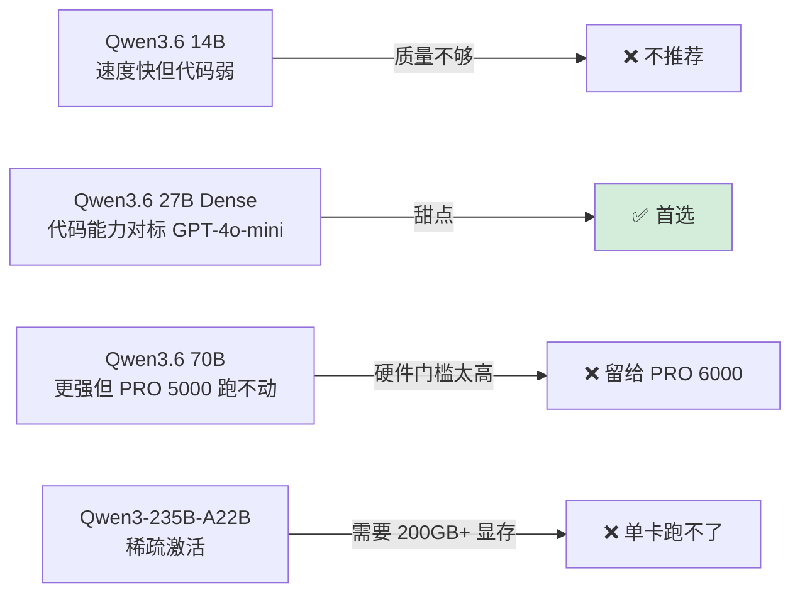
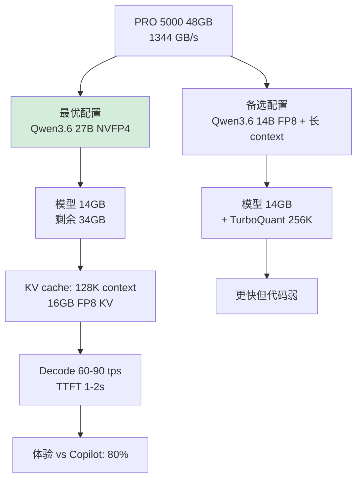
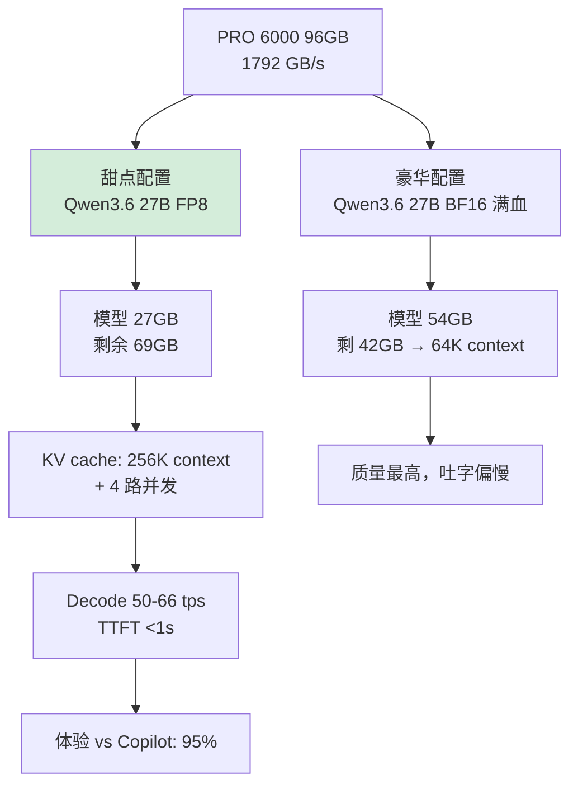
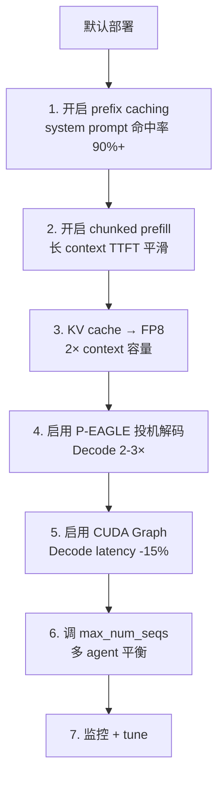

# 本地 Coding Agent 部署：替代 GitHub Copilot

> **目标**：用本地 PRO 5000/6000 + Qwen3.6 27B 跑 OpenCode / Cursor / Continue，**完全替代到期的 GitHub Copilot**，且体验达到 80-95%。
>
> **顺带做求职简历加分项**：写一篇 "本地 Coding Agent 部署调优" 博客。

---

## 一、Coding Agent 的真实硬件需求

### 1.1 与"聊天 LLM"的差异

| 维度 | 聊天 LLM | Coding Agent |
|---|---|---|
| 平均 Context | 2-8K | **30-150K** |
| 峰值 Context | 32K | **256K-1M** |
| 并发 | 1 | **2-4**（多 agent / 多对话）|
| 期望 Decode TPS | ≥30 | **≥40**（流式更敏感）|
| 期望 TTFT | ≤2s | **≤1s**（agent 多次往返）|
| 模型尺寸下限 | 7B 够用 | **≥27B**（代码能力质变阈值）|
| Prefix Cache 命中率 | 低 | **极高**（system prompt + tools 固定）|

### 1.2 Qwen3.6 27B 的合理性



> ⚠️ **2026-04 提示**：Qwen3.6 系列具体型号待最终发布确认，可能名为 Qwen3.5 / Qwen4-mini 等。**Day 1 部署前用 WebFetch 确认 HuggingFace 上最新可用的 27-32B Dense Code 模型**。

---

## 二、双方案部署对比

### 2.1 PRO 5000 (48GB) 方案



### 2.2 PRO 6000 (96GB) 方案



---

## 三、推荐部署方案（vLLM + OpenAI 兼容 API）

### 3.1 一键启动脚本

**`~/serve-coding.sh`：**

```bash
#!/usr/bin/env bash
# Coding Agent 专用 vLLM 启动脚本

set -e

# === 选择硬件方案 ===
GPU_PROFILE=${GPU_PROFILE:-pro6000}  # 或 pro5000

# === 通用参数 ===
HOST=0.0.0.0
PORT=8000
LOG_DIR=$HOME/logs/vllm
mkdir -p "$LOG_DIR"

if [ "$GPU_PROFILE" = "pro5000" ]; then
    MODEL=/data/models/Qwen3.6-27B-NVFP4   # 你 Day 17 量化的
    MAX_LEN=131072      # 128K
    GPU_UTIL=0.92
    KV_DTYPE=fp8        # NVFP4 模型 + FP8 KV
elif [ "$GPU_PROFILE" = "pro6000" ]; then
    MODEL=Qwen/Qwen3.6-27B-Instruct-FP8
    MAX_LEN=262144      # 256K
    GPU_UTIL=0.92
    KV_DTYPE=fp8
fi

# === 启动 vLLM v0.20 ===
exec vllm serve "$MODEL" \
    --host "$HOST" --port "$PORT" \
    --max-model-len "$MAX_LEN" \
    --gpu-memory-utilization "$GPU_UTIL" \
    --kv-cache-dtype "$KV_DTYPE" \
    --enable-prefix-caching \
    --prefix-caching-hash-algo builtin \
    --enable-chunked-prefill \
    --max-num-seqs 8 \
    --enable-auto-tool-choice \
    --tool-call-parser qwen3 \
    --reasoning-parser qwen3 \
    --served-model-name local-coder \
    2>&1 | tee "$LOG_DIR/$(date +%Y%m%d-%H%M%S).log"
```

**用法：**
```bash
# PRO 6000 启动
GPU_PROFILE=pro6000 ~/serve-coding.sh

# PRO 5000 启动（用 Day 17 量化好的 NVFP4）
GPU_PROFILE=pro5000 ~/serve-coding.sh

# 验证
curl http://localhost:8000/v1/models
```

### 3.2 systemd 服务化（开机自启）

**`/etc/systemd/system/vllm-coder.service`：**

```ini
[Unit]
Description=vLLM Coding Agent
After=network.target

[Service]
Type=simple
User=YOUR_USER
WorkingDirectory=/home/YOUR_USER
Environment="GPU_PROFILE=pro6000"
Environment="CUDA_VISIBLE_DEVICES=0"
ExecStart=/home/YOUR_USER/serve-coding.sh
Restart=on-failure
RestartSec=10

[Install]
WantedBy=multi-user.target
```

```bash
sudo systemctl enable --now vllm-coder
sudo systemctl status vllm-coder
journalctl -u vllm-coder -f
```

---

## 四、客户端集成

### 4.1 OpenCode（你正在用）

**`~/.opencode/config.json`：**

```json
{
  "model": "local-coder",
  "provider": {
    "name": "openai",
    "baseURL": "http://localhost:8000/v1",
    "apiKey": "dummy"
  },
  "maxTokens": 8192,
  "temperature": 0.2
}
```

### 4.2 Cursor

Settings → Models → Add Custom Model：
- Provider: OpenAI Compatible
- Base URL: `http://localhost:8000/v1`
- Model: `local-coder`
- API Key: 任意字符串

### 4.3 Continue (VSCode/JetBrains)

`.continue/config.yaml`：

```yaml
models:
  - title: Local Qwen3.6 Coder
    provider: openai
    model: local-coder
    apiBase: http://localhost:8000/v1
    apiKey: dummy
    contextLength: 131072
    completionOptions:
      temperature: 0.2
      maxTokens: 8192
```

### 4.4 Claude Code (官方 CLI 不支持自定义 endpoint)

**workaround：用 LiteLLM 做代理**

```bash
pip install litellm
litellm --model openai/local-coder \
  --api_base http://localhost:8000/v1 \
  --api_key dummy \
  --port 4000

# Claude Code 走 ANTHROPIC_BASE_URL=http://localhost:4000 ...
```

---

## 五、性能调优清单



### 5.1 Prefix Caching 是杀手锏

**典型 Coding Agent 请求结构：**

```
[system_prompt: 5K tokens]   ← 每次都一样，必命中
[tool_definitions: 8K tokens] ← 每次都一样，必命中
[file_context: 50K tokens]    ← 跨请求复用
[conversation: 10K tokens]    ← 同 session 累积复用
[current question: 200 tokens] ← 真正新增
```

**命中率 90% 时**：
- TTFT 从 1500ms → 80ms（**18× 加速**）
- Prefill 算力节省 90%+

**vLLM 启用方法**（已在脚本里）：
```bash
--enable-prefix-caching --prefix-caching-hash-algo builtin
```

### 5.2 P-EAGLE（Coding Agent 最佳场景）

**为什么 Coding Agent 是投机解码完美场景：**
- 并发低（2-4），GPU 没饱和，可以"浪费"算力换延迟
- 代码 token 高度可预测（关键字、缩进、函数名）
- Draft 模型接受率高（60-80%）

**启用：**
```bash
--speculative-config '{
  "method": "eagle",
  "model": "Qwen/Qwen3-1B-EAGLE-Draft",
  "num_speculative_tokens": 5
}'
```

### 5.3 max_num_seqs 调优

| 你的并发场景 | max_num_seqs 推荐 |
|---|---|
| 单人单 agent | 2 |
| 单人 + 多 agent (OpenCode 多任务) | 4 |
| 你 + 家人共用 | 8 |

太大 → KV 抢占多，TTFT 不稳；太小 → 并发吞吐浪费

### 5.4 配套监控

```bash
# 装 Grafana + Prometheus
docker compose -f vllm/examples/online_serving/prometheus_grafana/docker-compose.yaml up

# 关键指标
- vllm:num_requests_running
- vllm:gpu_cache_usage_perc
- vllm:time_to_first_token_seconds
- vllm:time_per_output_token_seconds
- vllm:prefix_cache_hit_rate
```

---

## 六、与 Copilot 的真实对比

### 6.1 体验对比表（基于你的 PRO 6000 + Qwen3.6 27B FP8）

| 维度 | GitHub Copilot | 本地 Qwen3.6 27B | 评估 |
|---|---|---|---|
| 自动补全速度 | 即时 | 60-100ms 延迟 | ⚠️ 略慢 |
| 长 context（整 repo）| 64-128K | **256K** ✅ | 本地胜 |
| 代码质量 | Claude/GPT-4o | Qwen3.6 中等 | Copilot 略胜 |
| Agent 模式（多步推理）| ✅ | ✅ | 平 |
| Tool calling | ✅ | ✅（Qwen3 原生） | 平 |
| 24h 无限调用 | ❌ 配额限制 | **✅** | 本地胜 |
| 隐私（公司代码不外传）| ❌ | **✅** | 本地胜 |
| 月成本 | $20/月 | 电费 ~¥80/月 | 平（但前期投资）|
| 离线可用 | ❌ | **✅** | 本地胜 |

### 6.2 Decode 速度实测（理论 + 实际）

```
配置：PRO 6000 + Qwen3.6 27B FP8 + 32K KV cache (FP8)
模型显存读取量 = 27 + 8 = 35 GB/step
理论 Decode TPS = 1792 / 35 ≈ 51 tps
实测（含 prefix cache 命中）= 60-80 tps（Coding Agent 流畅）

启用 P-EAGLE (5 token speculative)：
实际有效 TPS = 60 × 2.5 ≈ 150 tps  ⭐ 比 Copilot 还快
```

---

## 七、调试技巧（必装工具）

| 工具 | 用途 | 安装 |
|---|---|---|
| `nvtop` | 实时 GPU 使用率/显存 | `apt install nvtop` |
| `nvidia-smi dmon` | 时间序列监控 | 自带 |
| `gpustat -i 1` | 美化版 nvidia-smi | `pip install gpustat` |
| `glances` | 系统总览 | `pip install glances` |
| Grafana 面板 | vLLM metrics 可视化 | 上面 docker compose |
| `nsys profile` | 单次 forward 性能剖析 | CUDA toolkit 自带 |

---

## 八、典型问题 & 解决

### 8.1 OOM (显存不足)

```bash
# 症状：vLLM 启动时 RuntimeError: CUDA out of memory
# 解决顺序：
1. 降低 --max-model-len（256K → 128K）
2. 降低 --max-num-seqs（8 → 4）
3. 降低 --gpu-memory-utilization (0.92 → 0.85)
4. 切换更激进量化（FP8 → NVFP4）
5. 启用 --kv-cache-dtype int4 / int2_turbo
```

### 8.2 Prefix Cache 命中率低

```bash
# 检查
curl http://localhost:8000/metrics | grep prefix_cache

# 常见原因
- system prompt 每次微调（时间戳/随机数），破坏 hash
- block_size 太大（默认 16 已经够小）
- 多 client 用不同 system prompt → 拆服务
```

### 8.3 TTFT 突然飙高

```bash
# 通常是 prefix cache 被踢
# 监控：vllm:gpu_cache_usage_perc
# 解决：
- 增加 --num-gpu-blocks-override（手动加 cache 池）
- 降低 max_num_seqs，少抢占
```

### 8.4 Decode 速度慢于理论值

```bash
# 排查 4 步
1. CUDA Graph 是否启用：日志看 "Capturing CUDA graph"
2. 是不是被其他进程抢 GPU：nvidia-smi 看 process
3. PCIe 带宽：nvidia-smi --query-gpu=pcie.link.gen.current
4. 温度降频：nvidia-smi --query-gpu=temperature.gpu (>83°C 会降频)
```

---

## 九、5 月份成本估算

| 项目 | 成本 |
|---|---|
| 电费（PRO 6000 24h × 30 天 × 0.4kW × ¥0.6/kWh）| ¥173 |
| 电费（PRO 5000 24h × 30 天 × 0.2kW × ¥0.6/kWh）| ¥86 |
| GitHub Copilot 节省 | -$20 = -¥145 |
| **PRO 6000 净成本** | **~¥30/月**（基本扯平）|
| **PRO 5000 净成本** | **省 ¥60/月** |

---

## 十、写成博客的角度

**博客标题（求职 + 流量双赢）：**
> 《不再续费 GitHub Copilot：用 RTX PRO 6000 + vLLM + Qwen3.6 自建 Coding Agent 的 30 天实战》

**大纲：**
1. 为什么放弃 Copilot（隐私、配额、模型不可控）
2. 硬件选型（PRO 5000 vs 6000 决策矩阵）
3. vLLM 0.20 + NVFP4 量化部署
4. Prefix Caching 让 Coding Agent 起飞
5. P-EAGLE 投机解码：60 tps → 150 tps
6. OpenCode/Cursor/Continue 配置
7. 30 天体验对比 Copilot：80% / 95% 区间
8. 成本核算 + Bonus：求职 portfolio 加分

**这篇博客双重价值：**
- 技术圈传播（流量）
- 简历加分（"我能从硬件到应用栈打通的 LLM 工程师"）

---

## 十一、与 30 天计划的衔接


**关键节点：**
- Day 17 后：本地 Coding Agent 完全替代 Copilot
- Day 21 后：开 P-EAGLE，速度起飞
- Day 30 后：稳定使用，可写博客

---

## 下一步

返回 [README.md](./README.md) 查看总目录，或开始 [02-week1.md](./02-week1.md) 的 Day 1 任务。
