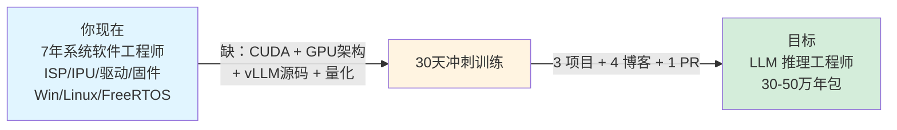
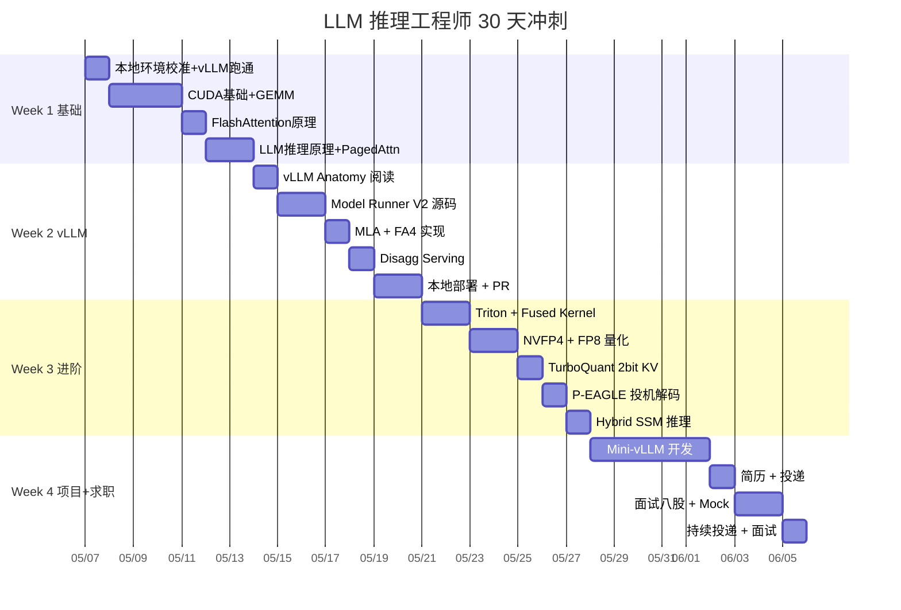
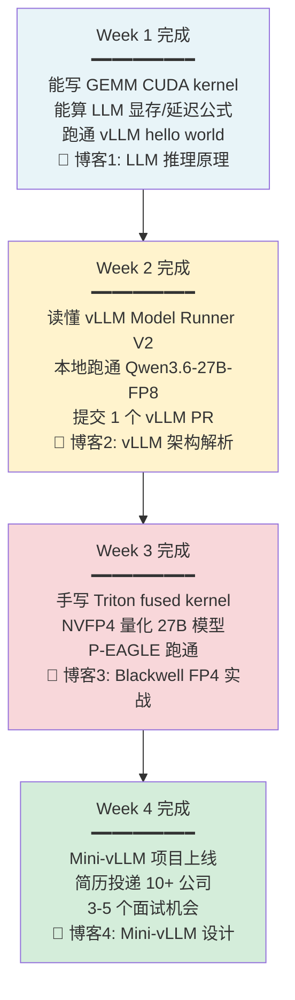
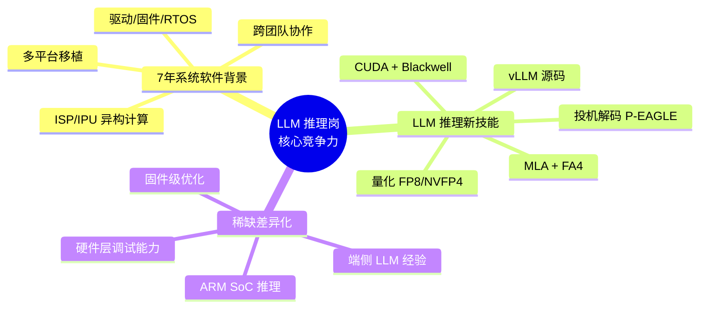

# LLM 推理工程师 30 天冲刺计划

> **目标**：从 Intel ISP/IPU 系统软件工程师转型为国内顶尖大模型公司（字节 AML / Moonshot / DeepSeek / MiniMax / 智谱 / 阿里 PAI / 华为 / 摩尔线程）的 **LLM Inference Engineer**。
>
> **方法**：30 天 × 8h/天 = **240 小时实打实训练**，输出 **3 个 GitHub portfolio 项目 + 4 篇技术博客 + 1 个 vLLM PR**。
>
> **当前日期**：2026 年 5 月初（Day 1 = 2026-05-07）
>
> **规划版本**：v2.1（基于 vLLM v0.20.1、DeepSeek V4、Qwen3.6、Blackwell SM10.0；本地 PRO 6000 96GB 单卡主线）

---

## 文档导航

| 文件 | 内容 |
|---|---|
| [README.md](./README.md) | 总览（本文件） |
| [01-hardware.md](./01-hardware.md) | 硬件落地记录（PRO 6000 Blackwell 96GB 实装）+ Ubuntu 24.04 + CUDA 13.2 验证 |
| [02-week1.md](./02-week1.md) | Week 1 Day-by-Day：CUDA 基础 + LLM 推理原理 |
| [03-week2.md](./03-week2.md) | Week 2 Day-by-Day：vLLM v0.20 源码 + MLA + FA4 |
| [04-week3.md](./04-week3.md) | Week 3 Day-by-Day：Kernel + 量化 + P-EAGLE |
| [05-week4.md](./05-week4.md) | Week 4 Day-by-Day：Mini-vLLM 项目 + 求职冲刺 |
| [06-mini-vllm-design.md](./06-mini-vllm-design.md) | Week 4 项目架构设计文档 |
| [07-resources.md](./07-resources.md) | 完整资源清单（论文、书、博客、课程） |
| [08-job-strategy.md](./08-job-strategy.md) | 求职策略：简历、面试、内推、八股 |
| [09-local-coding-agent.md](./09-local-coding-agent.md) | 本地 Coding Agent 部署（替代 Copilot）|

---

## 总览：你的转型路径

---

## 30 天大局

---

## 4 周里程碑

---

## 你的核心优势（简历主线）

**简历定位（一句话）：**

> 7 年 Intel ISP/IPU 系统软件工程师，深度参与 IPU6→IPU8 在 Windows/Linux/FreeRTOS 的全栈研发，精通 SoC 异构计算、驱动/固件/调度。近期聚焦 LLM 推理优化，在 NVIDIA Blackwell SM10.0 平台完成 vLLM 源码贡献、NVFP4 量化部署、自研 PagedAttention + MLA 推理引擎。

---

## 硬件方案（详见 [01-hardware.md](./01-hardware.md)）

**已落地（2026-05-06）**：

| 部件 | 型号 | 备注 |
|---|---|---|
| GPU | NVIDIA RTX PRO 6000 Blackwell 96GB | SM 10.0 / 1792 GB/s / 600W |
| CPU | Intel Core Ultra 9 285K | |
| 主板 | MSI PRO B860-P WIFI | |
| 内存 | DDR5 ~30GB | ⚠️ 偏紧，建议 Week 1 内升级到 64GB+ |
| 系统 | Ubuntu 24.04 LTS | Driver 595.58.03 + CUDA 13.2 |
| 备用 | Mac mini M4 | 端侧 MLX 实验 |

**与公司硬件对齐**：PRO 6000 = SM 10.0 数据中心架构，与 H100/B100/B200 100% 指令集兼容，简历卖点完全一致。

---

## 信息时效性约定

- ⚠️ **当前是 2026 年 5 月初**，AI 推理领域月度迭代
- ✅ 计划基于 **vLLM v0.20.1**（2026-05-04 发布）+ DeepSeek V4 + Qwen3.6 时代
- 🔄 **每周开始前**用 WebFetch 刷新 vLLM blog + arxiv，确保不学过时内容
- ❓ 任何"新概念"（如某天看到 "FA5"、"DSv5"），立刻向我确认是否影响计划

---

## 立即行动

**今天（Day 0，2026-05-06）：**
- [ ] 等 `Qwen/Qwen3.6-27B` 下载完成（确认 `model.safetensors.index.json` 落盘）
- [ ] 拉取 FP8 主力模型：`modelscope download --model Qwen/Qwen3.6-27B-FP8 --local_dir ~/models/Qwen3.6-27B-FP8`
- [ ] 创建 venv 并安装 vLLM v0.20.1：`uv venv --python 3.12 && source .venv/bin/activate && uv pip install "vllm==0.20.1"`
- [ ] 安装 Nsight Systems：`sudo apt install nsight-systems`
- [ ] 下单 DDR5 内存条扩容到 ≥64GB（Week 4 mini-vLLM 关键依赖）

**明天（Day 1，2026-05-07）：** 开始 [02-week1.md](./02-week1.md) 的 Day 1 任务

---

## 联系方式 / 进度跟踪

每天结束时，把当天的 checkpoint 完成情况记录到 `progress.md`（你自己创建），并在遇到任何问题时随时回来问。

**祝顺利！30 天后，你将站在国内顶尖大模型公司的 offer 面前。**
